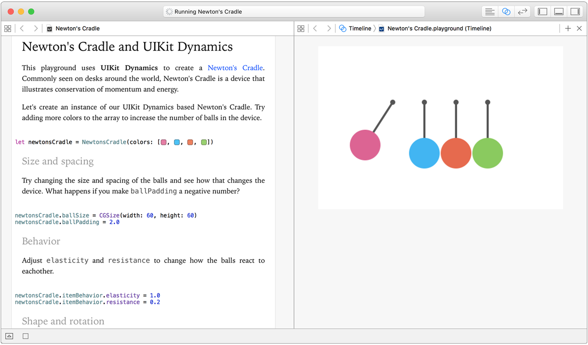

Xcode 7.3 beta 3 中 iOS 和 OS X 的 Playground 添加了交互性，它允许你在 Playground 中与你写的代码进行点击、拖拽、输入以及其他交互。这些界面的响应将和它们在应用中完全一致。可交互的 Playground 可以帮助你快速建模和建立你的应用，并且提供了一个与你代码交互的完美方式。

任何指定到XCPlaygroundPage 中liveView 属性的视图和视图控制器都会自动地实现交互性，并且自从它在 Playground 中运行开始，你就可以得到所有通常的 Playground 结果。你可以实验动作识别，看看UITableView 在你滚动的时候是如何创建和删除行的，或者在 SceneKit 中与复杂的 3D 场景互动。

### 示例 Playground

下面是一个使用在 iOS Playground 中 使用 UIKit 动态创建的高可交互并且可定制的[牛顿摆](https://zh.wikipedia.org/wiki/牛顿摆)，超适合你的桌面。

- [NewtonsCradle.playground](https://developer.apple.com/swift/blog/downloads/NewtonsCradle.playground.zip)
