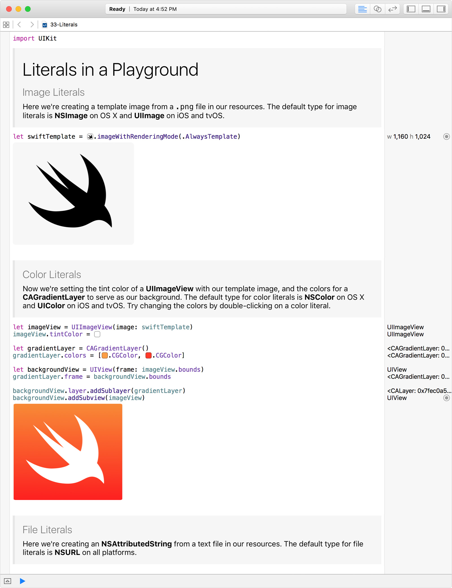

Xcode 7.1 里的新功能是嵌入文件，图像和颜色字面量到你的 Playground 代码里。字面量是你的数据以原本格式表示的实际值，直接显示于 Xcode 编辑器中。比如说不需要在编辑器里写 _“myImage.jpg”_——只需要从 Finder 拖动进你的图像，它就会以实际的样子在你代码行内显示。比起显示 RGB 值来表示颜色，Playground 将会渲染一个颜色样本。Playground 里的字面量与你手写的标准 Swift 代码有着极其相似的行为，但却使用了更好的方式渲染。

另外看起来更酷的是，字面量同时能让编辑资源变得更快。你可以使用颜色选择器来从调色板快速选择一个不同的颜色。通过从 Finder 拖拽文件到你的 Playground 代码里来立即使用它。你甚至可以在光标当前位置插入字面量，通过选择Editor > Insert File, Image, 或者 Color Literal 双击字面量允许你简单地选择另一个值。

如果需要的话，资源会拷贝到你的 Playground 资源目录里，所以你 Playground 需要的一切都包含在了文档之中。因为字面量是你代码的一部分，你同样可以拷贝，粘贴，移动和删除你的源码。

### Swift 代码里的字面量

字面量被翻译为特定平台类型，默认为下面列表所示：

  
| **对象字面量** | OS X | iOS and tvOS |
| --- | --- | --- |
| Color | NSColor | UIColor |
| File | NSURL | NSURL |
| Image | NSImage | UIImage |

要得到完整的字面量行内表示体验，你需要在 Playground 中使用。总之，如果你拷贝和粘贴使用字面量的代码到你的 Swift 代码中，粘贴的代码将会按照你预期的方式运行，Xcode 会直接把字面量渲染为纯文本。

为了让你开始使用字面量，我们已经在博文里包含了一个非常简短的 Playground。下载最新的 [Xcode 7.1 beta](http://developer.apple.com/xcode/download) 来试试[这个 Playground](http://developer.apple.com/swift/blog/downloads/Literals.zip)。

### 额外的文档

配合 Xcode 7.1 beta 3 的文档包含了更新了的 [Playground 帮助文档](https://developer.apple.com/library/prerelease/ios/recipes/Playground_Help/)和其他强大的 Playground 特性的更新信息，包含新的字面量内容。这里是相关子页面的直达链接：[添加图片字面量](https://developer.apple.com/library/prerelease/ios/recipes/Playground_Help/Chapters/AddImageLiteral.html#//apple_ref/doc/uid/TP40015166-CH49-SW1)，[添加颜色字面量](https://developer.apple.com/library/prerelease/ios/recipes/Playground_Help/Chapters/AddColorLiteral.html#//apple_ref/doc/uid/TP40015166-CH50-SW1)，还有[添加文件字面量](https://developer.apple.com/library/prerelease/ios/recipes/Playground_Help/Chapters/AddFileLiteral.html#//apple_ref/doc/uid/TP40015166-CH51-SW1)。

下面是在 Xcode 7.1 中字面量显示的演示截图：

