作为[基本运算符](https://www.cnswift.org/basic-operators)的补充，Swift 提供了一些对值进行更加复杂操作的高级运算符。这些运算包括你在 C 或 Objective-C 所熟悉的所有按位和移位运算符。

与 C 的算术运算符不同，Swift 中算术运算符默认不会溢出。溢出行为都会作为错误被捕获。要允许溢出行为，可以使用 Swift 中另一套默认支持的溢出运算符，比如溢出加法运算符（&+ ）。所有这些溢出运算符都是以（& ）符号开始的。

当你定义了自己的结构体、类以及枚举的时候，那么为这些自定义类型也提供 Swift 标准的运算符就很有必要。Swift 简化了这些运算符的定制实现并且精确地确定了你创建的每个类型的运算符所具有的行为。

你不会被限制在预定义的运算符里。Swift 允许你自由地定义你自己的中缀、前缀、后缀和赋值运算符，以及相对应的优先级和结合性。这些运算符可以像预先定义的运算符一样在你的代码里使用和采纳，甚至你可以扩展已存在的类型来支持你自己定义的运算符。

## 位运算符

_位运算符_可以操作数据结构中每一个独立的位。它们通常被用在底层开发中，比如图形编程和创建设备驱动。位运算符在处理外部资源的原始数据时也非常有用，比如为自定义的通信协议的数据进行编码和解码。

Swift 支持 C 里面所有的位运算符，具体如下：

### 位取反运算符

_位取反运算符_（~ ）是对所有位的数字进行取反操作：

 

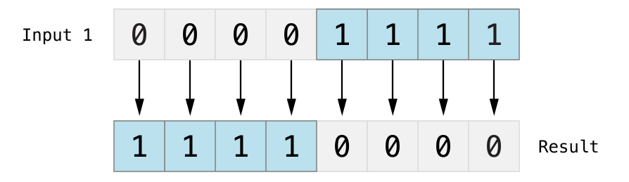

位取反运算符是一个前缀运算符，需要直接放在运算符的前面，并且不能有空格：

```
let initialBits: UInt8 = 0b00001111
let invertedBits = ~initialBits  // equals 11110000
```

UInt8 类型的整数有八位，可以存储0  到255 之间的任意值。这个例子使用二进制值00001111 初始化了一个UInt8 类型的整数，前四位全是 0 ，后四位都是1 。这和十进制的15 是相等的。

然后使用位取反运算符创建一个新的常量名为invertedBits ，它和initialBits 相等，但是所有位都被取反了。0  变为了1 ，1 变为了 0 。invertedBits 的值是11110000 ，和无符号十进制整数240 相等。

### 位与运算符

_位与运算符_（& ）可以对两个数的比特位进行合并。它会返回一个新的数，只有当这两个数_都_是1 的时候才能返回1 。

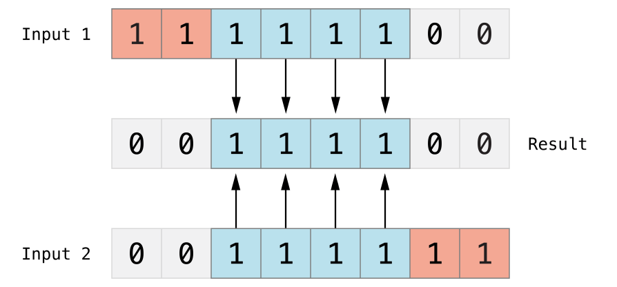

 

在下面的例子中，firstSixBits 和lastSixBits 的中间四个位都为1 。按位与可以把它们合并为一个新值 00111100 ，对应十进制的值为60 。

```
let firstSixBits: UInt8 = 0b11111100
let lastSixBits: UInt8 = 0b00111111
let middleFourBits = firstSixBits & lastSixBits // equals 00111100
```

### 位或运算符

_位或运算符_（| ）可以对两个比特位进行比较，然后返回一个新的数，只要两个操作位任意一个为1 时，那么对应的位数就为1 ：

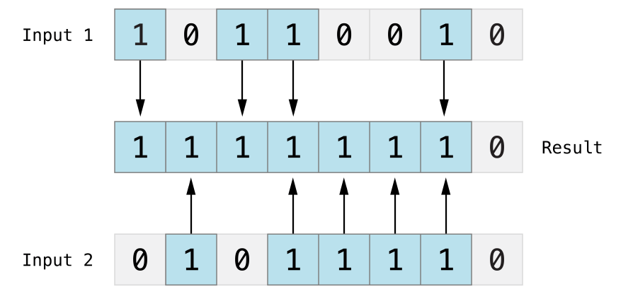

在下面的例子中，someBits 和moreBits 在不同的位设置了1 。位或运算符把它们合并为11111110 ，等于十进制无符号整数154 。

```
let someBits: UInt8 = 0b10110010
let moreBits: UInt8 = 0b01011110
let combinedbits = someBits | moreBits // equals 11111110
```

### 位异或运算符

位异或运算符，或者说“互斥或”（^ ）可以对两个数的比特位进行比较。它返回一个新的数，当两个操作数的对应位不相同时，该数的对应位就为1 ：

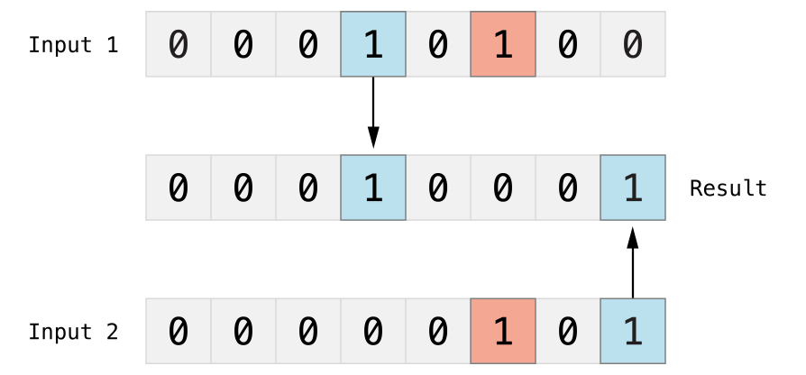

在下面的例子中，firstBits 和otherBits 的值有一位设置为1 ，而对方设置为0 。位异或运算符会将这两个位上的值设置为1 ，firstBits 和otherBits 其他位都设置为了0 。

```
let firstBits: UInt8 = 0b00010100
let otherBits: UInt8 = 0b00000101
let outputBits = firstBits ^ otherBits // equals 00010001
```

## 位左移和右移运算符

_位左移运算符_（<< ）和_位右移运算符_（\>> ）可以把所有位数的数字向左或向右移动一个确定的位数，但是需要遵守下面定义的规则。

位左和右移具有给整数乘以或除以二的效果。将一个数左移一位相当于把这个数翻倍，将一个数右移一位相当于把这个数减半。

#### 无符号整数的移位操作

对无符号整数的移位规则如下：

1. 已经存在的比特位按指定的位数进行左移和右移。
2. 任何移动超出整型存储边界的位都会被丢弃。
3. 用 0  来填充向左或向右移动后产生的空白位。

这种方法称就是所谓的_逻辑移位_。

下图展示了11111111 << 1 （即把11111111 向左移1 位），11111111 >> 1 （即把 11111111 向右移1 位），蓝色的数字是被移位的，灰色的数字被舍弃，橙色的数字 0  是新插入的：

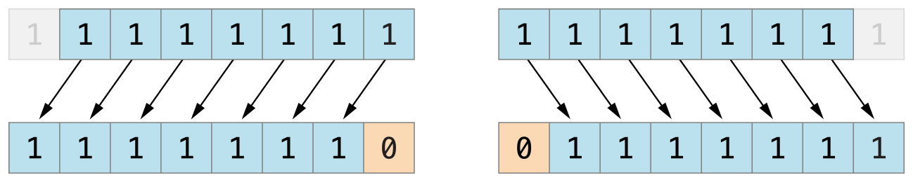

 

下面的代码展示了 Swift 的移位操作：

```
let shiftBits: UInt8 = 4 // 00000100 in binary
shiftBits << 1 // 00001000
shiftBits << 2 // 00010000
shiftBits << 5 // 10000000
shiftBits << 6 // 00000000
shiftBits >> 2 // 00000001
```

可以使用移位操作对其他的数据类型进行编码和解码：

```
let pink: UInt32 = 0xCC6699 let redComponent = (pink & 0xFF0000) >> 16 // redComponent is 0xCC, or 204 let greenComponent = (pink & 0x00FF00) >> 8 // greenComponent is 0x66, or 102 let blueComponent = pink & 0x0000FF // blueComponent is 0x99, or 153
```

这个示例使用了一个命名为 pink  的 UInt32  常量来存储层叠样式表\[1\]中粉色的颜色值。该 CSS 的颜色值 #CC6699 ， 在 Swift 中表示为十六进制 0xCC6699 。然后利用位与运算符（& ）和位右移运算符（\>> ）从这个颜色值中分解出红（CC ）、绿（66 ）以及蓝（99 ）三个部分。

红色部分是通过对0xCC6699 和0xFF0000 进行按位与运算后得到的。0xFF0000 中的 0  部分作为掩码，掩盖了OxCC6699 中的第二和第三个字节，使得数值中的6699 被忽略，只留下0xCC0000 。

然后，再将这个数按向右移动16 位（\>> 16 ）。十六进制中每两个字符表示8 个比特位，所以移动16 位后0xCC0000 就变为0x0000CC 。这个数和0xCC 是等同的，也就是十进制数值的204 。

同样的，绿色部分通过对0xCC6699 和0x00FF00 进行按位与运算得到0x006600 。然后将这个数向右移动8 位，得到0x66 ，也就是十进制数值的102 。

最后，蓝色部分通过对0xCC6699 和0x0000FF 进行按位与运算得到0x000099 。并且不需要进行向右移位，所以结果为0x99 ，也就是十进制数值的153 。

> 译注
> 
> \[1\] 层叠样式表（Cascading Style Sheets），即 CSS 。

### 有符号整型的位移操作

对比无符号整型来说有符整型的移位操作相对复杂得多，这种复杂性源于有符号整数的二进制表现形式。（为了简单起见，以下的示例都是基于8 位有符号整数的，但是其中的原理对大小的有符号整数都是一样的。）

有符号整型使用它的第一位（所谓的_符号位_）来表示这个整数是正数还是负数。符号位为0  表示为正数， 1 表示为负数。

其余的位数（所谓的_数值位_）存储了实际的值。有符号正整数和无符号数的存储方式是一样的，都是从 0  开始算起。这是值为4 的Int8 型整数的二进制位表现形式：

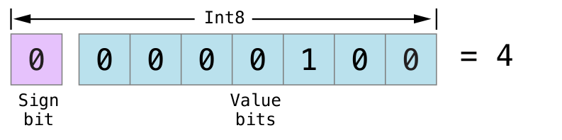

符号位是 0 （意味着是一个正数），另外七位则代表了十进制数值4 的二进制表示。

但是负数的存储方式略有不同。它存储的是2 的n 次方减去它的绝对值，这里的n 为数值位的位数。一个 8 位的数有七个数值位，所以是2 的7 次方，或者说128 。

这是值为\-4 的Int8 型整数的二进制位表现形式：

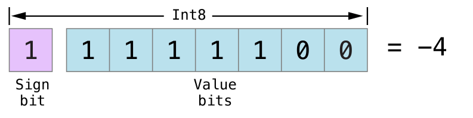

这次，符号位为1 （说明是负数），另外七个位则代表了数值124 （即128 - 4 ) 的二进制表示：

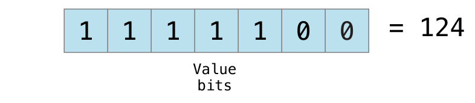

负数的编码就是所谓的二进制补码表示。用这种方法来表示负数乍看起来有点奇怪，但它有几个优点。

首先，如果想给\-4 加个 \-1  ，只需要将这两个数的全部八个比特位相加（包括符号位），并且将计算结果中超出的部分丢弃：

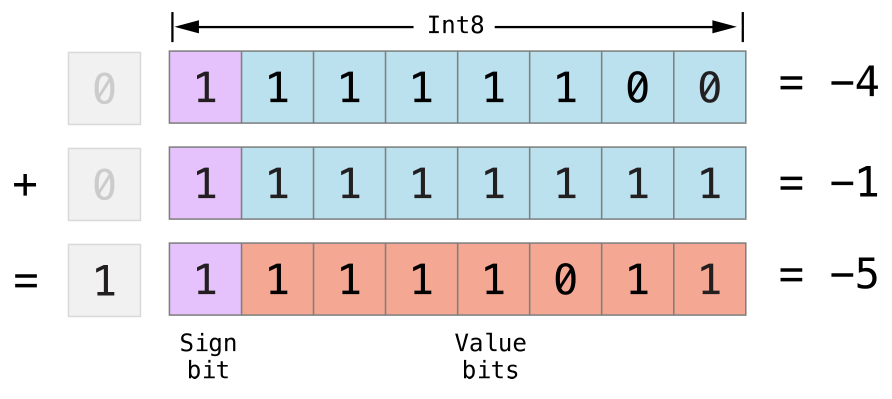

其次，使用二进制补码可以使负数的位左移和右移操作得到跟正数同样的效果，即每向左移一位就将自身的数值乘以2 ，每向右一位就将自身的数值除以2 。要达到此目的，对有符号整数的右移有一个额外的规则：当对正整数进行位右移操作时，遵循与无符号整数相同的规则，但是对于移位产生的空白位使用_符号位_进行填充，而不是 0  。

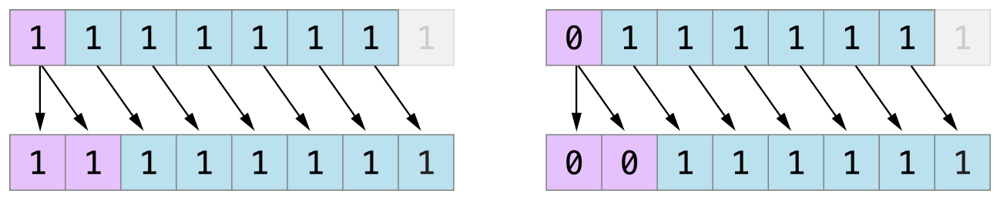

这个行为可以确保有符号整数的符号位不会因为右移操作而改变，这就是所谓的_算术移位_。

由于正数和负数的特殊存储方式，在对它们进行右移的时候，会使它们越来越接近零。在移位的过程中保持符号位不变，意味着负整数在接近零的过程中会一直保持为负。

## 溢出运算符

在默认情况下，当向一个整数赋超过它容量的值时，Swift 会报错而不是生成一个无效的数。这个行为给我们操作过大或着过小的数的时候提供了额外的安全性。

例如，Int16 整数能容纳的有符号整数范围是\-32768 到32767 ，当为一个Int16 型变量赋的值超过这个范围时，系统就会报错：

```
var potentialOverflow = Int16.max
// potentialOverflow equals 32767, which is the maximum value an Int16 can hold
potentialOverflow += 1
// this causes an error
```

为过大或者过小的数值提供错误处理，能让我们在处理边界值时更加灵活。

总之，当你故意想要溢出来截断可用位的数字时，也可以选择这么做而非报错。Swift 提供三个算数_溢出运算符_来让系统支持整数溢出运算。这些运算符都是以& 开头的：

- 溢出加法 （&+ ）
- 溢出减法 （&- ）
- 溢出乘法 （&\* ）

### 值溢出

数值可能出现向上溢出或向下溢出。

这个示例演示了当对一个无符号整数使用溢出加法（&+ ）进行上溢运算时会发生什么：

```
var unsignedOverflow = UInt8.max
// unsignedOverflow equals 255, which is the maximum value a UInt8 can hold
unsignedOverflow = unsignedOverflow &+ 1
// unsignedOverflow is now equal to 0
```

unsignedOverflow 初始化为UInt8 所能容纳的最大整数（255 ，二进制为11111111 ）。溢出加法运算符（&+ ）对其进行加1 操作。这使得它的二进制表示正好超出UInt8 所能容纳的位数，也就导致它溢出了边界，如下图所示。溢出后，留在UInt8 边界内的值是00000000 ，也就是十进制数值的 0 。

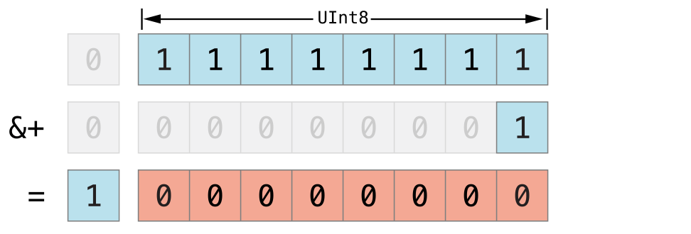

同样地，当我们对一个无符号整数使用溢出减法（&- ）进行下溢运算时也会产生类似的现象：

```
var unsignedOverflow = UInt8.min
// unsignedOverflow equals 0, which is the minimum value a UInt8 can hold
unsignedOverflow = unsignedOverflow &- 1
// unsignedOverflow is now equal to 255
```

UInt8 型整数能容纳的最小值是0 ，以二进制表示即00000000 。当使用溢出减法运算符（&- ）对其进行减1 操作时，数值会产生下溢并被截断为11111111 ， 也就是十进制数值的255 。

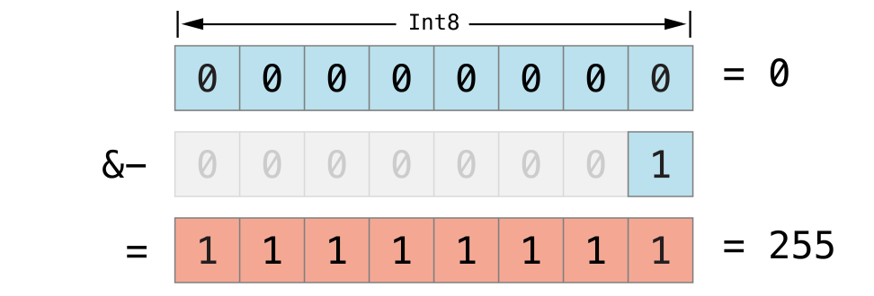

溢出也会发生在有符号整型数值上。正如[按位左移/右移运算符](https://developer.apple.com/library/ios/documentation/Swift/Conceptual/Swift_Programming_Language/AdvancedOperators.html#//apple_ref/doc/uid/TP40014097-CH27-ID34)所描述的，在对有符号整型数值进行溢出加法或溢出减法运算时，符号位也需要参与计算。

```
var signedOverflow = Int8.min
// signedOverflow equals -128, which is the minimum value an Int8 can hold
signedOverflow = signedOverflow &- 1
// signedOverflow is now equal to 127
```

Int8 整数能容纳的最小值是\-128 ，以二进制表示即10000000 。当使用溢出减法运算符对其进行减1 操作时，符号位翻转，得到二进制数值 01111111 ，也就是十进制数值的 127 ，这个值也是 Int8  型整数所能容纳的最大值。

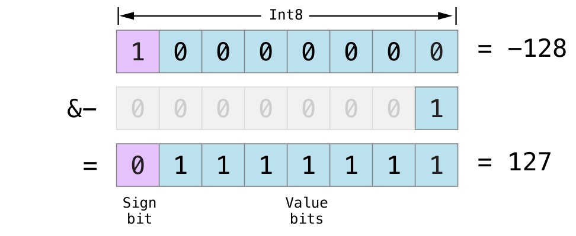

对于无符号与有符号整型数值来说，当出现上溢时，它们会从数值所能容纳的最大数变成最小的数。同样地，当发生下溢时，它们会从所能容纳的最小数变成最大的数。

## 优先级和结合性

运算符的_优先级_使得一些运算符优先于其他运算符，高优先级的运算符会先被计算。

_结合性_定义了具有相同优先级的运算符是如何结合（或关联）的 —— 是与左边结合为一组，还是与右边结合为一组。可以这样理解：“它们是与左边的表达式结合的”或者“它们是与右边的表达式结合的”。

在复合表达式的运算顺序中，运算符的优先级和结合性是非常重要的。举例来说，为什么下面这个表达式的运算结果是 17 。

```
2 + 3 % 4 * 5
// this equals 17
```

如果严格地从左到右进行运算，则运算的过程是这样的：

- 2 + 3 = 5
- 5 % 4 = 1
- 1 \* 5 = 5

然而正确的答案是 17 ，而不是5 。优先级高的运算符要先于优先级低的运算符进行计算。与 C 语言类似，在 Swift 中，取余运算符（% ）和乘法运算符（\* ）的优先级高于加法运算符（+ ）。因此，它们的计算顺序要先于加法运算。

但是，取余和乘法具有相同的优先级。这时为了得到正确的运算顺序，还需要考虑结合性，乘法与取余运算都是左结合的。可以将这考虑成为这两部分表达式都隐式地加上了括号：

```
2 + ((3 % 4) * 5)
```

(3 % 4)  是 3 ，所以表达式等价于：

```
2 + (3 * 5)
```

(3 \* 5)  是 15 ，所以表达式等价于：

```
2 + 15
```

此时可以容易地看出计算的结果为 17 。

如果想查看完整的 Swift 运算符优先级和结合性规则，请参考[表达式](https://developer.apple.com/library/ios/documentation/Swift/Conceptual/Swift_Programming_Language/Expressions.html#//apple_ref/doc/uid/TP40014097-CH32-ID383)。以及 [Swift 标准库中的运算符](https://developer.apple.com/library/ios/documentation/Swift/Reference/Swift_StandardLibrary_Operators/index.html#//apple_ref/doc/uid/TP40016054)。

> 注意
> 
> 对于 C 和 Objective-C 来说，Swift 的运算符优先级和结合性规则是更加简洁和可预测的。但是，这也意味着它们于那些基于 C 的语言不是完全一致的。在对现有的代码进行移植的时候，要注意确保运算符的行为仍然是按照你所想的那样去执行。

## 运算符方法

类和结构体可以为现有的运算符提供自定义的实现，这通常被称为运算符重载。

下面的例子展示了如何为自定义的结构实现加法运算符(+ )。算术加法运算符是一个二元运算符，因为它可以对两个目标进行操作，同时它还是_中缀_运算符，因为它出现在两个目标中间。

例子中定义了一个名为 Vector2D  的结构体用来表示二维坐标向量(x, y) ，紧接着定义了一个可以对两个 Vector2D  结构体进行相加的_运算符方法_：

```
struct Vector2D {
    var x = 0.0, y = 0.0
}
 
extension Vector2D {
    static func + (left: Vector2D, right: Vector2D) -> Vector2D {
        return Vector2D(x: left.x + right.x, y: left.y + right.y)
    }
}
```

该运算符函数被定义为一个全局函数，并且函数的名字与它要进行重载的 +  名字一致。因为算术加法运算符是双目运算符，所以这个运算符函数接收两个类型为 Vector2D  的输入参数，同时有一个 Vector2D  类型的返回值。

在这个实现中，输入参数分别被命名为 left  和 right ，代表在 +  运算符左边和右边的两个 Vector2D  对象。函数返回了一个新的 Vector2D 的对象，这个对象的 x  和 y  分别等于两个参数对象的 x  和 y  的值之和。

这个函数被定义成全局的，而不是 Vector2D  结构的成员方法，所以任意两个 Vector2D  对象都可以使用这个中缀运算符：

```
let vector = Vector2D(x: 3.0, y: 1.0)
let anotherVector = Vector2D(x: 2.0, y: 4.0)
let combinedVector = vector + anotherVector
// combinedVector is a Vector2D instance with values of (5.0, 5.0)
```

这个例子实现两个向量 (3.0，1.0)  和 (2.0，4.0)  的相加，并得到新的向量 (5.0，5.0) 。这个过程如下图示：

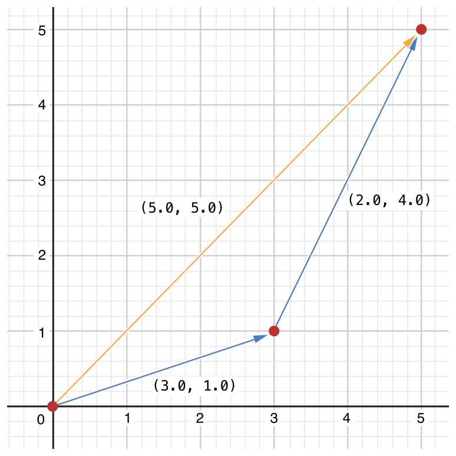

### 前缀和后缀运算符

上个例子演示了一个二元中缀运算符的自定义实现。类与结构体也能提供标准_一元运算符_的实现。单目运算符只有一个操作目标。当运算符出现在目标之前，它就是_前缀_(比如 \-a )，当它出现在操作目标之后时，它就是_后缀_运算符(比如 b! )。

要实现前缀或者后缀运算符，需要在声明运算符函数的时候在 func  关键字之前指定 prefix  或者 postfix  限定符：

```
extension Vector2D {
    static prefix func - (vector: Vector2D) -> Vector2D {
        return Vector2D(x: -vector.x, y: -vector.y)
    }
}
```

这段代码为 Vector2D  类型实现了单目减运算符（\-a ）。由于单目减运算符是前缀运算符，所以这个函数需要加上 prefix  限定符。

对于简单数值，单目减运算符可以对它们的正负性进行改变。对于 Vector2D  来说，单目减运算将其 x  和 y  属性的正负性都进行了改变。

```
let positive = Vector2D(x: 3.0, y: 4.0)
let negative = -positive
// negative is a Vector2D instance with values of (-3.0, -4.0)
let alsoPositive = -negative
// alsoPositive is a Vector2D instance with values of (3.0, 4.0)

```

### 组合赋值运算符

_组合赋值运算符_将赋值运算符(\= )与其它运算符进行结合。比如，将加法与赋值结合成加法赋值运算符（+= ）。在实现的时候，需要把运算符的左参数设置成 inout  类型，因为这个参数的值会在运算符函数内直接被修改。

下面的例子实现了一个Vector2D 的加赋值运算符：

```
extension Vector2D {
    static func += (left: inout Vector2D, right: Vector2D) {
        left = left + right
    }
}
```

因为加法运算在之前已经定义过了，所以在这里无需重新定义。在这里可以直接利用现有的加法运算符函数，用它来对左值和右值进行相加，并再次赋值给左值：

```
var original = Vector2D(x: 1.0, y: 2.0)
let vectorToAdd = Vector2D(x: 3.0, y: 4.0)
original += vectorToAdd
// original now has values of (4.0, 6.0)
```

> 注意
> 
> 不能对默认的赋值运算符（\= ）进行重载。只有组合赋值运算符可以被重载。同样地，也无法对三元条件运算符a ? b : c  进行重载.

### 等价运算符

自定义类和结构体不接收_等价运算符_的默认实现，也就是所谓的“等于”运算符（\== ）和“不等于”运算符（!= ）。

要使用等价运算符来检查你自己类型的等价，需要和其他中缀运算符一样提供一个“等于”运算符，并且遵循标准库的Equatable 协议：

```
extension Vector2D: Equatable {
    static func == (left: Vector2D, right: Vector2D) -> Bool {
        return (left.x == right.x) && (left.y == right.y)
    }
}
```

上面的例子实现了一个“等于”运算符（\== ）来检查两个Vector2D 实例是否拥有相同的值。在Vector2D 上下文中，“等于”作为“两个实例都具有相同的x 值和y 值”是有意义的，因此这个逻辑用作运算符的实现。标准库提供了一个关于“不等于”运算符（!= ）的默认实现，它仅仅返回“等于”运算符的相反值。

现在你就可以用这些运算符来检查Vector2D 实例是否等价了：

```
let twoThree = Vector2D(x: 2.0, y: 3.0)
let anotherTwoThree = Vector2D(x: 2.0, y: 3.0)
if twoThree == anotherTwoThree {
    print("These two vectors are equivalent.")
}
// Prints "These two vectors are equivalent."
```

Swift 为以下自定义类型提等价运算符供合成实现：

- 只拥有遵循Equatable 协议存储属性的结构体；
- 只拥有遵循Equatable 协议关联类型的枚举；
- 没有关联类型的枚举。

在类型原本的声明中声明遵循Equatable 来接收这些默认实现。

下面为三维位置向量(x, y, z) 定义的Vector3D 结构体，与Vector2D 类似，由于x ，y 和z 属性都是Equatable 类型，Vector3D 就收到默认的等价运算符实现了。

```
struct Vector3D: Equatable {
    var x = 0.0, y = 0.0, z = 0.0
}
 
let twoThreeFour = Vector3D(x: 2.0, y: 3.0, z: 4.0)
let anotherTwoThreeFour = Vector3D(x: 2.0, y: 3.0, z: 4.0)
if twoThreeFour == anotherTwoThreeFour {
    print("These two vectors are also equivalent.")
}
// Prints "These two vectors are also equivalent."

```

## 自定义运算符

除了实现标准运算符，在 Swift 当中还可以声明和实现自定义运算符（custom operators）。可以用来自定义运算符的字符列表请参考运算符

新的运算符要在全局作用域内，使用 operator  关键字进行声明，同时还要指定 prefix 、infix  或者 postfix  限定符：

```
prefix operator +++ {}
```

上面的代码定义了一个新的名为 +++  的前缀运算符。这个运算符在 Swift 中并没有意义，我们针对 Vector2D  的实例来赋予它意义。对这个例子来讲，+++  作为“前缀翻倍”运算符。它让 Vector2D  实例的 x  属性和 y  属性的值翻倍，使用前面定义的复合加法运算符来让向量对自身进行相加。要实现+++运算符，添加一个叫做+++ 的类型方法到Vector2D ：

```
extension Vector2D {
    static prefix func +++ (vector: inout Vector2D) -> Vector2D {
        vector += vector
        return vector
    }
}
 
var toBeDoubled = Vector2D(x: 1.0, y: 4.0)
let afterDoubling = +++toBeDoubled
// toBeDoubled now has values of (2.0, 8.0)
// afterDoubling also has values of (2.0, 8.0)

```

### 自定义中缀运算符的优先级和结合性

自定义的中缀（infix ）运算符也可以指定优先级和结合性。[优先级和结合性](https://developer.apple.com/library/ios/documentation/Swift/Conceptual/Swift_Programming_Language/AdvancedOperators.html#//apple_ref/doc/uid/TP40014097-CH27-ID41)中详细阐述了这两个特性是如何对中缀运算符的运算产生影响的。

结合性（associativity ）可取的值有 left ，right  和 none 。当左结合运算符跟其他相同优先级的左结合运算符写在一起时，会跟左边的操作数进行结合。同理，当右结合运算符跟其他相同优先级的右结合运算符写在一起时，会跟右边的操作数进行结合。而非结合运算符不能跟其他相同优先级的运算符写在一起。

associativity 的默认值是 none ，precedence 默认为 100 。

下面例子定义了一个新的自定义中缀运算符 +- ，此运算符是left 结合的，优先级为 140 ：

```
infix operator +- { associativity left precedence 140 }
extension Vector2D {
    static func +- (left: Vector2D, right: Vector2D) -> Vector2D {
        return Vector2D(x: left.x + right.x, y: left.y - right.y)
    }
}
let firstVector = Vector2D(x: 1.0, y: 2.0)
let secondVector = Vector2D(x: 3.0, y: 4.0)
let plusMinusVector = firstVector +- secondVector
// plusMinusVector is a Vector2D instance with values of (4.0, -2.0)
```

这个运算符把两个向量的x  值相加，同时用第一个向量的 y  值减去第二个向量的 y  值。因为它本质上是属于“加”运算符，所以将它的结合性和优先级被设置与 +  和 \-  等默认的中缀加型运算符是相同的（left  和 140 ）。完整的 Swift 运算符默认结合性与优先级请参考[Swift 标准库运算符引用](https://developer.apple.com/library/ios/documentation/Swift/Reference/Swift_StandardLibrary_Operators/index.html#//apple_ref/doc/uid/TP40016054)。

> 注意
> 
> 当定义前缀与后缀运算符的时候，我们并没有指定优先级。然而，如果对同一个操作数同时使用前缀与后缀运算符，则后缀运算符会先被应用。

## 结果建造器

_结果建造器_是你定义的为创建内嵌数据添加语法的类型，就像列表或者树，只不过是以自然，声明式的方法实现。使用结果建造器的代码可以包含普通 Swift 语法，比如 if  和 for ，用以处理有条件或需要重复的数据。

下面的代码声明了一些用星号或文本绘制线条的类型。

```
protocol Drawable {
    func draw() -> String
}
struct Line: Drawable {
    var elements: [Drawable]
    func draw() -> String {
        return elements.map { $0.draw() }.joined(separator: "")
    }
}
struct Text: Drawable {
    var content: String
    init(_ content: String) { self.content = content }
    func draw() -> String { return content }
}
struct Space: Drawable {
    func draw() -> String { return " " }
}
struct Stars: Drawable {
    var length: Int
    func draw() -> String { return String(repeating: "*", count: length) }
}
struct AllCaps: Drawable {
    var content: Drawable
    func draw() -> String { return content.draw().uppercased() }
}

```

Drawable 协议定义了可以被绘制的需求，比如线条或者形状：类型必须实现draw() 方法。Line 结构体表示了一条线的绘制，并且它会作为大多数绘制的顶层容器。要绘制一条Line ，结构体会调用每一条线的组件，然后串联所有结果到一个字符串中。Text 结构体包装了一个字符串作为绘制的一部分。AllCaps 结构体包装并修饰其他绘制过程，把所有绘制过程中的文字转为大写。

这就使得通过调用这些类型的初始化器完成绘制成为可能：

```
let name: String? = "Ravi Patel"
let manualDrawing = Line(elements: [
    Stars(length: 3),
    Text("Hello"),
    Space(),
    AllCaps(content: Text((name ?? "World") + "!")),
    Stars(length: 2),
    ])
print(manualDrawing.draw())
// Prints "***Hello RAVI PATEL!**"
```

这个代码能用，但就是有点尴尬。AllCaps 后边过多嵌入的括号导致阅读困难。当name 是nil 时使用“World”作为备用的逻辑使用了行内?? 运算符，这就导致代码更加复杂难懂。如果你需要使用switch 或者for 循环来建造部分绘制过程，这个代码是不能实现的。使用结果建造器能允许你重构这样的代码，让它看起来更像普通 Swift 代码。

要定义一个结果建造器，用@resultBuilder 特性修饰类型声明。比如，这段代码定义了一个叫做DrawingBuilder 的结果建造器，它允许你使用声明式语法描述绘制过程：

```
@resultBuilder
struct DrawingBuilder {
    static func buildBlock(_ components: Drawable...) -> Drawable {
        return Line(elements: components)
    }
    static func buildEither(first: Drawable) -> Drawable {
        return first
    }
    static func buildEither(second: Drawable) -> Drawable {
        return second
    }
}
```

DrawingBuilder 结构体定义了三个实现了部分结果建造器语法的方法。buildBlock(\_:) 方法添加了对一个代码块写多行的支持。它把代码块中的各种组件组合到一个Line 中。buildEither(first:) 和buildEither(second:) 方法则提供了if-else 支持。

你可以给函数的形式参数添加@DrawingBuilding ，它能把闯入函数的闭包转换成结果建造器用这个闭包创建的值。比如说：

```
func draw(@DrawingBuilder content: () -> Drawable) -> Drawable {
    return content()
}
func caps(@DrawingBuilder content: () -> Drawable) -> Drawable {
    return AllCaps(content: content())
}

func makeGreeting(for name: String? = nil) -> Drawable {
    let greeting = draw {
        Stars(length: 3)
        Text("Hello")
        Space()
        caps {
            if let name = name {
                Text(name + "!")
            } else {
                Text("World!")
            }
        }
        Stars(length: 2)
    }
    return greeting
}
let genericGreeting = makeGreeting()
print(genericGreeting.draw())
// Prints "***Hello WORLD!**"

let personalGreeting = makeGreeting(for: "Ravi Patel")
print(personalGreeting.draw())
// Prints "***Hello RAVI PATEL!**"
```

makeGreeting(for:) 函数接收一个name 形式参数并用它来绘制个性化的问候语。draw(\_:) 和caps(\_:) 函数都接受单一闭包作为它们的实际参数，使用@DrawingBuilder 特性进行标记。当你调用这些函数时，你就使用了DrawingBuilder 定义的特殊语法。Swift 会把这些以函数形式参数传递的绘制过程的声明式描述转换为一系列的DrawingBuilder 方法调用来建造值。比如说，Swift 把上面例子中caps(\_:) 的调用转换为下面代码中的样子：

```
let capsDrawing = caps {
    let partialDrawing: Drawable
    if let name = name {
        let text = Text(name + "!")
        partialDrawing = DrawingBuilder.buildEither(first: text)
    } else {
        let text = Text("World!")
        partialDrawing = DrawingBuilder.buildEither(second: text)
    }
    return partialDrawing
}
```

Swift 会把if-else 代码块转换为buildEither(first:) 和buildEither(second:) 的方法调用。尽管你不需要在你自己的代码中调用这些方法，展示转换后的结果能让你更容易地理解当你使用DrawingBuilder 语法时 Swift 是如何转换你的代码的。

为了在特殊绘制语法中支持for 循环，添加一个buildArray(\_:) 方法。

```
extension DrawingBuilder {
    static func buildArray(_ components: [Drawable]) -> Drawable {
        return Line(elements: components)
    }
}
let manyStars = draw {
    Text("Stars:")
    for length in 1...3 {
        Space()
        Stars(length: length)
    }
}
```

上面的代码中，for 循环创建了一个绘制过程的数组，buildArray(\_:) 方法将这个数组转换成Line 。

要了解 Swift 如何转换建造语法到建造器类型方法的完整列表，见[resultBuilder](https://www.cnswift.org/attributes#resultBuilder)。
