Swift 使用_自动引用计数_(ARC)机制来追踪和管理你的 App 的内存。在大多数情况下，这意味着 Swift 的内存管理机制会一直起作用，你不需要自己考虑内存管理。当这些实例不在需要时，ARC会自动释放类实例所占用的内存。

总之，在少数情况下，为了能帮助你管理内存，ARC需要更多关于你代码之间的关系信息。本章描述了这些情况并向你展示如何启用ARC来管理你 App 的内存。在 Swift 中使用 ARC 与_[Transitioning to ARC Release Notes](https://developer.apple.com/library/prerelease/content/releasenotes/ObjectiveC/RN-TransitioningToARC/Introduction/Introduction.html#//apple_ref/doc/uid/TP40011226)_ 中描述的在 Objective-C 中使用 ARC 十分相似。

> 注意
> 
> 引用计数只应用于类的实例。结构体和枚举是值类型，不是引用类型，没有通过引用存储和传递。

## ARC的工作机制

每次你创建一个类的实例，ARC 会分配一大块内存来存储这个实例的信息。这些内存中保留有实例的类型信息，以及该实例所有存储属性值的信息。

此外，当实例不需要时，ARC 会释放该实例所占用的内存，释放的内存用于其他用途。这确保类实例当它不在需要时，不会一直占用内存。

然而，如果 ARC 释放了正在使用的实例内存，那么它将不会访问实例的属性，或者调用实例的方法。确实，如果你试图访问该实例，你的app很可能会崩溃。

为了确保使用中的实例不会消失，ARC 会跟踪和计算当前实例被多少属性，常量和变量所引用。只要存在对该类实例的引用，ARC 将不会释放该实例。

为了使这些成为可能，无论你将实例分配给属性，常量或变量，它们都会创建该实例的_强引用_。之所以称之为“强”引用，是因为它会将实例保持住，只要强引用还在，实例是不允许被销毁的。

## ARC

下面的例子展示了自动引用计数的工作机制。这个例子由一个简单的Person 类开始，定义了一个名为name 的存储常量属性:

```
class Person {
    let name: String
    init(name: String) {
        self.name = name
        print("\(name) is being initialized")
    }
    deinit {
        print("\(name) is being deinitialized")
    }
}
```

Person 类有一个初始化器，它设置了实例的name 属性并且输出一条信息表明初始化器生效。Person 类也有一个反初始化器，会在类的实例被销毁的时候打印一条信息。

下面的代码片段定义了三个Peroson? 类型的变量，用来按照代码中的顺序，为新的Person 实例设置多个引用。由于可选类型的变量会被自动初始化为一个nil 值，目前还不会引用到Person 类的实例。

```
var reference1: Person?
var reference2: Person?
var reference3: Person?
```

你可以创建一个新的Person 实例并且将它赋值给三个变量中的一个：

```
reference1 = Person(name: "John Appleseed")
// prints "John Appleseed is being initialized"
```

注意，当调用person 类的出初始化器的时候，会输出"John Appleseed is being initialized" 信息。这就说明初始化执行了。

因为Person 实例已经赋值给了reference1 变量，现在就有了一个从reference1 到该实例的强引用。因为至少有一个强引用，ARC可以确保Person 一直保持在内存中不被销毁。

如果你将同一个Person 实例分配给了两个变量，则该实例又会多出两个强引用：

```
reference2 = reference1
reference3 = reference1
```

现在这一个Person 实例就有了三个强引用。

如果你通过给其中两个变量赋值nil 的方式断开两个强引用（包括最先的那个强引用），只留下一个强引用，Person 实例不会被销毁：

```
reference1 = nil
reference2 = nil
```

在你清楚地表明不再使用这个Person 实例时，直到第三个也就是最后一个强引用被断开时 ARC 会销毁它。

```
reference3 = nil
// prints "John Appleseed is being deinitialized"
```

## 类实例之间的循环强引用

在上面的例子中，ARC 能够追踪你所创建的Person 实例的引用数量，并且会在Person 实例不在使用时销毁。

总之，写出某个类_永远_不会变成零强引用的代码是可能的。如果两个类实例彼此持有对方的强引用，因而每个实例都让对方一直存在，就会发生这种情况。这就是所谓的循环_强引用_。

解决循环强引用问题，可以通过定义类之间的关系为弱引用(weak )或无主引用(unowned )来代替强引用。这个过程在[解决类实例之间的循环强引用](#spl-3)中有描述。总之，在你学习如何解决循环强引用问题前，了解一下它是如何产生的也是很有意义的事情。

下面的例子展示了一个如何意外地创建循环强引用的例子。这个例子定义了两个类，分别是Person 和Apartment ，用来建模公寓和它其中的居民：

```
class Person {
    let name: String
    init(name: String) { self.name = name }
    var apartment: Apartment?
    deinit { print("\(name) is being deinitialized") }
}
 
class Apartment {
    let unit: String
    init(unit: String) { self.unit = unit }
    var tenant: Person?
    deinit { print("Apartment \(unit) is being deinitialized") }
}
```

每一个Person 实例有一个类型为String ，名字为name 的属性，并有一个可选的初始化为nil 的apartment 属性。apartment 属性是可选项，因为一个人并不总是拥有公寓。

类似的，每个Apartment 实例都有一个叫unit ，类型为String 的属性，并有一个可选的初始化为nil 的tenant 属性。tenant 属性是可选的，因为一栋公寓并不总是有居民。

这两个类都定义了反初始化器，用以在类实例被反初始化时输出信息。这让你能够知晓Person 和Apartment 的实例是否像预期的那样被释放。

接下来的代码片段定义了两个可选项变量john 和unit4A ，它们分别被赋值为下面的Apartment 和Person 的实例。这两个变量都被初始化为nil ，这正是可选项的优点：

```
var john: Person?
var unit4A: Apartment?
```

现在你可以创建特定的Person 和Apartment 实例并将其赋值给john 和unit4A 变量：

```
john = Person(name: "John Appleseed")
unit4A = Apartment(unit: "4A")
```

在两个实例的强引用创建和分配之后，下图表现了强引用的关系。John 变量对Person 实例有一个强引用，unit4A 变量对Apartment 实例有一个强引用:

[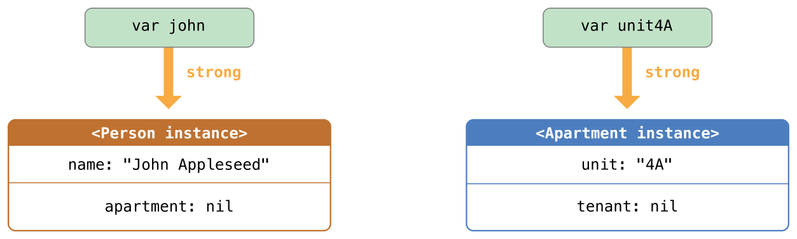](https://www.logcg.com/wp-content/uploads/2015/12/referenceCycle01_2x.png)

现在你就可以把这两个实例关联在一起，这样人就有公寓了，而且公寓有房间号。注意，感叹号(! )是用来展开和访问可选变量john 和unit4A 里的实例的，所以这些实例的属性可以设置：

```
john!.apartment = unit4A
unit4A!.tenant = john
```

在将两个实例联系在一起之后，强引用的关系如图所示：

[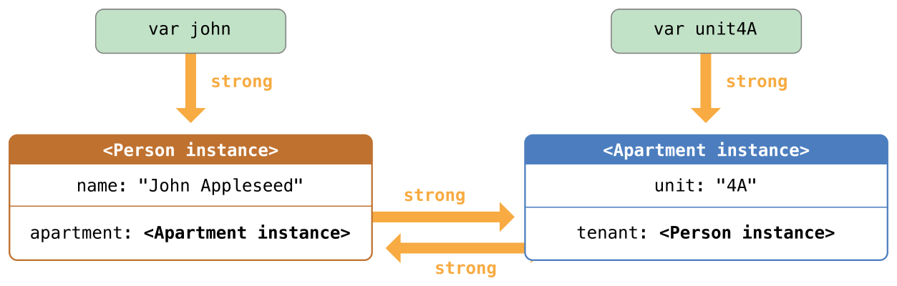](https://www.logcg.com/wp-content/uploads/2015/12/referenceCycle02_2x.png)

不幸的是，这两个实例关联后会产生一个循环强引用。Person 实例现在有了一个指向Apartment 实例的强引用，而Apartment 实例也有了一个指向Person 实例的强引用。因此，当你断开john 和unit4A 变量所持有的强引用时，引用计数并不会降零，实例也不会被 ARC 释放：

```
john = nil
unit4A = nil
```

注意，当你把这两个变量设为nil 时，没有任何一个反初始化器被调用。循环强引用会一直阻止Person 和Apartment 类实例的释放，这就在你的应用程序中造成了内存泄漏。 在你将john 和unit4A 赋值为nil 后，强引用关系如下图：

[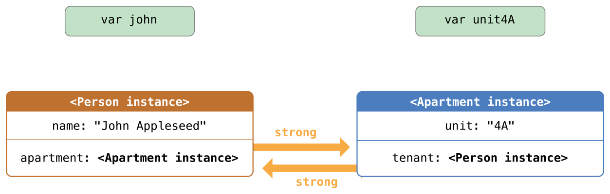](https://www.logcg.com/wp-content/uploads/2015/12/referenceCycle03_2x.png)

Person 和Apartment 实例之间的强引用关系保留了下来并且不会被断开。

## 解决实例之间的循环强引用

Swift 提供了两种办法用来解决你在使用类的属性时所遇到的循环强引用问题：弱引用（weak reference ）和无主引用（unowned reference )。

弱引用和无主引用允许循环引用中的一个实例引用另外一个实例而_不_保持强引用。这样实例能够互相引用而不产生循环强引用。

对于生命周期中会变为nil 的实例使用弱引用。相反，对于初始化赋值后再也不会被赋值为nil 的实例，使用无主引用。在实例的生命周期中，当引用可能“没有值”的时候，就使用弱引用来避免循环引用。如同在[无主引用](#spl-5)中描述的那样，如果引用_始终_有值，则可以使用无主引用来代替。上面的Apartment 例子中，在它的声明周期中，有时是"没有居民"的，因此适合使用弱引用来解决循环强引用。

### 弱引用

_弱引用_不会对其引用的实例保持强引用，因而不会阻止 ARC 释放被引用的实例。这个特性阻止了引用变为循环强引用。声明属性或者变量时，在前面加上weak 关键字表明这是一个弱引用。

由于弱引用不会强保持对实例的引用，所以说实例被释放了弱引用仍旧引用着这个实例也是有可能的。因此，ARC 会在被引用的实例被释放是自动地设置弱引用为nil 。由于弱引用需要允许它们的值为nil ，它们一定得是可选类型。

你可以检查弱引用的值是否存在，就像其他可选项的值一样，并且你将永远不会遇到“野指针”。

 

> 注意
> 
> 在 ARC 给弱引用设置nil 时不会调用属性观察者。

下面的例子跟上面Person 和Apartment 的例子一致，但是有一个重要的区别。这次，Apartment 的tenant 属性被声明为弱引用：

```
class Person {
    let name: String
    init(name: String) { self.name = name }
    var apartment: Apartment?
    deinit { print("\(name) is being deinitialized") }
}
 
class Apartment {
    let unit: String
    init(unit: String) { self.unit = unit }
    weak var tenant: Person?
    deinit { print("Apartment \(unit) is being deinitialized") }
}
```

两个变量（john 和unit4A ）之间的强引用和关联创建得与上次相同：

```
var john: Person?
var unit4A: Apartment?
 
john = Person(name: "John Appleseed")
unit4A = Apartment(unit: "4A")
 
john!.apartment = unit4A
unit4A!.tenant = john
```

现在，两个关联在一起的实例的引用关系如下图所示：

[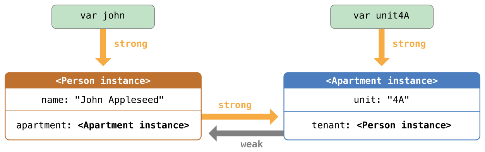](https://www.logcg.com/wp-content/uploads/2015/12/weakReference01_2x.png)

Person 实例依然保持对Apartment 实例的强引用，但是Apartment 实例现在对Person 实例是_弱_引用。这意味着当你断开john 变量所保持的强引用时，再也没有指向Person 实例的强引用了，由于再也没有指向Person 实例的强引用，该实例会被释放：

```
john = nil
// prints "John Appleseed is being deinitialized"
```

由于再也没有强引用到Person 它被释放掉了并且tenant 属性被设置为nil ：

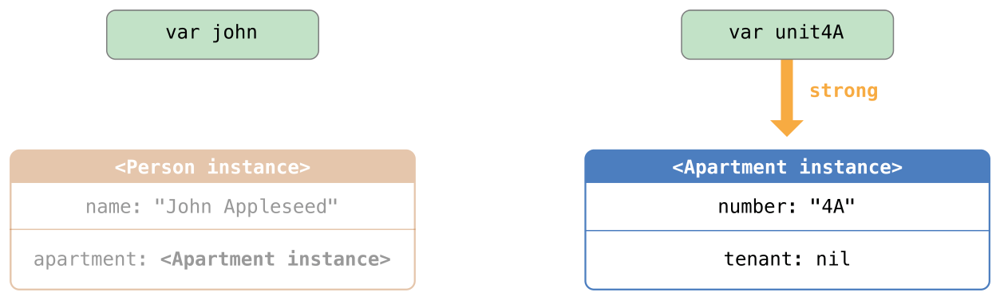

 

现在只剩下来自unit4A 变量对Apartment 实例的强引用。如果你打断_这个_强引用，那么Apartment 实例就再也没有强引用了：

```
unit4A = nil
// prints "Apartment 4A is being deinitialized"
```

由于再也没有指向Apartment 实例的强引用，该实例也会被释放：

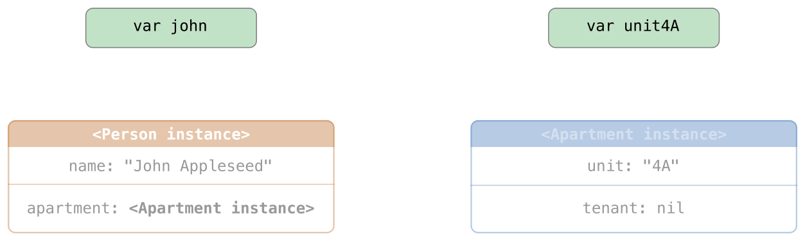

> 注意
> 
> 在使用垃圾回收机制的系统中，由于没有强引用的对象会在内存有压力时触发垃圾回收而被释放，弱指针有时用来实现简单的缓存机制。总之，对于 ARC 来说，一旦最后的强引用被移除，值就会被释放，这样的话弱引用就不再适合这类用法了。

### 无主引用

和弱引用类似，_无主引用_不会牢牢保持住引用的实例。但是不像弱引用，总之，无主引用假定是_永远_有值的。因此，无主引用总是被定义为非可选类型。你可以在声明属性或者变量时，在前面加上关键字unowned 表示这是一个无主引用。

由于无主引用是非可选类型，你不需要在使用它的时候将它展开。无主引用总是可以直接访问。不过 ARC 无法在实例被释放后将无主引用设为nil ，因为非可选类型的变量不允许被赋值为nil 。

> 注意
> 
> 如果你试图在实例的被释放后访问无主引用，那么你将触发运行时错误。只有在你确保引用会_一直_引用实例的时候才使用无主引用。
> 
> 还要注意的是，如果你试图访问引用的实例已经被释放了的无主引用，Swift 会确保程序直接崩溃。你不会因此而遭遇无法预期的行为。所以你应当避免这样的事情发生。

下面的例子定义了两个类，Customer 和CreditCard ，模拟了银行客户和客户的信用卡。这两个类中，每一个都将另外一个类的实例作为自身的属性。这种关系可能会造成循环强引用。

Customer 和CreditCard 之间的关系与前面弱引用例子中Apartment 和Person 的关系略微不同。在这个数据模型中，一个客户可能有或者没有信用卡，但是一张信用卡总是关联着一个客户。为了表示这种关系，Customer 类有一个可选类型的card 属性，但是CreditCard 类有一个非可选类型的customer 属性。

另外，新的CreditCard 实例只有通过传送number 值和一个customer 实例到CreditCard 的初始化器才能创建。这就确保了CreditCard 实例在创建时总是有与之关联的customer 实例。

由于信用卡总是关联着一个客户，因此将customer 属性定义为无主引用，以避免循环强引用：

```
class Customer {
    let name: String
    var card: CreditCard?
    init(name: String) {
        self.name = name
    }
    deinit { print("\(name) is being deinitialized") }
}
 
class CreditCard {
    let number: UInt64
    unowned let customer: Customer
    init(number: UInt64, customer: Customer) {
        self.number = number
        self.customer = customer
    }
    deinit { print("Card #\(number) is being deinitialized") }
}
```

> 注意: CreditCard 类的number 属性定义为UInt64 类型而不是Int ，以确保number 属性的存储量在32位和64位系统上都能足够容纳16位的卡号。

下面的代码片段定义了一个叫john 的可选Customer 变量，用来保存某个特定客户的引用。由于是可选项，所以变量被初始化为nil 。

```
var john: Customer?
```

现在你可以创建一个Customer 实例，用它初始化和分配一个新的CreditCard 实例作为customer 的card 属性：

```
john = Customer(name: "John Appleseed")
john!.card = CreditCard(number: 1234_5678_9012_3456， customer: john!)
```

如下图，是你关联了两个实例后的图示关系:

[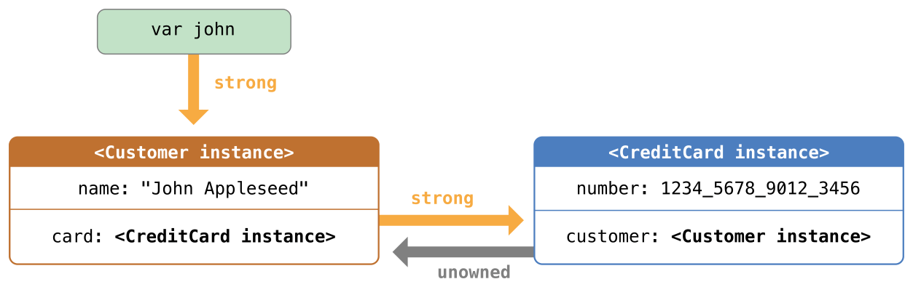](https://www.logcg.com/wp-content/uploads/2015/12/unownedReference01_2x.png)

现在Customer 实例对CreditCard 实例有一个强引用，并且CreditCard 实例对Customer 实例有一个无主引用。

由于Customer 的无主引用，当你断开john 变量持有的强引用时，那么就再也没有指向Customer 实例的强引用了。

[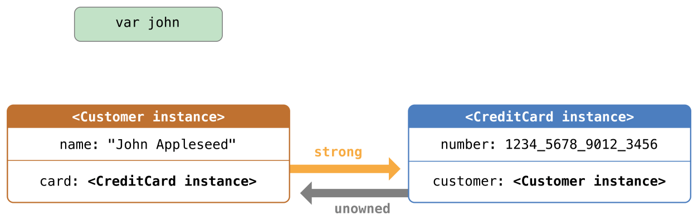](https://www.logcg.com/wp-content/uploads/2015/12/unownedReference02_2x.png)

因为不再有Customer 的强引用，该实例被释放了。其后，再也没有指向CreditCard 实例的强引用，该实例也随之被释放了：

```
john = nil
// prints "John Appleseed is being deinitialized"
// prints "Card #1234567890123456 is being deinitialized"
```

最后的代码片段展示了在john 变量被设为nil 后Customer 实例和CreditCard 实例的反初始化器都打印出了“被释放”的信息。

> 注意
> 
> 上边的例子展示了如何使用_安全_无主引用。Swift 还为你需要关闭运行时安全检查的情况提供了_不安全_无主引用——举例来说，性能优化的时候。对于所有的不安全操作，你要自己负责检查代码安全性。
> 
> 使用unowned(unsafe) 来明确使用了一个不安全无主引用。如果你在实例的引用被释放后访问这个不安全无主引用，你的程序就会尝试访问这个实例曾今存在过的内存地址，这就是不安全操作。

### 无主可选引用

你可以给类标记可选引用来作为无主引用。从 ARC 所有权模型角度来看，无主可选引用和弱引用可在同一个上下文中使用。区别在于使用无主可选引用时，你需要负责保证它总引用到一个合法对象或nil 。

这里有一个例子，它追踪学校特定部门提供的课程：

```
class Department {
    var name: String
    var courses: [Course]
    init(name: String) {
        self.name = name
        self.courses = []
    }
}

class Course {
    var name: String
    unowned var department: Department
    unowned var nextCourse: Course?
    init(name: String, in department: Department) {
        self.name = name
        self.department = department
        self.nextCourse = nil
    }
}
```

Department 维护了部门提供的每一门课程的强引用。在 ARC 所有权模型中，部门拥有它的课程。Course 有两个无主引用，一个是到部门，另一个是下一门学生要上的课程；课程并不拥有这些对象。每一门课程都是某些部门的一部分，所以department 不是可选的。总之，由于某些课程并不包含推荐的后续课程，nextCourse 是可选的。

这里是使用这些类的例子：

```
let department = Department(name: "Horticulture")

let intro = Course(name: "Survey of Plants", in: department)
let intermediate = Course(name: "Growing Common Herbs", in: department)
let advanced = Course(name: "Caring for Tropical Plants", in: department)

intro.nextCourse = intermediate
intermediate.nextCourse = advanced
department.courses = [intro, intermediate, advanced]
```

上面的代码创建了一个部门以及它的三个课程。初级和中级课程都有一个建议的后续课程存放在它们的nextCourse 属性中，它维护了一个无主可选引用，指向了学生在完成本课程后应该继续的课程。

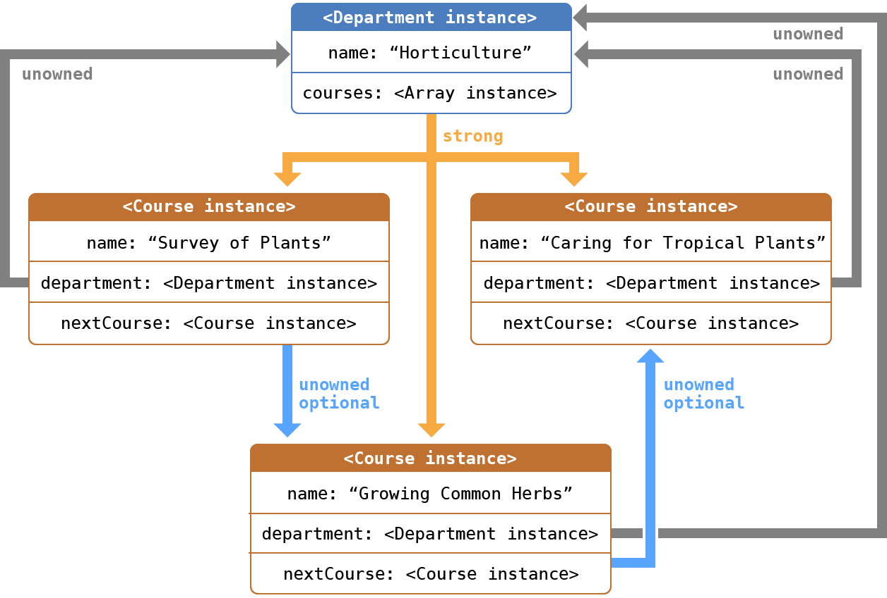

无主可选引用并不保持它包含的对象的强引用，所以它并不会阻止 ARC 释放实例。它的行为和无主引用在 ARC 下一致，除了无主可选引用能是nil 。

类似非可选无主引用，你需要负责保证nextCourse 指向了一个没有被释放的课程，当你从department.courses 删除课程时，你同样需要移除其他课程中可能对这个课程的引用。

> 注意：
> 
> 上述可选值的类型是Optional ，也就是 Swift 标准库中的枚举。总之，可选项是值类型不能被标记为unowned 这个规则中的例外。
> 
> 包裹了类的可选项并不使用引用计数，所以你不需要对可选项维持强引用。

### 无主引用和隐式展开的可选属性

上面弱引用和无主引用例子涵盖了两种常用的需要打破循环强引用的场景。

Person 和Apartment 的例子展示了两个属性的值都允许为nil ，并会潜在的产生循环强引用。这种场景最适合用弱引用来解决。

Customer 和CreditCard 的例子展示了一个属性的值允许为nil ，而另一个属性的值不允许为nil ，这也可能导致循环强引用。这种场景最好使用无主引用来解决。

总之， 还有第三种场景，在这种场景中，两个属性都必须有值，并且初始化完成后永远不会为nil 。在这种场景中，需要一个类使用无主属性，而另外一个类使用隐式展开的可选属性。

一旦初始化完成，这两个属性能被直接访问(不需要可选展开)，同时避免了循环引用。这一节将为你展示如何建立这种关系。

下面的例子定义了两个类，Country 和City ，每个类将另外一个类的实例保存为属性。在这个数据模型中，每个国家必须有首都，每个城市必须属于一个国家。为了实现这种关系，Country 类拥有一个capitalCity 属性，而City 类有一个country 属性：

```
class Country {
    let name: String
    var capitalCity: City!
    init(name: String, capitalName: String) {
        self.name = name
        self.capitalCity = City(name: capitalName, country: self)
    }
}
 
class City {
    let name: String
    unowned let country: Country
    init(name: String, country: Country) {
        self.name = name
        self.country = country
    }
}
```

为了建立两个类的依赖关系，City 的初始化器接收一个Country 实例，并且将实例保存到country 属性。

Country 的初始化器调用了City 的初始化器。总之，如同在[两段式初始化](https://www.cnswift.org/initialization/#spl-17)中描述的那样，只有Country 的实例完全初始化完后，Country 的初始化器才能把self 传给City 的初始化器。

为了满足这种需求，通过在类型结尾处加上感叹号（City! ）的方式，以声明Country 的capitalCity 属性为一个隐式展开的可选属性。如同在[隐式展开可选项](https://www.cnswift.org/the-basics/#spl-21)中描述的那样，这意味着像其他可选项一样，capitalCity 属性有一个默认值nil ，但是不需要展开它的值就能访问它。

由于capitalCity 默认值为nil ，一旦Country 的实例在初始化器中给name 属性赋值后，整个初始化过程就完成了。这意味着一旦name 属性被赋值后，Country 的初始化器就能引用并传递隐式的self 。Country 的初始化器在赋值capitalCity 时，就能将self 作为参数传递给City 的初始化器。

以上的意义在于你可以通过一条语句同时创建Country 和City 的实例，而不产生循环强引用，并且capitalCity 的属性能被直接访问，而不需要通过感叹号来展开它的可选值：

```
var country = Country(name: "Canada", capitalName: "Ottawa")
print("\(country.name)'s capital city is called \(country.capitalCity.name)")
// prints "Canada's capital city is called Ottawa"
```

在上面的例子中，使用隐式展开的可选属性的意义在于满足了两段式类初始化器的需求。capitalCity 属性在初始化完成后，就能像非可选项一样使用和存取同时还避免了循环强引用。

## 闭包的循环强引用

上面我们看到了循环强引用是如何在两个实例属性互相保持对方的强引用时产生的，还知道了如何用弱引用和无主引用来打破这些循环强引用。

循环强引用还会出现在你把一个闭包分配给类实例属性的时候，并且这个闭包中又捕获了这个实例。捕获可能发生于这个闭包函数体中访问了实例的某个属性，比如self.someProperty ，或者这个闭包调用了一个实例的方法，例如self.someMethod() 。这两种情况都导致了闭包 “捕获"了 self ，从而产生了循环强引用。

循环强引用的产生，是因为闭包和类相似，都是_引用类型_。当你把闭包赋值给了一个属性，你实际上是把一个_引用_赋值给了这个闭包。实质上，这跟之前上面的问题是一样的——两个强引用让彼此一直有效。总之，和两个类实例不同，这次一个是类实例和一个闭包互相引用。

Swift 提供了一种优雅的方法来解决这个问题，称之为_闭包捕获列表_（closuer capture list ）。不过，在学习如何用闭包捕获列表打破循环强引用之前，我们还是先来了解一下这个循环强引用是如何产生的，这对我们很有帮助。

下面的例子为你展示了当一个闭包引用了self 后是如何产生一个循环强引用的。例子中定义了一个叫HTMLElement 的类，用一种简单的模型表示 HTML 中的一个单独的元素：

```
class HTMLElement {
    
    let name: String
    let text: String?
    
    lazy var asHTML: () -> String = {
        if let text = self.text {
            return "<\(self.name)>\(text)</\(self.name)>"
        } else {
            return "<\(self.name) />"
        }
    }
    
    init(name: String, text: String? = nil) {
        self.name = name
        self.text = text
    }
    
    deinit {
        print("\(name) is being deinitialized")
    }
    
}
```

HTMLElement 类定义了一个name 属性来表示这个元素的名称，例如表示标题元素的"h1" 、代表段落元素的"p" 、或者代表换行元素的"br" 。HTMLElement 还定义了一个可选的属性text ，它可以用来设置和展现 HTML  元素的文本。

除了上面的两个属性，HTMLElement 还定义了一个lazy 属性asHTML 。这个属性引用了一个将name 和text 组合成 HTML  字符串片段的闭包。该属性是Void -> String 类型，或者可以理解为“一个没有参数，但返回String 的函数”。

默认情况下，闭包赋值给了asHTML 属性，这个闭包返回一个代表HTML 标签的字符串。如果text 值存在，该标签就包含可选值text ；如果text 不存在，该标签就不包含文本。对于段落元素，根据text 是"some text" 还是nil ，闭包会返回"<p>some text</p>" 或者"<p />" 。

可以像实例方法那样去命名、使用asHTML 属性。总之，由于asHTML 是闭包而不是实例方法，如果你想改变特定元素的HTML 处理的话，可以用自定义的闭包来取代默认值。

```
let heading = HTMLElement(name: "h1")
let defaultText = "some default text"
heading.asHTML = {
    return "<\(heading.name)>\(heading.text ?? defaultText)</\(heading.name)>"
}
print(heading.asHTML())
// prints "<h1>some default text</h1>"
```

> 注意: asHTML 声明为lazy 属性，因为只有当元素确实需要处理为HTML 输出的字符串时，才需要使用asHTML 。实际上asHTML 是延迟加载属性意味着你在默认的闭包中可以使用self ，因为只有当初始化完成以及self 确实存在后，才能访问延迟加载属性。

HTMLElement 类只提供一个初始化器，通过name 和text （如果有的话）参数来初始化一个元素。该类也定义了一个初始化器，当HTMLElement 实例被释放时打印一条消息。

下面的代码展示了如何用HTMLElement 类创建实例并打印消息。

```
var paragraph: HTMLElement? = HTMLElement(name: "p", text: "hello, world")
print(paragraph!.asHTML())
// prints"hello, world"
```

> 注意: 上面的paragraph 变量定义为可选HTMLElement ，因此我们接下来可以赋值nil 给它来演示循环强引用。

不幸的是，上面写的HTMLElement 类产生了类实例和asHTML 默认值的闭包之间的循环强引用。循环强引用如下图所示：

[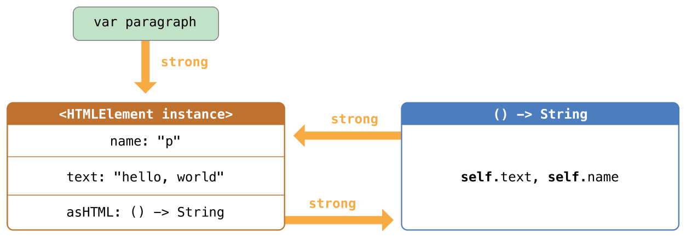](https://www.logcg.com/wp-content/uploads/2015/12/closureReferenceCycle01_2x.png)

实例的asHTML 属性持有闭包的强引用。但是，闭包在其闭包体内使用了self （引用了self.name 和self.text ），因此闭包捕获了self ，这意味着闭包又反过来持有了HTMLElement 实例的强引用。这样两个对象就产生了循环强引用。（更多关于闭包捕获值的信息，请参考[值捕获](/closures/#spl-8)）。

> 注意
> 
> 尽管闭包多次引用了self ，它只捕获HTMLElement 实例的一个强引用。

如果设置paragraph 变量为nil ，打破它持有的HTMLElement 实例的强引用，HTMLElement 实例和它的闭包都不会被释放，也是因为循环强引用：

```
paragraph = nil
```

注意HTMLElement 的反初始化器中的消息并没有被打印，证明了HTMLElement 实例并没有被销毁。

## 解决闭包的循环强引用

你可以通过定义_捕获列表_作为闭包的定义来解决在闭包和类实例之间的循环强引用。捕获列表定义了当在闭包体里捕获一个或多个引用类型的规则。正如在两个类实例之间的循环强引用，声明每个捕获的引用为引用或无主引用而不是强引用。应当根据代码关系来决定使用弱引用还是无主引用。

> 注意
> 
> Swift 要求你在闭包中引用self成员时使用self.someProperty 或者self.someMethod （而不只是someProperty 或someMethod ）。这有助于提醒你可能会一不小心就捕获了self 。

### 定义捕获列表

捕获列表中的每一项都由weak 或unowned 关键字与类实例的引用（如self ）或初始化过的变量（如delegate = self.delegate! ）成对组成。这些项写在方括号中用逗号分开。

把捕获列表放在形式参数和返回类型前边，如果它们存在的话：

```
lazy var someClosure: (Int, String) -> String = {
    [unowned self, weak delegate = self.delegate!] (index: Int, stringToProcess: String) -> String in
    // closure body goes here
}
```

如果闭包没有指明形式参数列表或者返回类型，是因为它们会通过上下文推断，那么就把捕获列表放在关键字in 前边，闭包最开始的地方：

```
lazy var someClosure: () -> String = {
    [unowned self, weak delegate = self.delegate!] in
    // closure body goes here
}

```

### 弱引用和无主引用

在闭包和捕获的实例总是互相引用并且总是同时释放时，将闭包内的捕获定义为无主引用。

相反，在被捕获的引用可能会变为nil 时，定义一个弱引用的捕获。弱引用总是可选项，当实例的引用释放时会自动变为nil 。这使我们可以在闭包体内检查它们是否存在。

> 注意
> 
> 如果被捕获的引用永远不会变为nil ，应该用无主引用而不是弱引用。

前面的HTMLElement 例子中，无主引用是正确的解决循环强引用的方法。这样编写HTMLElement 类来避免循环强引用：

```
class HTMLElement {
    
    let name: String
    let text: String?
    
    lazy var asHTML: () -> String = {
        [unowned self] in
        if let text = self.text {
            return "<\(self.name)>\(text)</\(self.name)>"
        } else {
            return "<\(self.name) />"
        }
    }
    
    init(name: String, text: String? = nil) {
        self.name = name
        self.text = text
    }
    
    deinit {
        print("\(name) is being deinitialized")
    }
    
}
```

上面的HTMLElement 实现和之前的实现一致，除了在asHTML 闭包中多了一个捕获列表。这里，捕获列表是\[unowned self\] ，表示“用无主引用而不是强引用来捕获self ”。

和之前一样，我们可以创建并打印HTMLElement 实例：

```
var paragraph: HTMLElement? = HTMLElement(name: "p", text: "hello, world")
print(paragraph!.asHTML())
// prints "<p>hello, world</p>"
```

使用捕获列表后引用关系如下图所示：

[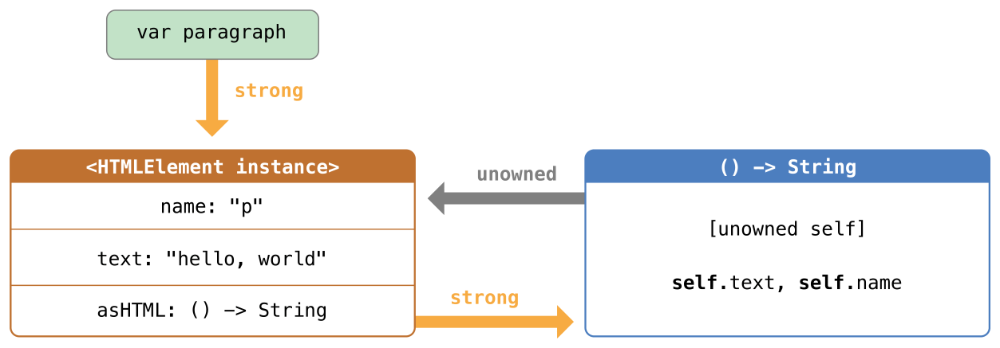](https://www.logcg.com/wp-content/uploads/2015/12/closureReferenceCycle02_2x.png)

这次，闭包以无主引用的形式捕获self ，并不会持有HTMLElement 实例的强引用。如果将paragraph 赋值为nil ，HTMLElement 实例将会被释放，并能看到它的反初始化器打印出的消息。

```
paragraph = nil
// prints "p is being deinitialized"
```

了解更多关于捕获列表，请看[捕获列表](https://www.cnswift.org/expressions#spl-10)。
