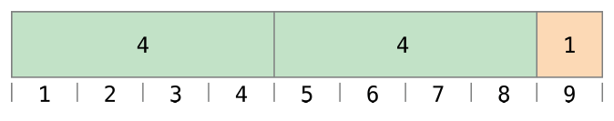

_运算符_是一种用来检查、改变或者合并值的特殊符号或组合符号。举例来说，加运算符（+ ）能够把两个数字相加（比如 let i = 1 + 2  ）。更复杂的栗子包括逻辑与运算 &&  比如 if enteredDoorCode && passedRetinaScan  。

Swift 在支持 C 中的大多数标准运算符的同时也增加了一些排除常见代码错误的能力。赋值符号（\= ）不会返回值，以防它被误用于等于符号（\== ）的意图上。算数符号（+ , \- , \* , / , %  以及其他）可以检测并阻止值溢出，以避免你在操作比储存类型允许的范围更大或者更小的数字时得到各种奇奇怪怪的结果。如同 [溢出操作符](https://www.cnswift.org/advanced-operators#spl-9) 中描述的那样，你可以通过使用 Swift 的溢出操作符来选择进入值溢出行为模式。

Swift 提供了两种 C 中没有的区间运算符（a..<b  和 a...b ），来让你便捷表达某个范围的值。

这个章节叙述了 Swift 语言当中常见的运算符。[高级运算符](/advanced-operators/) 则涵盖了 Swift 中的高级运算符，同时描述了如何定义你自己的运算符以及在你自己的类当中实现标准运算符。

## 专门用语

运算符包括一元、二元、三元：

- _一元_运算符对一个目标进行操作（比如 \-a  ）。一元_前缀_运算符在目标之前直接添加（比如!b ），同时一元后缀运算符直接在目标末尾添加（比如 c! ）。
- _二元_运算符对两个目标进行操作（比如 2 + 3  ）同时因为它们出现在两个目标之间，所以是_中缀_。
- _三元_运算符操作三个目标。如同 C，Swift语言也仅有一个三元运算符，三元条件运算符（ a ? b : c  ）。

受到运算符影响的值叫做操作数。在表达式 1 + 2  中， +  符号是一个二元运算符，其中的两个值 1  和 2  就是操作数。

## 赋值运算符

赋值运算符（a = b ）可以初始化或者更新 a  为 b  的值：

```
let b = 10
var a = 5
a = b
// a 的值现在是 10
```

如果赋值符号右侧是拥有多个值的元组，它的元素将会一次性地拆分成常量或者变量：

```
let (x, y) = (1, 2)
// x 等于 1, 同时 y 等于 2
```

与 Objective-C 和 C 不同，Swift 的赋值符号自身不会返回值。下面的语句是不合法的：

```
if x = y {
    // 这是不合法的, 因为 x = y 并不会返回任何值。
}
```

这个特性避免了赋值符号 (_**`=`**_) 被意外地用于等于符号 (_**`==`**_) 的实际意图上。Swift 通过让 if x = y  非法来帮助你避免这类的错误在你的代码中出现。

## 算术运算符

Swift 对所有的数字类型支持四种标准_算术运算符_：

- 加 (+ )
- 减 (\- )
- 乘 (\* )
- 除 (/ )

```
1 + 2 // equals 3
5 - 3 // equals 2
2 * 3 // equals 6
10.0 / 2.5 // equals 4.0
```

与 C 和 Objective-C 中的算术运算符不同，Swift 算术运算符默认不允许值溢出。你可以选择使用 Swift 的溢出操作符（比如  a &+ b  `）`来行使溢出行为。参见 [溢出操作符](https://www.cnswift.org/advanced-operators#spl-9)

加法运算符同时也支持 String  的拼接：

```
"hello, " + "world" // equals "hello, world"
```

### 余数运算符

_余数运算符_（a % b ）可以求出多少个 b  的倍数能够刚好放进 a  中并且返回剩下的值（就是我们所谓的余数）。

> 注意
> 
> 余数运算符（% ）同样会在别的语言中称作_取模__运算符_。总之，严格来讲的话这个行为对应着 Swift 中对负数的操作，所以余数要比模取更合适。

现在我们展示余数运算符如何生效。要计算 9 % 4  `，`你首先要求出多少个 4  能够放到 9  里边：



你可以给 9  当中放进两个 4  去，这样就得到了 1  这个余数 （橘黄色的部分）。

在 Swift 中，这将写作：

```
9 % 4 // equals 1
```

决定  a % b  的结果， %  按照如下等式运算然后返回 remainder 作为它的输出：

a = (b x some multiplier) + remainder

此时 some multiplier  是 b  能放进 a  的最大倍数。

把 9  和 4  插入到等式当中去：

9 = (4 x 2) + 1

当 a  是负数时也使用相同的方法来进行计算：

```
-9 % 4 // equals -1
```

把 -9  和 4  插入到等式当中：

\-9 = (4 x -2) + -1

得到余数 -1  。

当b为负数时它的正负号被忽略掉了。这意味着 a % b  与 a % -b  能够获得相同的答案。

### 一元减号运算符

数字值的正负号可以用前缀 _**\-**_ 来切换，我们称之为 _一元减号运算符_：

```
let three = 3
let minusThree = -three // minusThree equals -3
let plusThree = -minusThree // plusThree equals 3, or "minus minus three"
```

一元减号运算符（\- ）直接在要进行操作的值前边放置，不加任何空格。

### 一元加号运算符

_一元加号运算符_ （+ ）直接返回它操作的值，不会对其进行任何的修改：

```
let minusSix = -6
let alsoMinusSix = +minusSix // alsoMinusSix equals -6
```

尽管一元加号运算符实际上什么也不做，你还是可以对正数使用它来让你的代码对一元减号运算符来说显得更加对称。

## 组合赋值符号

如同 C ，Swift 提供了由赋值符号（\= ）和其他符号组成的 _组合赋值符号_ 。一个_加赋值符号_的栗子 （+= ）：

```
var a = 1
a += 2
// a is now equal to 3
```

表达式  _**a += 2**_  其实就是 a = a + 2  的简写。效率上来讲，加号和赋值符号组合成的一个运算符能够同时进行这两个操作。

> 注意
> 
> 组合运算符不会返回任何值。举例来说，你不能写成这样 **let b = a += 2**  。这个与前边提到的增量和减量符号的行为不同。

你可以在 表达式（此处应有链接） 章节找到组合赋值符号的完整列表。

<a id="spl-10"></a>
## 比较运算符

Swift 支持所有 C 的标准比较运算符：

- 相等 (a == b )
- 不相等 (a != b )
- 大于 (a > b )
- 小于 (a < b )
- 大于等于 (a >= b )
- 小于等于 (a <= b )

> 注意
> 
> Swift 同时也提供两个_等价运算符_（\===  和 !== ），你可以使用它们来判断两个对象的引用是否相同。参考 [类和结构体](http://spl.logcg.com/classes-and-structures/) 章节来了解更多。

每个比较运算符都会返回一个 Bool  值来表示语句是否为真：

```
1 == 1 // true, because 1 is equal to 1
2 != 1 // true, because 2 is not equal to 1
2 > 1 // true, because 2 is greater than 1
1 < 2 // true, because 1 is less than 2
1 >= 1 // true, because 1 is greater than or equal to 1
2 <= 1 // false, because 2 is not less than or equal to 1
```

比较运算符通常被用在条件语句当中，比如说 if  语句：

```
let name = "world"
if name == "world" {
    print("hello, world")
} else {
    print("I'm sorry \(name), but I don't recognize you")
}
// prints "hello, world", because name is indeed equal to "world"
```

更多关于 if  语句的信息，参见 [控制流](http://spl.logcg.com/control-flow/) 。

你同样可以比较拥有同样数量值的元组，只要元组中的每个值都是可比较的。比如说，Int 和String 都可以用来比较大小，也就是说(Int,String) 类型的元组就可以比较。一般来说，Bool 不能比较，这意味着包含布尔值的元组不能用来比较大小。

元组以从左到右的顺序比较大小，一次一个值，直到找到两个不相等的值为止。如果所有的值都是相等的，那么就认为元组本身是相等的。比如说：

```
(1, "zebra") < (2, "apple")   // true because 1 is less than 2
(3, "apple") < (3, "bird")    // true because 3 is equal to 3, and "apple" is less than "bird"
(4, "dog") == (4, "dog")      // true because 4 is equal to 4, and "dog" is equal to "dog"
```

> 注意
> 
> Swift 标准库包含的元组比较运算符仅支持小于七个元素的元组。要比较拥有七个或者更多元素的元组，你必须自己实现比较运算符。

## 三元条件运算符

_三元条件运算符_是一种有三部分的特殊运算，它看起来是这样的： question ? answer1 : answer2  。这是一种基于 question  是真还是假来选择两个表达式之一的便捷写法。如果 question  是真，则会判断为 answer1  并且返回它的值；否则，它判断为 answer2  并且返回它的值。

三元条件运算符就是下边代码的简写：

```
if question {
    answer1
} else {
    answer2
}
```

这里有一个栗子，它计算一个表格的行高。行高应该是比内容的高度高50点，如果行有标题的话。要是没有标题，就比内容高20点：

```
let contentHeight = 40
let hasHeader = true
let rowHeight = contentHeight + (hasHeader ? 50 : 20)
// rowHeight is equal to 90
```

先前的栗子是下边代码的简写：

```
let contentHeight = 40
let hasHeader = true
var rowHeight = contentHeight
if hasHeader {
    rowHeight = rowHeight + 50
} else {
    rowHeight = rowHeight + 20
}
// rowHeight is equal to 90
```

第一个栗子使用了三元条件运算符意味着 rowHeight  可以在单行代码中就能被设置为正确的值。它要比第二个栗子简洁不少，并且不再需要 rowHeight  为变量，因为它的值不需要在 if  中做改变了。

三元条件运算符提供了一个非常有效的简写来决策要两个表达式之间选哪个。总之，使用三元条件运算符要小心。它的简洁性会导致你代码重用的时候失去易读的特性。避免把多个三元条件运算符组合到一句代码当中。

## 合并空值运算符

_合并空值运算符_ （a ?? b ）如果可选项 a  有值则展开，如果没有值，是 nil  ，则返回默认值 b 。表达式 a 必须是一个可选类型。表达式 b  必须与 a  的储存类型相同。

合并空值运算符是下边代码的缩写：

```
a != nil ? a! : b
```

上边的代码中，三元条件运算符强制展开（a! ）储存在 a  中的值，如果 a  不是 nil  的话，否则就返回 b  的值。合并空值运算符提供了更加优雅的方式来封装这个条件选择和展开操作，让它更加简洁易读。

> 注意
> 
> 如果 a  的值是非空的， b  的值将不会被考虑。这就是所谓的 _短路计算_ 。

下边的栗子使用了合并空值运算符来在默认颜色名和可选的用户定义颜色名之间做选择：

```
let defaultColorName = "red"
var userDefinedColorName: String? // defaults to nil
var colorNameToUse = userDefinedColorName ?? defaultColorName
// userDefinedColorName is nil, so colorNameToUse is set to the default of "red"
```

userDefinedColorName  变量被定义为可选的 String  ，默认为 nil  。由于 userDefinedColorName  是一个可选类型，你可以使用合并空值运算符来控制它的值。在上边的栗子当中，这个运算符被用来决定 String  类型的变量 colorNameToUse  的初始值。因为 userDefinedColorName  是 nil ，表达式 userDefinedColorName ?? defaultColorName  返回了defaultColorName  的值，"red" 。

如果你给 userDefinedColorName  指定一个非空的值然后让合并空值运算符在检查一次，那么 userDefinedColorName  中封装的值将会替换掉默认值：

```
userDefinedColorName = "green"
colorNameToUse = userDefinedColorName ?? defaultColorName
// userDefinedColorName is not nil, so colorNameToUse is set to "green"
```

## 区间运算符

Swift 包含了两个 区间运算符 ，他们是表示一个范围的值的便捷方式。

### 闭区间运算符

_闭区间运算符_（a...b ）定义了从 a  到 b  的一组范围，并且包含 a  和 b  。a  的值不能大于 b 。

在遍历你需要用到的所有数字时，使用闭区间运算符是个不错的选择，比如说在 for-in  循环当中：

```
for index in 1...5 {
    print("\(index) times 5 is \(index * 5)")
}
// 1 times 5 is 5
// 2 times 5 is 10
// 3 times 5 is 15
// 4 times 5 is 20
// 5 times 5 is 25
```

更多关于for-in  循环的内容，参见[控制流](http://spl.logcg.com/control-flow/) 。

### 半开区间运算符

_半开区间运算符_（a..<b ）定义了从 a  到 b  但不包括 b  的区间，即 _半开_ ，因为它只包含起始值但并不包含结束值。_（十奶注：其实就是左闭右开区间。）_如同闭区间运算符， a  的值也不能大于 b  ，如果 a  与 b  的值相等，那返回的区间将会是空的。

半开区间在遍历基于零开始序列比如说数组的时候非常有用，它从零开始遍历到数组长度（但是不包含）：

```
let names = ["Anna", "Alex", "Brian", "Jack"]
let count = names.count
for i in 0..<count {
    print("Person \(i + 1) is called \(names[i])")
}
// Person 1 is called Anna
// Person 2 is called Alex
// Person 3 is called Brian
// Person 4 is called Jack
```

注意数组包含四个元素，但是0..<count  只遍历到 3 （元素序号的最大值），因为这是一个半开区间。关于数组的更多内容，参见[数组](/collection-types/#spl-2)。

### 单侧区间

闭区间有另外一种形式来让区间朝一个方向尽可能的远——比如说，一个包含数组所有元素的区间，从索引2 到数组的结束。在这种情况下，你可以省略区间运算符一侧的值。因为运算符只有一侧有值，所以这种区间叫做_单侧区间_。比如说：

```
for name in names[2...] {
    print(name)
}
// Brian
// Jack
 
for name in names[...2] {
    print(name)
}
// Anna
// Alex
// Brian
```

半开区间运算符同样可以有单侧形式，只需要写它最终的值。和你两侧都包含值一样，最终的值不是区间的一部分。举例来说：

```
for name in names[..<2] {
    print(name)
}
// Anna
// Alex
```

单侧区间可以在其他上下文中使用，不仅仅是下标。你不能遍历省略了第一个值的单侧区间，因为遍历根本不知道该从哪里开始。你可以遍历省略了最终值的单侧区间；总之，由于区间无限连续，你要确保给循环添加一个显式的条件。你同样可以检测单侧区间是否包含特定的值，就如下面的代码所述。

```
let range = ...5
range.contains(7)   // false
range.contains(4)   // true
range.contains(-1)  // true

```

## 逻辑运算符

逻辑运算符可以修改或者合并布尔逻辑值true  和false  。Swift 支持三种其他基于 C 的语言也包含的标准逻辑运算符

- 逻辑 非  (!a )
- 逻辑 与  (a && b )
- 逻辑 或  (a || b )

### 逻辑非运算符

逻辑非运算符（!a ）会转换布尔值，把true  变成false  ， 把false  变成true 。

逻辑非运算符是一个前缀运算符，它直接写在要进行运算的值前边，不加空格。读作“非 a ”，如同下边的栗子：

```
let allowedEntry = false
if !allowedEntry {
    print("ACCESS DENIED")
}
// prints "ACCESS DENIED"
```

这句if !allowedEntry  可以读作“如果不允进入。”后边的代码只有 “不允许进入” 为真才会执行； 比如说现在allowedEntry  为false  。

在这个栗子当中，要注意布尔量的常量和变量名能够帮助你保持代码的可读和简洁，同时也要避免双重否定或者其他奇奇怪怪的逻辑语句。

### 逻辑与运算符

逻辑与运算符（a && b ）需要逻辑表达式的两个值都为true  ，整个表达式的值才为true 。

如果任意一个值是false  ，那么整个表达式的结果会是false  。事实上，如果第一个值是false  ，那么第二个值就会被忽略掉了，因为它已经无法让整个表达式再成为true  。这就是所谓的 短路计算 。

这个栗子依据两个Bool  值判断只有它们都为true  时才允许访问：

```
let enteredDoorCode = true
let passedRetinaScan = false
if enteredDoorCode && passedRetinaScan {
    print("Welcome!")
} else {
    print("ACCESS DENIED")
}
// prints "ACCESS DENIED"

```

### 逻辑或运算符

逻辑或运算符（a || b ）是一个中缀运算符，它由两个相邻的管道字符组成。你可以使用它来创建两个值之间只要有一个为true  那么整个表达式就是true  的逻辑表达式。

如同上文中的逻辑与运算符，逻辑或运算符也使用短路计算来判断表达式。如果逻辑或运算符左侧的表达式为true  ，那么右侧则不予考虑了，因为它不会影响到整个逻辑表达式的结果。

在下边的栗子当中，第一个 Bool  值（hasDoorKey ）是false  ，但是第二个值 （knowsOverridePassword ） 是true  。由于有一个值是true  ，这整个逻辑表达式的值同样被判断为true ， 所以访问被允许：

```
let hasDoorKey = false
let knowsOverridePassword = true
if hasDoorKey || knowsOverridePassword {
    print("Welcome!")
} else {
    print("ACCESS DENIED")
}
// prints "Welcome!"

```

### 混合逻辑运算

你可以组合多个逻辑运算符来创建一个更长的组合表达式：

```
if enteredDoorCode && passedRetinaScan || hasDoorKey || knowsOverridePassword {
    print("Welcome!")
} else {
    print("ACCESS DENIED")
}
// prints "Welcome!"
```

这个栗子使用了多个&&  和||  运算符来创建组合表达式。不过，&& 和||  仍旧只能够操作两个值，它实际上是三个更小的表达式链接而成。这个栗子可以读作：

如果我们输入了正确的密码并通过了视网膜扫描，或者如果我们有合法的钥匙或者我们知道紧急超驰密码，就允许进入。

基于enteredDoorCode ，passedRetinaScan ，和hasDoorKey  的值，前两个子表达式都是false 。总之，紧急超驰密码是知道的，所以整个组合的表达式仍然被评定为true 。

> 注意\[1\]
> 
> Swift 语言中逻辑运算符_**&&**_ 和|| 是左相关的，这意味着多个逻辑运算符组合的表达式会首先计算最左边的子表达式。

 

> 译注
> 
> \[1\]：优先级问题： 在 Swift 编程语言全文当中并没有提到逻辑运算符的优先级问题（即默认相等），总之，它们是有优先级的，在[标准库引用文档](https://developer.apple.com/library/mac/documentation/Swift/Reference/Swift_StandardLibrary_Operators/index.html#//apple_ref/doc/uid/TP40016054)中提及。

### 显式括号

很多时候虽然不被要求，但使用括号还是很有用的，这能让复杂的表达式更容易阅读。在上文当中的门禁栗子里，把前边部分的表达式用圆括号括起来就会让整个组合表达式的意图更加明显：

```
if (enteredDoorCode && passedRetinaScan) || hasDoorKey || knowsOverridePassword {
    print("Welcome!")
} else {
    print("ACCESS DENIED")
}
// prints "Welcome!"
```

圆括号把前边的两个值单独作为一部分来考虑，这样使整个表达式的意图清晰明显。组合表达式的输出并没有改变，但是整个意图变得清晰易读。可读性永远是第一位的；当需要的时候，使用圆括号让你的意图更加明确。
