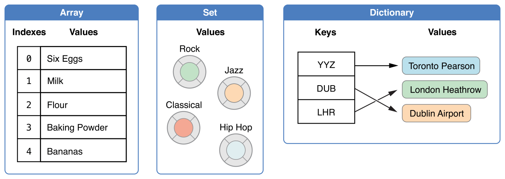
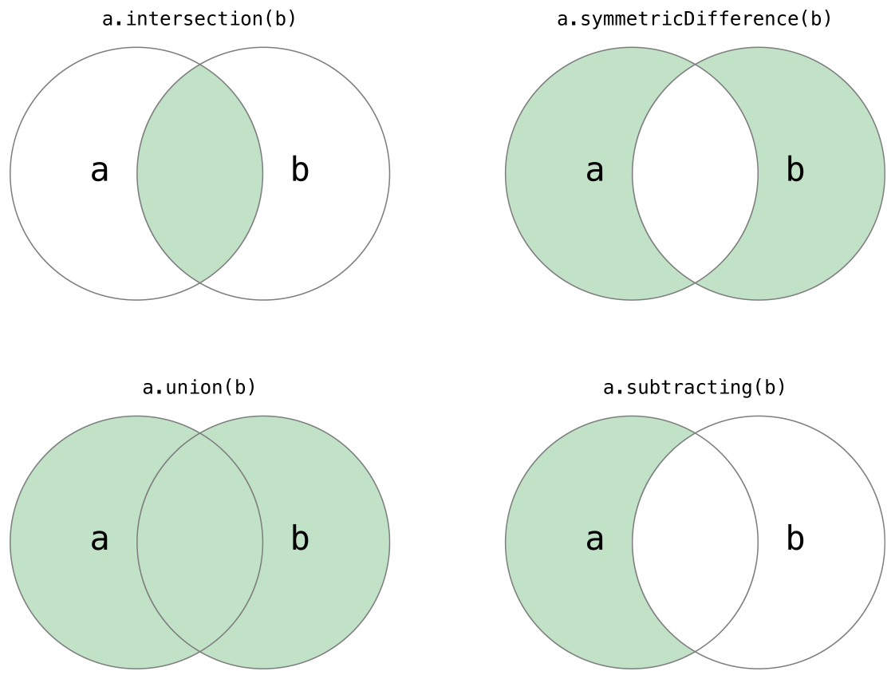
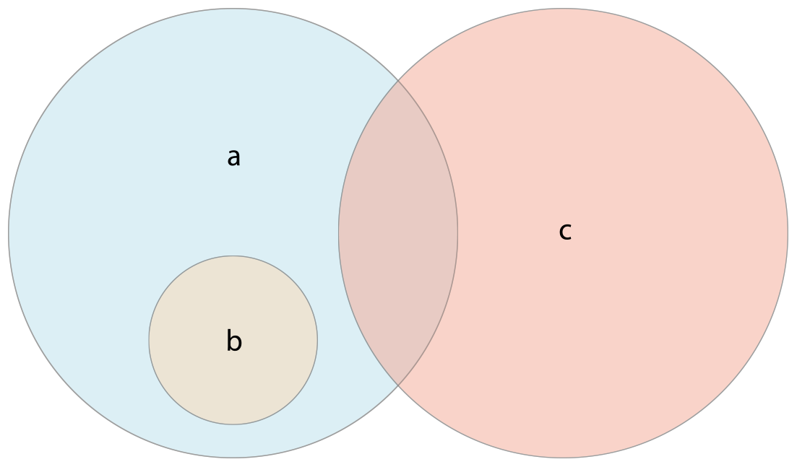

Swift 提供了三种主要的_集合类型_，所谓的数组、合集还有字典，用来储存值的集合。数组是有序的值的集合。合集是唯一值的无序集合。字典是无序的键值对集合。



Swift 中的数组、合集和字典总是明确能储存的值的类型以及它们能储存的键。就是说你不会意外地插入一个错误类型的值到集合中去。它同样意味着你可以从集合当中取回确定类型的值。

> 注意
> 
> Swift 的数组、合集和字典是以_泛型集合_实现的。要了解更多关于泛型类型和集合，参见[泛型](http://www.cnswift.org/generics/)。

## 集合的可变性

如果你创建一个数组、合集或者一个字典，并且赋值给一个变量，那么创建的集合就是_可变的_。这意味着你随后可以通过添加、移除、或者改变集合中的元素来改变（或者说_异变_）集合。如果你把数组、合集或者字典赋值给一个常量，则集合就成了_不可变的_，它的大小和内容都不能被改变。

> 注意
> 
> 在集合不需要改变的情况下创建不可变集合是个不错的选择。这样做可以允许 Swift 编译器优化你创建的集合的性能。

<a id="spl-2"></a>
## 数组

数组以有序的方式来储存相同类型的值。相同类型的值可以在数组的不同地方多次出现。

> 注意
> 
> Swift 的Array类型被桥接到了基础框架的NSArray类上。
> 
> 更多关于与基础框架和 Cocoa 一同使用Array的信息，参考[与 Cocoa 和 Objective-C 一起使用 Swift](https://developer.apple.com/library/prerelease/content/documentation/Swift/Conceptual/BuildingCocoaApps/index.html#//apple_ref/doc/uid/TP40014216)（Swift 3）（官方链接） 。

### 数组类型简写语法

Swift 数组的类型完整写法是Array<Element>，Element是数组允许存入的值的类型。你同样可以简写数组的类型为\[Element\]。尽管两种格式功能上相同，我们更推荐简写并且全书涉及到数组类型的时候都会使用简写。

### 创建一个空数组

你可以使用确定类型通过初始化器语法来创建一个空数组：

```
var someInts = [Int]()
print("someInts is of type [Int] with \(someInts.count) items.")
// prints "someInts is of type [Int] with 0 items."
```

注意someInts变量的类型通过初始化器的类型推断为\[Int\]。

相反，如果内容已经提供了类型信息，比如说作为函数的实际参数或者已经分类了的变量或常量，你可以通过空数组字面量来创建一个空数组，它写作\[ \]（一对空方括号）：

```
someInts.append(3)
// someInts now contains 1 value of type Int

someInts = []
// someInts is now an empty array, but is still of type [Int]
```

<a id="spl-5"></a>
### 使用默认值创建数组

Swift 的Array类型提供了初始化器来创建确定大小且元素都设定为相同默认值的数组。你可以传给初始化器对应类型的默认值（叫做repeating）和新数组元素的数量（叫做count）：

```
var threeDoubles = Array(repeating: 0.0, count: 3)
// threeDoubles is of type [Double], and equals [0.0, 0.0, 0.0]

```

### 通过连接两个数组来创建数组

你可以通过把两个兼容类型的现存数组用加运算符（+）加在一起来创建一个新数组。新数组的类型将从你相加的数组里推断出来：

```
var anotherThreeDoubles = Array(repeating: 2.5, count: 3)
// anotherThreeDoubles is of type [Double], and equals [2.5, 2.5, 2.5]
 
var sixDoubles = threeDoubles + anotherThreeDoubles
// sixDoubles is inferred as [Double], and equals [0.0, 0.0, 0.0, 2.5, 2.5, 2.5]

```

### 使用数组字面量创建数组

你同样可以使用_数组字面量_来初始化一个数组，它是一种以数组集合来写一个或者多个值的简写方式。数组字面量写做一系列的值，用逗号分隔，用方括号括起来：

```
[value 1, value 2, value 3]
```

下边的示例创建了一个叫做shoppingList的数组来储存String值：

```
var shoppingList: [String] = ["Eggs", "Milk"]
// shoppingList has been initialized with two initial items
```

shoppingList变量被声明为“字符串值的数组”写做\[String\] 。由于这个特定的数组拥有特定的String值类型，它就只能储存String值。这里，shoppingList被两个String值（"Eggs"和"Milk"）初始化，写在字符串字面量里。

> 注意
> 
> 数组shoppingList被声明为变量（用var提示符）而不是常量（用let提示符）因为更多的元素会在下边的栗子中添加到数组当中。

在这种情况下，数组的字面量只包含两个String值。这与shoppingList变量声明类型一致（一个只能储存String值的数组），因此用数组字面量作为shoppingList以两个初始元素初始化的方式是被允许的。

依托于 Swift 的类型推断，如果你用包含相同类型值的数组字面量初始化数组，就不需要写明数组的类型。shoppingList的初始化可以写得更短：

```
var shoppingList = ["Eggs", "Milk"]
```

因为数组字面量中的值都是相同的类型，Swift 就能够推断\[String\]是shoppingList变量最合适的类型。

### 访问和修改数组

你可以通过数组的方法和属性来修改数组，或者使用下标脚本语法。

要得出数组中元素的数量，检查只读的count属性：

```
print("The shopping list contains \(shoppingList.count) items.")
// prints "The shopping list contains 2 items."
```

使用布尔量isEmpty属性来作为检查count属性是否等于0 的快捷方式：

```
if shoppingList.isEmpty {
    print("The shopping list is empty.")
} else {
    print("The shopping list is not empty.")
}
// prints "The shopping list is not empty."
```

你可以通过append(\_:)方法给数组末尾添加新的元素：

```
shoppingList.append("Flour")
// shoppingList now contains 3 items, and someone is making pancakes
```

另外，可以使用加赋值运算符 (+=)来在数组末尾添加一个或者多个同类型元素：

```
shoppingList += ["Baking Powder"]
// shoppingList now contains 4 items
shoppingList += ["Chocolate Spread", "Cheese", "Butter"]
// shoppingList now contains 7 items
```

通过_下标脚本语法_来从数组当中取回一个值，在紧跟数组名后的方括号内传入你想要取回的值的索引：

```
var firstItem = shoppingList[0]
// firstItem is equal to "Eggs"
```

> 注意
> 
> 数组中的第一个元素的索引为0 ，不是1 .Swift 中的数组都是零开头的。

你可以使用下标脚本语法来改变给定索引中已经存在的值：

```
shoppingList[0] = "Six eggs"
// the first item in the list is now equal to "Six eggs" rather than "Eggs"
```

你同样可以使用下标脚本语法来一次改变一个范围的值，就算替换与范围长度不同的值的合集也行。下面的栗子替换用"Bananas"和"Apples"替换"Chocolate Spread", "Cheese", and "Butter"：

```
shoppingList[4...6] = ["Bananas", "Apples"]
// shoppingList now contains 6 items
```

> 注意
> 
> 你不能用下标脚本语法来追加一个新元素到数组的末尾。

要把元素插入到特定的索引位置，调用数组的insert(\_:at:)方法：

```
shoppingList.insert("Maple Syrup", at: 0)
// shoppingList now contains 7 items
// "Maple Syrup" is now the first item in the list
```

调用insert(\_:at:)方法插入了一个新元素值为"Maple Syrup"到 shopping list 的最前面，通过明确索引位置为0  .

类似地，你可以使用remove(at:)方法来移除一个元素。这个方法移除特定索引的元素并且返回它（尽管你不需要的话可以无视返回的值）：

```
let mapleSyrup = shoppingList.remove(at: 0)
// the item that was at index 0 has just been removed
// shoppingList now contains 6 items, and no Maple Syrup
// the mapleSyrup constant is now equal to the removed "Maple Syrup" string
```

> 注意
> 
> 如果你访问或者修改一个超出数组边界索引的值，你将会触发运行时错误。你可以在使用索引前通过对比数组的count属性来检查它。除非当count为0 （就是说数组为空），否则最大的合法索引永远都是count - 1，因为数组的索引从零开始。

当数组中元素被移除，任何留下的空白都会被封闭，所以索引 0 的值再一次等于"Six eggs"：

```
firstItem = shoppingList[0]
// firstItem is now equal to "Six eggs"
```

如果你想要移除数组最后一个元素，使用removeLast()方法而不是remove(at:)方法以避免查询数组的count属性。与remove(at:)方法相同，removeLast()返回删除了的元素：

```
let apples = shoppingList.removeLast()
// the last item in the array has just been removed
// shoppingList now contains 5 items, and no apples
// the apples constant is now equal to the removed "Apples" string
```

### 遍历一个数组

你可以用for-in`循环来遍历整个数组中值的合集：`

```
for item in shoppingList {
    print(item)
}
// Six eggs
// Milk
// Flour
// Baking Powder
// Bananas
```

如果你需要每个元素以及值的整数索引，使用enumerated()方法来遍历数组。enumerated()方法返回数组中每一个元素的元组，包含了这个元素的索引和值。你可以分解元组为临时的常量或者变量作为遍历的一部分：

```
for (index, value) in shoppingList.enumerated() {
    print("Item \(index + 1): \(value)")
}
// Item 1: Six eggs
// Item 2: Milk
// Item 3: Flour
// Item 4: Baking Powder
// Item 5: Bananas
```

关于for-in循环的更多内容，见[For-in循环](/control-flow/#For-in)。

<a id="spl-24"></a>
## 合集[\[1\]](#spl-24)

_合集_将同一类型且不重复的值无序地储存在一个集合当中。当元素的顺序不那么重要的时候你就可以使用合集来代替数组，或者你需要确保元素不会重复的时候。

> 注意
> 
> Swift 的Set类型桥接到了基础框架的NSSet类上。
> 
> 更多关于与基础框架和 Cocoa 一起使用Set的信息，见[与 Cocoa 和 Objective-C 一起使用 Swift](https://developer.apple.com/library/prerelease/ios/documentation/Swift/Conceptual/BuildingCocoaApps/index.html#//apple_ref/doc/uid/TP40014216)（Swift 3）。

### Set 类型的哈希值

为了能让类型储存在合集当中，它必须是_可哈希_的——就是说类型必须提供计算它自身_哈希值_的方法。哈希值是Int值且所有的对比起来相等的对象都相同，比如 a == b`，`它遵循a.hashValue == b.hashValue`。`

所有 Swift 的基础类型（比如String, Int, Double, 和Bool）默认都是可哈希的，并且可以用于合集或者字典的键。没有关联值的枚举成员值（如同[枚举](/enumerations/)当中描述的那样）同样默认可哈希。

> 注意
> 
> 你可以使用你自己自定义的类型作为合集的值类型或者字典的键类型，只要让它们遵循 Swift 基础库的Hashable协议即可。遵循Hashable协议的类型必须提供可获取的叫做hashValue的Int属性。通过hashValue属性返回的值不需要在同一个程序的不同的执行当中都相同，或者不同程序。
> 
> 因为Hashable协议遵循Equatable，遵循的类型必须同时一个“等于”运算符 (\==)的实现。Equatable协议需要任何遵循\==的实现都具有等价关系。就是说，\==的实现必须满足以下三个条件，其中a,b, 和c是任意值：
> 
> - a == a  (自反性)
> - a == b 意味着 b == a  (对称性)
> - a == b && b == c 意味着 a == c  (传递性)
> 
> 更多对协议的遵循信息，见[协议](/protocols/)。

### 合集类型语法

Swift 的合集类型写做Set<Element>`，`这里的`Element`是合集要储存的类型。不同与数组，合集没有等价的简写。

### 创建并初始化一个空合集

你可以使用初始化器语法来创建一个确定类型的空合集：

```
var letters = Set<Character>()
print("letters is of type Set<Character> with \(letters.count) items.")
// prints "letters is of type Set<Character> with 0 items."
```

> 注意
> 
> letters变量的类型被推断为Set<Character>，基于初始化器的类型。

另外，如果内容已经提供了类型信息，比如函数的实际参数或者已经分类的变量常量，你就可以用空的数组字面量来创建一个空合集：

```
letters.insert("a")
// letters now contains 1 value of type Character
letters = []
// letters is now an empty set, but is still of type Set<Character>
```

### 使用数组字面量创建合集

你同样可以使用数组字面量来初始化一个合集，算是一种写一个或者多个合集值的快捷方式。

下边的栗子创建了一个叫做favoriteGenres的合集来储存String值：

```
var favoriteGenres: Set<String> = ["Rock", "Classical", "Hip hop"]
// favoriteGenres has been initialized with three initial items
```

favoriteGenres变量被声明为“String值的合集”，写做Set<String>。由于这个合集已经被明确值类型为String，它_只_允许储存String值。这时，合集favoriteGenres用三个写在数组字面量中的String值 ("Rock", "Classical", 和"Hip hop")初始化。

> 注意
> 
> 合集favoriteGenres作为变量（用var标记）而不是常量（用let标记）是因为元素会在下边的栗子中添加和移除。

合集类型不能从数组字面量推断出来，所以Set类型必须被显式地声明。总之，由于 Swift 的类型推断，你不需要在使用包含相同类型值的数组字面量初始化合集的时候写合集的类型。favoriteGenres 的初始化可以写的更短一些：

```
var favoriteGenres: Set = ["Rock", "Classical", "Hip hop"]
```

由于数组字面量中所有的值都是相同类型的，Swift 就可以推断Set<String>是favoriteGenres变量的正确类型。

### 访问和修改合集

你可以通过合集的方法和属性来访问和修改合集。

要得出合集当中元素的数量，检查它的只读count属性：

```
print("I have \(favoriteGenres.count) favorite music genres.")
// prints "I have 3 favorite music genres."
```

使用布尔量isEmpty属性作为检查count属性是否等于0 的快捷方式：

```
if favoriteGenres.isEmpty {
    print("As far as music goes, I'm not picky.")
} else {
    print("I have particular music preferences.")
}
// prints "I have particular music preferences."
```

你可通过调用insert(\_:)方法来添加一个新的元素到合集：

```
favoriteGenres.insert("Jazz")
// favoriteGenres now contains 4 items
```

你可以通过调用合集的remove(\_:)方法来从合集当中移除一个元素，如果元素是合集的成员就移除它，并且返回移除的值，如果合集没有这个成员就返回nil。另外，合集当中所有的元素可以用removeAll()一次移除。

```
if let removedGenre = favoriteGenres.remove("Rock") {
    print("\(removedGenre)? I'm over it.")
} else {
    print("I never much cared for that.")
}
// prints "Rock? I'm over it."
```

要检查合集是否包含了特定的元素，使用contains(\_:)方法。

```
if favoriteGenres.contains("Funk") {
    print("I get up on the good foot.")
} else {
    print("It's too funky in here.")
}
// prints "It's too funky in here."

```

### 遍历合集

你可以在for-in循环里遍历合集的值。

```
for genre in favoriteGenres {
    print("\(genre)")
}
// Classical
// Jazz
// Hip hop
```

更多关于for-in循环，见 [For-in 循环](/control-flow/#For-in)。

Swift 的Set类型是无序的。要以特定的顺序遍历合集的值，使用sorted()方法，它把合集的元素作为使用< 运算符排序了的数组返回。

```
for genre in favoriteGenres.sorted() {
    print("\(genre)")
}
// Classical
// Hip hop
// Jazz

```

## 执行合集操作

你可以高效地执行基本地合集操作，比如合并两个合集，确定两个合集共有哪个值，或者确定两个合集是否包含所有、某些或没有相同的值。

### 基本合集操作

下边的示例描述了两个合集——a和b——在各种合集操作下的结果，用阴影部分表示。



- 使用intersection(\_:)方法来创建一个只包含两个合集共有值的新合集；
- 使用symmetricDifference(\_:)方法来创建一个只包含两个合集各自有的非共有值的新合集；
- 使用union(\_:)方法来创建一个包含两个合集所有值的新合集；
- 使用subtracting(\_:)方法来创建一个两个合集当中不包含某个合集值的新合集。

```
let oddDigits: Set = [1, 3, 5, 7, 9]
let evenDigits: Set = [0, 2, 4, 6, 8]
let singleDigitPrimeNumbers: Set = [2, 3, 5, 7]
 
oddDigits.union(evenDigits).sorted()
// [0, 1, 2, 3, 4, 5, 6, 7, 8, 9]
oddDigits.intersection(evenDigits).sorted()
// []
oddDigits.subtracting(singleDigitPrimeNumbers).sorted()
// [1, 9]
oddDigits.symmetricDifference(singleDigitPrimeNumbers).sorted()
// [1, 2, 9]

```

### 合集成员关系和相等性

下面的示例描述了三个合集——a，b和c——用重叠区域代表合集之间值共享。合集a是合集b的_超集_，因为a包含b的所有元素。相反地，合集b是合集a的_子集_，因为b的所有元素被a包含。合集b和合集c是_不相交_的，因为他们的元素没有相同的。



 

- 使用“相等”运算符 (\== )来判断两个合集是否包含有相同的值；
- 使用isSubset(of:) 方法来确定一个合集的所有值是被某合集包含；
- 使用isSuperset(of:)方法来确定一个合集是否包含某个合集的所有值；
- 使用isStrictSubset(of:) 或者isStrictSuperset(of:)方法来确定是个合集是否为某一个合集的子集或者超集，但并不相等；
- 使用isDisjoint(with:)方法来判断两个合集是否拥有完全不同的值。

```
let houseAnimals: Set = ["🐶", "🐱"]
let farmAnimals: Set = ["🐮", "🐔", "🐑", "🐶", "🐱"]
let cityAnimals: Set = ["🐦", "🐭"]

houseAnimals.isSubset(of: farmAnimals)
// true
farmAnimals.isSuperset(of: houseAnimals)
// true
farmAnimals.isDisjoint(with: cityAnimals)
// true
```

## 字典

_字典_储存无序的互相关联的同一类型的键和同一类型的值的集合。每一个值都与唯一的_键_相关联，它就好像这个值的身份标记一样。不同于数组中的元素，字典中的元素没有特定的顺序。当你需要查找基于特定标记的值的时候使用字典，很类似现实生活中字典用来查找特定字的定义。

> 注意
> 
> Swift 的Dictionary桥接到了基础框架的NSDictionary类。
> 
> 更多关于与基础框架和 Cocoa 一起使用Dictionary的信息，见[与 Cocoa 和 Objective-C 一起使用 Swift](https://developer.apple.com/library/prerelease/ios/documentation/Swift/Conceptual/BuildingCocoaApps/index.html#//apple_ref/doc/uid/TP40014216)（Swift 3）（官方链接）。

### 字典类型简写语法

Swift 的字典类型写全了是这样的： Dictionary<Key, Value>，其中的Key是用来作为字典键的值类型，Value就是字典为这些键储存的值的类型。

> 注意
> 
> 字典的Key类型必须遵循Hashable协议，就像合集的值类型。

你同样可以用简写的形式来写字典的类型为\[Key: Value\]。尽管两种写法是完全相同的，但本书所有提及字典的地方都会使用简写形式。

### 创建一个空字典

就像数组，你可以用初始化器语法来创建一个空Dictionary：

```
var namesOfIntegers = [Int: String]()
// namesOfIntegers is an empty [Int: String] dictionary
```

这个栗子创建了类型为\[Int: String\]的空字典来储存整数的可读名称。它的键是Int类型，值是String类型。

如果内容已经提供了信息，你就可以用字典字面量创建空字典了，它写做\[:\]（在一对方括号里写一个冒号）：

```
namesOfIntegers[16] = "sixteen"
// namesOfIntegers now contains 1 key-value pair
namesOfIntegers = [:]
// namesOfIntegers is once again an empty dictionary of type [Int: String]
```

### 用字典字面量创建字典

你同样可以使用_字典字面量_来初始化一个字典，它与数组字面量看起来差不多。字典字面量是写一个或者多个键值对为Dictionary集合的快捷方式。

键值对由一个键和一个值组合而成，每个键值对里的键和值用冒号分隔。键值对写做一个列表，用逗号分隔，并且最终用方括号把它们括起来：

\[key 1: value 1, key 2: value 2, key 3: value 3\]

下边的栗子创建了一个储存国际机场名称的字典。这个字典中，键是三个字母的国际航空运输协会代码，值是机场的名字：

```
var airports: [String: String] = ["YYZ": "Toronto Pearson", "DUB": "Dublin"]
```

airports字典被声明为\[String: String\]类型，它意思是“一个键和值都是String的Dictionary”。

> 注意
> 
> airports字典被声明为变量（使用var标记），而不是常量（使用let标记），因为下边的栗子还有给它添加更多机场。

字典airports 用包含两个键值对的字典字面量初始化。第一对有"YYZ"的键和"Toronto Pearson"的值。第二对时"DUB" 的键和"Dublin"的值。

这个字典字面量包含两个String: String对。这个键值对类型与airports变量的声明类型相同（一个使用String键并且只储存String值的字典），所以赋值的这个字典字面量让airports字典用两个初始元素初始化。

与数组一样，如果你用一致类型的字典字面量初始化字典，就不需要写出字典的类型了。airports的初始化就能写的更短：

```
var airports = ["YYZ": "Toronto Pearson", "DUB": "Dublin"]
```

由于字面量中所有的键都有相同的类型，同时所有的值也是相同的类型，Swift 可以推断\[String: String\]就是airports字典的正确类型。

<a id="spl-22"></a>
### 访问和修改字典

你可以通过字典自身的方法和属性来访问和修改它，或者通过使用下标脚本语法。

如同数组，你可以使用count只读属性来找出Dictionary拥有多少元素：

```
print("The airports dictionary contains \(airports.count) items.")
// prints "The airports dictionary contains 2 items."
```

使用布尔量isEmpty属性作为检查count属性是否等于0 的快捷方式：

```
if airports.isEmpty {
    print("The airports dictionary is empty.")
} else {
    print("The airports dictionary is not empty.")
}
// prints "The airports dictionary is not empty."
```

你可以用下标脚本给字典添加新元素。使用正确类型的新键作为下标脚本的索引，然后赋值一个正确类型的值：

```
airports["LHR"] = "London"
// the airports dictionary now contains 3 items
```

你同样可以使用下标脚本语法来改变特定键关联的值：

```
airports["LHR"] = "London Heathrow"
// the value for "LHR" has been changed to "London Heathrow"
```

作为下标脚本的代替，使用字典的updateValue(\_:forKey:)方法来设置或者更新特点键的值。就像上边下标脚本的栗子，updateValue(\_:forKey:)方法会在键没有值的时候设置一个值，或者在键已经存在的时候更新它。总之，不同于下标脚本，updateValue(\_:forKey:)方法在执行更新之后返回旧的值。这允许你检查更新是否成功。

updateValue(\_:forKey:)方法返回一个字典值类型的可选项值。比如对于储存String值的字典来说，方法会返回String?类型的值，或者说“可选的String”。这个可选项包含了键的旧值如果更新前存在的话，否则就是nil：

```
if let oldValue = airports.updateValue("Dublin Airport", forKey: "DUB") {
    print("The old value for DUB was \(oldValue).")
}
// prints "The old value for DUB was Dublin."

```

你同样可以使用下标脚本语法来从字典的特点键中取回值。由于可能请求的键没有值，字典的下标脚本返回可选的字典值类型。如果字典包含了请求的键的值，下标脚本就返回一个包含这个键的值的可选项。否则，下标脚本返回nil ：

```
if let airportName = airports["DUB"] {
    print("The name of the airport is \(airportName).")
} else {
    print("That airport is not in the airports dictionary.")
}
// prints "The name of the airport is Dublin Airport."
```

你可以使用下标脚本语法给一个键赋值nil来从字典当中移除一个键值对：

```
airports["APL"] = "Apple International"
// "Apple International" is not the real airport for APL, so delete it
airports["APL"] = nil
// APL has now been removed from the dictionary
```

另外，使用removeValue(forKey:)来从字典里移除键值对。这个方法移除键值对如果他们存在的话，并且返回移除的值，如果值不存在则返回nil：

```
if let removedValue = airports.removeValue(forKey: "DUB") {
    print("The removed airport's name is \(removedValue).")
} else {
    print("The airports dictionary does not contain a value for DUB.")
}
// Prints "The removed airport's name is Dublin Airport."

```

### 遍历字典

你可以用for-in循环来遍历字典的键值对。字典中的每一个元素返回为(key, value)元组，你可以解开元组成员到临时的常量或者变量作为遍历的一部分：

```
for (airportCode, airportName) in airports {
    print("\(airportCode): \(airportName)")
}
// YYZ: Toronto Pearson
// LHR: London Heathrow

```

更多关于for-in循环，见 [For-in 循环](/control-flow/#For-in)。

你同样可以通过访问字典的keys和values属性来取回可遍历的字典的键或值的集合：

```
for airportCode in airports.keys {
    print("Airport code: \(airportCode)")
}
// Airport code: YYZ
// Airport code: LHR
 
for airportName in airports.values {
    print("Airport name: \(airportName)")
}
// Airport name: Toronto Pearson
// Airport name: London Heathrow
```

如果你需要和接收Array实例的 API 一起使用字典的键或值，就用keys或values属性来初始化一个新数组：

```
let airportCodes = [String](airports.keys)
// airportCodes is ["YYZ", "LHR"]
let airportNames = [String](airports.values)
// airportNames is ["Toronto Pearson", "London Heathrow"]
```

Swift 的Dictionary类型是无序的。要以特定的顺序遍历字典的键或值，使用键或值的sorted()方法。

## 译注：

\[1\] 合集：此处 Set 应为“集合”，但为了与文章标题“Collection”做区别，故改写为合集。
