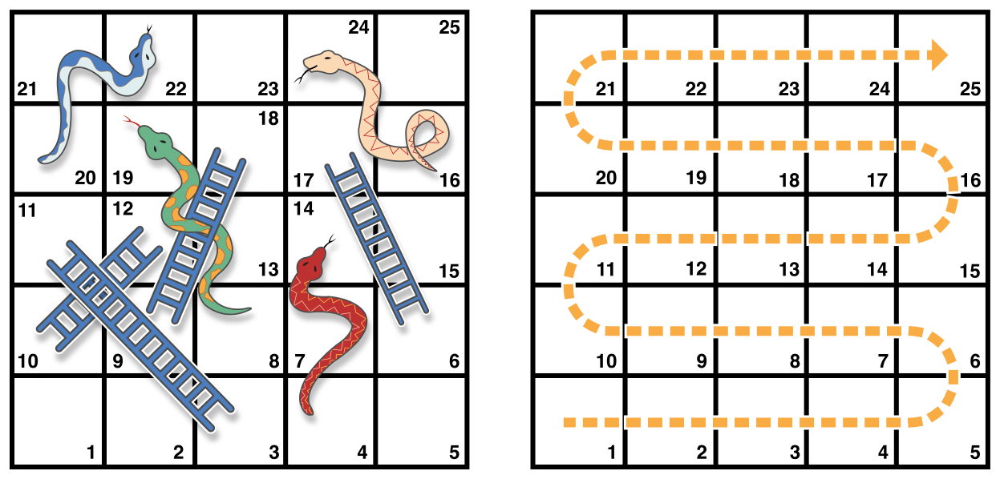
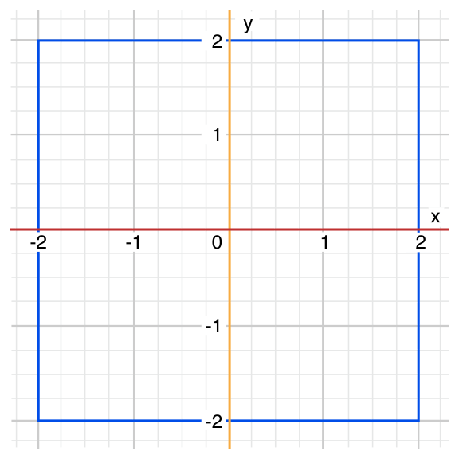
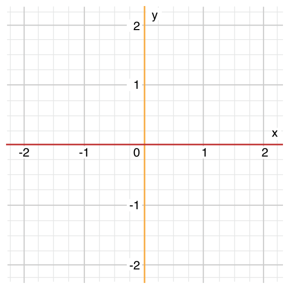
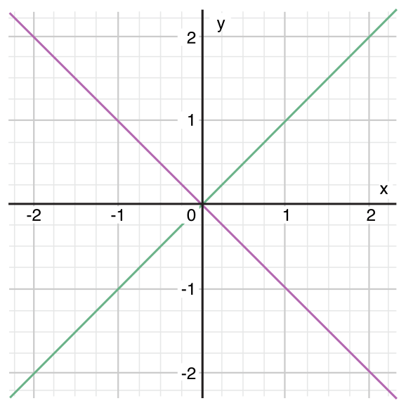

Swift 提供所有多样化的控制流语句。包括while 循环来多次执行任务；if ，guard 和switch 语句来基于特定的条件执行不同的代码分支；还有比如break 和continue 语句来传递执行流到你代码的另一个点上。

Swift 同样添加了for-in 循环，它让你更简便地遍历数组、字典、范围和其他序列。

Swift 的switch 语句同样比 C 中的对应语句多了不少新功能。比如说 Swift 中的switch 语句不再“贯穿”到下一个情况当中，这就避免了 C 中常见的break 语句丢失问题。情况可以匹配多种模式，包括间隔匹配，元组和特定的类型。switch 中匹配的值还能绑定到临时的常量和变量上供情况中代码使用，并且可以为每一个情况写where 分句表达式来应用复杂条件匹配。

## For-in 循环

使用for-in 循环来遍历序列，比如一个范围的数字，数组中的元素或者字符串中的字符。

这个例子使用for-in 循环来遍历数组中的元素：

```
let names = ["Anna", "Alex", "Brian", "Jack"]
for name in names {
    print("Hello, \(name)!")
}
// Hello, Anna!
// Hello, Alex!
// Hello, Brian!
// Hello, Jack!
```

你同样可以遍历字典来访问它的键值对。当字典遍历时，每一个元素都返回一个(key, value) 元组，你可以在for-in 循环体中使用显式命名常量来分解(key, value) 元组成员。这时，字典的键就分解到了叫做animalName 的常量中，而字典的值被分解到了legCount 的常量中：

```
let numberOfLegs = ["spider": 8, "ant": 6, "cat": 4]
for (animalName, legCount) in numberOfLegs {
    print("\(animalName)s have \(legCount) legs")
}
// ants have 6 legs
// cats have 4 legs
// spiders have 8 legs
```

Dictionary 中的元素没有必要安照它们写入的顺序遍历出来。Dictionary 的内容内在无序，并且不在取回遍历时保证有序。需要注意的是，你给Dictionary 插入元素的次序并不能代表你遍历时候的顺序。更多关于数组和字典，见[集合类型](http://www.cnswift.org/collection-types/)。

for-in 循环同样能遍历数字区间。这个栗子打印了乘五表格的前几行：

```
for index in 1...5 {
    print("\(index) times 5 is \(index * 5)")
}
// 1 times 5 is 5
// 2 times 5 is 10
// 3 times 5 is 15
// 4 times 5 is 20
// 5 times 5 is 25
```

被遍历的序列是1 到5 的数字范围，包含这两个数，使用闭区间运算符 (... )。index 的值被设置为范围中的第一个数字 (1 )，并且循环内的语句被执行了。这个栗子里，循环只包含了一个语句，它打印乘五表格中index 的当前值。在语句执行之后，index 的值就更新到了范围中的第二个值 (2 )，并且print(\_:separator:terminator:) 函数被再一次调用。这个过程会一直持续到范围结束。

在上面的栗子当中，index 是一个常量，它的值在每次遍历循环开始的时候被自动地设置。因此，它不需要在使用之前声明。它隐式地在循环的声明中声明了，不需要再用let 声明关键字。

如果你不需要序列的每一个值，你可以使用下划线来取代遍历名以忽略值。

```
let base = 3
let power = 10
var answer = 1
for _ in 1...power {
    answer *= base
}
print("\(base) to the power of \(power) is \(answer)")
// prints "3 to the power of 10 is 59049"
```

这个栗子计算一个数字的指数幂（这里为3 的10 次方）值。它以1 （就是说，3 的0  次幂）乘3 开始，十次，使用闭区间，从1 开始到10 为止。这样计算不需要计数器记录每次循环的值——它只需要以正确的次数执行循环就行了。下划线字符\_ （在循环变量那里使用的那个）导致单个值被忽略并且不需要在每次遍历循环中提供当前值的访问。

在某些情况下，你可能不想要一个闭区间，它包含了区间两端的值。比如说给表盘上画分钟标记。你得画60 个标记，从0  分钟开始，使用半开区间运算符（..< ）来包含最小值但不包含最大值。更多关于区间的内容，见[区间运算符](https://www.cnswift.org/basic-operators#spl-11)。

```
let minutes = 60
for tickMark in 0..<minutes {
    // render the tick mark each minute (60 times)
}
```

有些用户可能想要在他们的UI上少来点分钟标记。比如说每5 分钟一个标记吧。使用stride(from:to:by:) 函数来跳过不想要的标记。

```
let minuteInterval = 5
for tickMark in stride(from: 0, to: minutes, by: minuteInterval) {
    // render the tick mark every 5 minutes (0, 5, 10, 15 ... 45, 50, 55)
}
```

闭区间也同样适用，使用stride(from:through:by:) 即可：

```
let hours = 12
let hourInterval = 3
for tickMark in stride(from: 3, through: hours, by: hourInterval) {
    // render the tick mark every 3 hours (3, 6, 9, 12)
}

```

##  While 循环

while 循环执行一个合集的语句直到条件变成false 。这种循环最好在第一次循环之后还有未知数量的遍历时使用。Swift 提供了两种while 循环：

- while 在每次循环开始的时候计算它自己的条件；
- repeat-while 在每次循环结束的时候计算它自己的条件。

### While

while 循环通过判断单一的条件开始。如果条件为true ，语句的合集就会重复执行直到条件变为false 。

这里是一个while 循环的通用格式：

```
while condition {

    statements

}
```

这是一个玩_蛇与梯子_（也叫_滑梯与梯子_）的简单栗子： [](https://www.logcg.com/wp-content/uploads/2015/09/snakesAndLadders_2x.png)

下边是游戏的规则：

- 棋盘拥有25 个方格，目标就是到达或者超过第25 号方格；
- 每一次，你扔一个六面色子，安装方格的数字移动，依据水平的线路，如图安装上边虚线箭头标注的路线；
- 如果你停留在了梯子的下边，你就可以顺着梯子爬上去；
- 如果你停留在了蛇的头上，你就要顺着蛇滑下来。

游戏棋盘用Int 值的数组来表现。它的大小基于一个叫做finalSquare 的常量，它被用来初始化数组同样用来检测稍后的胜利条件。棋盘使用26 个零Int 值初始化，而不是25 个（从0  到25 ）：

```
let finalSquare = 25
var board = [Int](repeating: 0, count: finalSquare + 1)
```

有些方格随后设置为拥有更多特定的值比如蛇和梯子。有梯子的方格有一个正数来让你移动到棋盘的上方，因此有蛇的方格有一个负数来让你从棋盘上倒退：

```
board[03] = +08; board[06] = +11; board[09] = +09; board[10] = +02
board[14] = -10; board[19] = -11; board[22] = -02; board[24] = -08
```

方格3 包含了一个梯子的底部，它把你移动到11 号方格。要表达这个，board\[03\] 等于+08 ，它等价于整数值8 （如同3 和11 ）。一元加运算符（+i ）是为了与一元减运算符（\-i ）保持一致，并且所有小于10 的数字都要用零补齐（这两种做法都不是强制必须的，但它们让代码更加整洁，方便你开启处女座模式。）

玩家从“零格”开始，它正好是棋盘的左下角。第一次扔色子总会让玩家上到棋盘上去：

```
var square = 0
var diceRoll = 0
while square < finalSquare {
    // roll the dice
    diceRoll += 1
    if diceRoll == 7 { diceRoll = 1 }
    // move by the rolled amount
    square += diceRoll
    if square < board.count {
        // if we're still on the board, move up or down for a snake or a ladder
        square += board[square]
    }
}
print("Game over!")
```

这个栗子使用了一个非常简单的算法来扔色子。比起随机生成数，它以diceRoll 的0  开始。每次通过while 循环，diceRoll 增加一，然后检查看是否过大。无论何时这个返回的值等于7 ，它变得过大，就把它重置到1 .这给我们一个有序的diceRoll 值，它永远是1 ，2 ，3 ，4 ，5 ，6 ，1 ，2 等等。

在扔色子之后，玩家根据diceRoll 来在棋盘上移动。色子的值是有可能让玩家超出25 号方格的，这时游戏结束。为了应付这种情况，代码在加储存在board\[square\] 中的值到当前square 值以让玩家移动之前检查square 是否比board 数组的count 属性小。

如果这个检查没有执行，board\[square\] 就有可能尝试访问到超出board 数组边界的值，这会触发错误。如果square 现在等于26 ，代码就会去尝试检查 board\[26\] 的值，它比数组的长度还大。

> 注意
> 
> 这个检查还没有被执行，board\[square\] 可能会尝试访问超过board 数组边界的值，这就会触发一个错误。如果square 值为26 ，代码将会尝试检查board\[26\] 的值，这就会比数组的长度大一点。

当前的while 循环执行结束，并且循环条件已经检查来看循环是否应该再次执行。如果玩家已经移到或者超出了第25 号方格，循环评定为false ，游戏就结束了。

while 循环在这个情况当中合适是因为开始while 循环之后游戏的长度并不确定。循环会一直执行下去直到特定的条件不满足。

### Repeat-While

while 循环的另一种形式，就是所谓的repeat-while 循环，在判断循环条件_之前_会执行一次循环代码块。然后会继续重复循环直到条件为false 。

> 注意
> 
> Swift 的repeat-while 循环是与其他语言中的do-while 循环类似的。

这里是repeat-while 循环的通用形式：

```
repeat {
    statements
} while condition
```

再次回顾蛇与梯子的栗子，使用repeat-while 循环而不是while 循环。finalSquare , board , square , 和 diceRoll 的值初始化的方式与while 循环完全相同：

```
let finalSquare = 25
var board = [Int](repeating: 0, count: finalSquare + 1)
board[03] = +08; board[06] = +11; board[09] = +09; board[10] = +02
board[14] = -10; board[19] = -11; board[22] = -02; board[24] = -08
var square = 0
var diceRoll = 0
```

在这个版本的游戏中，_第一次_循环中的动作是用来检查梯子或者蛇的。没有梯子能直接把玩家带到25格，因此不可能通过梯子赢得游戏。也就是说，在循环一开始就检查蛇还是梯子是安全的。

游戏一开始，玩家在“零格”。board\[0\] 总是等于0  的，并且没有效果：

```
repeat {
    // move up or down for a snake or ladder
    square += board[square]
    // roll the dice
    diceRoll += 1
    if diceRoll == 7 { diceRoll = 1 }
    // move by the rolled amount
    square += diceRoll
} while square < finalSquare
print("Game over!")
```

在检查是蛇还是梯子的代码之后，就是要色子了，玩家按照diceRoll 数量的格数前进。当前循环执行结束。

循环条件 (while square < finalSquare)  与之前的相同，但是这次它会在第一次循环_结束_之后才会被判定。repeat-while 循环的结构要比前边栗子里的while 循环更适合这个游戏。在上边的repeat-while 循环中，square += board\[square\] 总是会在循环循环的while 条件确定square 仍在棋盘上_之后立即_执行。这个行为就去掉了早期游戏版本中对数组边界检查的需要。

## 条件语句

很多时候根据特定的条件来执行不同的代码是很有用的。你可能想要在错误发生时运行额外的代码，或者当值变得太高或者太低的时候显示一条信息。要达成这个目的，你可以让你的那部分代码_有条件地_执行。

Swift 提供了两种方法来给你的代码添加条件分支，就是所谓的if 语句和switch 语句。总的来说，你可以使用if 语句来判定简单的条件，比如少量的可能性。switch 语句则适合更复杂的条件，比如多个可能的组合，并且在模式匹配的情况下更加有用，可以帮你选择一段合适的代码分支来执行。

### If

最简单的形式中，if 语句有着一个单一的if 条件。它只会在条件为true 的情况下才会执行语句的集合：

```
var temperatureInFahrenheit = 30
if temperatureInFahrenheit <= 32 {
    print("It's very cold. Consider wearing a scarf.")
}
// prints "It's very cold. Consider wearing a scarf."
```

先前的栗子检测了温度是否小于等于32 华氏温度（水的冰点）。如果是，就打印一个信息。否则，没有信息打印，并且执行if 语句的大括号后边的代码。

 if 语句可以提供一个可选语句集，就是所谓的_else分句_，用来在if 条件为false 的时候使用。这些语句用else 关键字明确：

```
temperatureInFahrenheit = 40
if temperatureInFahrenheit <= 32 {
    print("It's very cold. Consider wearing a scarf.")
} else {
    print("It's not that cold. Wear a t-shirt.")
}
// prints "It's not that cold. Wear a t-shirt."
```

这两个分支至少会有一个被执行。因为温度增加到40华氏度，就不再冷的围围巾了，所以else 分支就被激活了。

 你可以链接多个if 语句，来考虑额外的条件：

```
temperatureInFahrenheit = 90
if temperatureInFahrenheit <= 32 {
    print("It's very cold. Consider wearing a scarf.")
} else if temperatureInFahrenheit >= 86 {
    print("It's really warm. Don't forget to wear sunscreen.")
} else {
    print("It's not that cold. Wear a t-shirt.")
}
// prints "It's really warm. Don't forget to wear sunscreen."
```

在这个栗子中，添加了一个额外的if语句来响应特定的温暖温度。最终的else 分句保留并打印对其他任何不冷也不热的温度的响应。

最后的else 分句是可选的，总之，如果条件集合不需要完成的话它可以被排除。

```
temperatureInFahrenheit = 72
if temperatureInFahrenheit <= 32 {
    print("It's very cold. Consider wearing a scarf.")
} else if temperatureInFahrenheit >= 86 {
    print("It's really warm. Don't forget to wear sunscreen.")
}
```

 这个栗子当中，温度既不太冷也补太热，所以没有触发if 或者else 条件，最后就没有信息被打印出来。

Swift 提供了一种用于设置值时的 if  的简写方式。例如，参考以下代码：

```
let temperatureInCelsius = 25
let weatherAdvice: String

if temperatureInCelsius <= 0 {
    weatherAdvice = "It's very cold. Consider wearing a scarf."
} else if temperatureInCelsius >= 30 {
    weatherAdvice = "It's really warm. Don't forget to wear sunscreen."
} else {
    weatherAdvice = "It's not that cold. Wear a T-shirt."
}

print(weatherAdvice)
// Prints "It's not that cold. Wear a T-shirt."
```

在这里，每个分支都为 weatherAdvice  常量设置了一个值，在 if  语句之后打印出来。

使用另一种语法，即 if  表达式，你可以更简洁地编写这段代码：

```
let weatherAdvice = if temperatureInCelsius <= 0 {
    "It's very cold. Consider wearing a scarf."
} else if temperatureInCelsius >= 30 {
    "It's really warm. Don't forget to wear sunscreen."
} else {
    "It's not that cold. Wear a T-shirt."
}

print(weatherAdvice)
// Prints "It's not that cold. Wear a T-shirt."
```

在这个 if  表达式版本中，每个分支都包含一个单独的值。如果某个分支的条件为真，则该分支的值将作为整个 if  表达式中 weatherAdvice  的值进行赋值。每个 if  分支都有相应的 else if  分支或 else  分支，确保其中一个分支总是匹配，并且无论哪个条件为真，if  表达式始终生成一个值。

由于赋值的语法从 if  表达式外部开始，因此不需要在每个分支内部重复写 weatherAdvice = 。相反，if  表达式的每个分支都会生成三个可能的值之一，并且赋值使用该值。

if  表达式的所有分支都需要包含相同类型的值。由于 Swift 单独检查每个分支的类型，因此像 nil  这样可以与多种类型一起使用的值会阻止 Swift 自动确定 if  表达式的类型。因此，您需要显式指定类型 - 例如：

```
let freezeWarning: String? = if temperatureInCelsius <= 0 {
    "It's below freezing. Watch for ice!"
} else {
    nil
}
```

在上面的代码中，if  表达式的一个分支具有字符串值，而另一个分支具有 nil  值。nil  值可以用作任何可选类型的值，因此您必须明确指定 freezeWarning  是一个可选字符串，如《类型注解》中所述。

提供此类型信息的替代方法是为 nil  提供显式类型，而不是为 freezeWarning  提供显式类型：

```
let freezeWarning = if temperatureInCelsius <= 0 {
    "It's below freezing. Watch for ice!"
} else {
    nil as String?
}
```

if  表达式可以通过抛出错误或调用像 fatalError(\_:file:line:)  这样永不返回的函数来响应意外故障。例如：

```
let weatherAdvice = if temperatureInCelsius > 100 {
    throw TemperatureError.boiling
} else {
    "It's a reasonable temperature."
}
```

在这个例子中，if 表达式检查预测温度是否比 100°C 高——水的沸点。如果温度过高，则 if  表达式会抛出 .boiling  错误而不是返回文本摘要。即使这个 if  表达式可能会抛出错误，您也不需要在它之前写上 try 。有关处理错误的信息，请参阅错误处理。

除了在赋值的右侧使用 if  表达式（如上面的示例所示）之外，还可以将它们用作函数或闭包返回的值。

### Switch

switch 语句会将一个值与多个可能的模式匹配。然后基于第一个成功匹配的模式来执行合适的代码块。switch 语句代替if 语句提供了对多个潜在状态的响应。

在其自身最简单的格式中，switch 语句把一个值与一个或多个相同类型的值比较：

```
switch some value to consider {
case value 1:
    respond to value 1
case value 2,
value 3:
    respond to value 2 or 3
default:
    otherwise, do something else
}
```

每一个switch 语句都由多个可能的_情况_组成，每一个情况都以case 关键字开始。对于对比额外特定的值来说，Swift 提供了多种方法给每个情况来区别更复杂的匹配模式。这些选项会在本小节稍后的内容中详述。

每一个switch 情况函数体都是独立的代码执行分支，与if 语句的分支差不多。switch 语句决定那个分支应该被选取。这就是所谓的在给定的值之间_选择_。

switch 语句一定得使_全面_的。就是说，给定类型里每一个值都得被考虑到并且匹配到一个switch 情况。如果无法提供一个switch情况给所有可能的值，你可以定义一个默认匹配所有的情况来匹配所有未明确出来的值。这个匹配所有的情况用关键字default 标记，并且必须在所有情况的最后出现。

这个示例使用了一个switch 语句来考虑一个叫做someCharacter 的单一小写字符：

```
let someCharacter: Character = "z"
switch someCharacter {
case "a":
    print("The first letter of the alphabet")
case "z":
    print("The last letter of the alphabet")
default:
    print("Some other character")
}
// Prints "The last letter of the alphabet"
```

switch 语句的第一个情况匹配英语字母表里的第一个字母，a ，并且它的第二个情况匹配最后一个字母，z ，由于switch 必须拥有所有可能的字母的情况，而不是仅仅英语字母表里的字符，这个switch 语句使用一个default 情况来匹配所有其他非a 和z 的字符。这使得switch 语句一定是全面的。

与 if  语句类似，switch  语句也有一个表达式形式：

```
let anotherCharacter: Character = "a"
let message = switch anotherCharacter {
case "a":
    "The first letter of the Latin alphabet"
case "z":
    "The last letter of the Latin alphabet"
default:
    "Some other character"
}

print(message)
// Prints "The first letter of the Latin alphabet"
```

在这个例子中，switch  表达式的每个情况都包含了与 anotherCharacter  匹配时要使用的 message  的值。由于 switch  语句始终是穷尽的，总是存在一个要赋值的值。

与 if  表达式一样，您可以在给定的情况中抛出错误或调用像 fatalError(\_:file:line:)  这样永不返回的函数，而不是提供一个值。你可以在赋值的右侧使用 switch  表达式，如上面的示例所示，并将其用作函数或闭包返回的值。

#### 没有隐式贯穿

相比 C 和 Objective-C 里的switch 语句来说，Swift 里的switch 语句不会默认从每个情况的末尾贯穿到下一个情况里。相反，整个switch 语句会在匹配到第一个switch 情况执行完毕之后退出，不再需要显式的break 语句。这使得switch 语句比 C 的更安全和易用，并且避免了意外地执行多个switch 情况。

> 注意
> 
> 尽管break 在 Swift 里不是必须的，你仍然可以使用break 语句来匹配和忽略特定的情况，或者在某个情况执行完成之前就打断它。移步 [Switch 语句中的 Break](#_Break) 来了解更多。

每一个情况的函数体_必须_包含至少一个可执行的语句。下面的代码就是不正确的，因为第一个情况是空的：

```
let anotherCharacter: Character = "a"
switch anotherCharacter {
case "a":
case "A":
    print("The letter A")
default:
    print("Not the letter A")
}
// this will report a compile-time error
```

 与 C 中的switch 语句不同，这个switch 语句没有同时匹配”a” 和”A” 。相反它会导致一个编译时错误case “a”:没有包含任何可执行语句 。这可以避免意外地从一个情况贯穿到另一个情况中，并且让代码更加安全和易读。

在一个switch 情况中匹配多个值可以用逗号分隔，并且可以写成多行，如果列表太长的话：

```
let anotherCharacter: Character = "a"
switch anotherCharacter {
case "a", "A":
    print("The letter A")
default:
    print("Not the letter A")
}
// Prints "The letter A"
```

为了可读性，复合的情况同样可以写成多行。更多关于符合情况的信息，见[复合情况](#spl-6)。

> 注意
> 
> 如同在贯穿中描述的那样，要在特定的switch 情况中使用贯穿行为，使用fallthrough 关键字。

#### 区间匹配

switch情况的值可以在一个区间中匹配。这个栗子使用了数字区间来为语言中的数字区间进行转换：

```
let approximateCount = 62
let countedThings = "moons orbiting Saturn"
var naturalCount: String
switch approximateCount {
case 0:
    naturalCount = "no"
case 1..<5:
    naturalCount = "a few"
case 5..<12:
    naturalCount = "several"
case 12..<100:
    naturalCount = "dozens of"
case 100..<1000:
    naturalCount = "hundreds of"
default:
    naturalCount = "many"
}
print("There are \(naturalCount) \(countedThings).")
// prints "There are dozens of moons orbiting Saturn."
```

在上面的栗子中， approximateCount  在switch 语句中进行评定。每个case 都与数字或者区间进行对比。由于approximateCount 的值在12和100之间，naturalCount 被赋值“dozens of” ，并且执行结果传递出了switch 语句。

#### 元组

你可以使用元组来在一个switch 语句中测试多个值。每个元组中的元素都可以与不同的值或者区间进行匹配。另外，使用下划线（\_）来表明匹配所有可能的值。

下边的例子接收一个（x,y） 点坐标，用一个简单的元组类型(Int,Int) ，并且在后边显示在图片中：

```
let somePoint = (1, 1)
switch somePoint {
case (0, 0):
    print("(0, 0) is at the origin")
case (_, 0):
    print("(\(somePoint.0), 0) is on the x-axis")
case (0, _):
    print("(0, \(somePoint.1)) is on the y-axis")
case (-2...2, -2...2):
    print("(\(somePoint.0), \(somePoint.1)) is inside the box")
default:
    print("(\(somePoint.0), \(somePoint.1)) is outside of the box")
}
// prints "(1, 1) is inside the box"
```

 [](https://www.logcg.com/wp-content/uploads/2015/09/coordinateGraphSimple_2x.png)

switch 语句决定坐标是否在原点(0,0) ；在红色的x 坐标轴；在橘黄色的y坐标轴；在蓝色的4乘4以原点为中心的方格里；或者在方格外边。

与 C 不同，Swift 允许多个switch 情况来判断相同的值。事实上，坐标(0,0) 可能匹配这个例子中所有_四个_情况，第一个匹配到的情况会被使用。坐标(0,0) 将会最先匹配 case(0,0) ，所以接下来的所有再匹配到的情况将被忽略。

#### 值绑定

switch 情况可以将匹配到的值临时绑定为一个常量或者变量，来给情况的函数体使用。这就是所谓的_值绑定_，因为值是在情况的函数体里“绑定”到临时的常量或者变量的。

下边的栗子接收一个(x,y) 坐标，使用(Int,Int) 元组类型并且在下边的图片里显示：

```
let anotherPoint = (2, 0)
switch anotherPoint {
case (let x, 0):
    print("on the x-axis with an x value of \(x)")
case (0, let y):
    print("on the y-axis with a y value of \(y)")
case let (x, y):
    print("somewhere else at (\(x), \(y))")
}
// prints "on the x-axis with an x value of 2"
```

 [](https://www.logcg.com/wp-content/uploads/2015/09/coordinateGraphMedium_2x.png)

switch 语句决定坐标是否在在红色的x坐标轴，在橘黄色的y坐标轴；还是其他地方；或不在坐标轴上。

三个switch 情况都使用了常量占位符x 和y ，它会从临时anotherPoint 获取一个或者两个元组值。第一个情况，case(let x, 0) ，匹配任何y 的值是0  并且赋值坐标的x到临时常量x 里。类似地，第二个情况，case(0,let y) ，匹配让后x 值是0  并且把y 的值赋值给临时常量y 。

在临时常量被声明后，它们就可以在情况的代码块里使用。这里，它们用来输出点的分类。

注意这个switch 语句没有任何的default 情况。最后的情况，case let (x,y) ，声明了一个带有两个占位符常量的元组，它可以匹配所有的值。结果，它匹配了所有剩下的值，然后就不需要default 情况来让switch 语句穷尽了。

在上边的栗子中，x 和y 被let 关键字声明为常量，因为它们没有必要在情况体内被修改。总之，它们也可以用变量来声明，使用var 关键字。如果这么做，临时的变量就会以合适的值来创建并初始化。对这个变量的任何改变都只会在情况函数体内有效。

#### Where

switch 情况可以使用where 分句来检查额外的情况。

下边的栗子划分(x,y) 坐标到下边的图例中：

```
let yetAnotherPoint = (1, -1)
switch yetAnotherPoint {
case let (x, y) where x == y:
    print("(\(x), \(y)) is on the line x == y")
case let (x, y) where x == -y:
    print("(\(x), \(y)) is on the line x == -y")
case let (x, y):
    print("(\(x), \(y)) is just some arbitrary point")
}
// prints "(1, -1) is on the line x == -y"
```

[](https://www.logcg.com/wp-content/uploads/2015/09/coordinateGraphComplex_2x.png)

switch 语句决定坐标在绿色的斜线x==y ，还是在紫色的斜线x == -y ，或者都不是。

三个switch 情况声明了占位符常量x 和y ，它从yetAnotherPoint 临时接收两个元组值。这个常量使用where 分句，来创建动态过滤。switch 情况只有where 分句情况评定等于true 时才会匹配这个值。

和前边的栗子一样，最后的情况匹配了余下所有可能的值，所以不需要default 情况这个switch 也是全面的。

#### 复合情况

多个 switch 共享同一个函数体的多个情况可以在case 后写多个模式来复合，在每个模式之间用逗号分隔。如果任何一个模式匹配了，那么这个情况都会被认为是匹配的。如果模式太长，可以把它们写成多行，比如说：

```
let someCharacter: Character = "e"
switch someCharacter {
case "a", "e", "i", "o", "u":
    print("\(someCharacter) is a vowel")
case "b", "c", "d", "f", "g", "h", "j", "k", "l", "m",
     "n", "p", "q", "r", "s", "t", "v", "w", "x", "y", "z":
    print("\(someCharacter) is a consonant")
default:
    print("\(someCharacter) is not a vowel or a consonant")
}
// Prints "e is a vowel"

```

这个switch 语句的第一个情况匹配了英语语言里所有五个小写的元音。类似的，第二个情况匹配了英语语言里所有的辅音。最终，default 情况匹配其他任意字符。

复合情况同样可以包含值绑定。所有复合情况的模式都必须包含相同的值绑定集合，并且复合情况中的每一个绑定都得有相同的类型格式。这才能确保无论复合情况的那部分匹配了，接下来的函数体中的代码都能访问到绑定的值并且值的类型也都相同。

```
let stillAnotherPoint = (9, 0)
switch stillAnotherPoint {
case (let distance, 0), (0, let distance):
    print("On an axis, \(distance) from the origin")
default:
    print("Not on an axis")
}
// Prints "On an axis, 9 from the origin"
```

上边的case 拥有两个模式： (let distance, 0)  匹配 x 轴的点以及(0, let distance) 匹配 y 轴的点。两个模式都包含一个distance 的绑定并且distance 在两个模式中都是整形——也就是说这个case 函数体的代码一定可以访问distance 的值。

## 控制转移语句

_控制转移语句_在你代码执行期间改变代码的执行顺序，通过从一段代码转移控制到另一段。Swift 拥有五种控制转移语句：

- `continue`
    
- `break`
    
- `fallthrough`
    
- `return`
    
- `throw`
    

continue , break , 和 fallthrough  语句在下边有详细描述。return 语句在[函数](http://www.cnswift.org/functions/)中描述，还有throw 语句在[使用抛出函数传递错误](#spl-3)中描述。

### Continue

continue 语句告诉循环停止正在做的事情并且再次从头开始循环的下一次遍历。它是说“我不再继续当前的循环遍历了”而不是离开整个的循环。

> 注意
> 
> 在一个包含条件和自增器的for 循环中，循环的自增器仍然会在调用continue 语句后评定。循环自身还是会和往常一样工作；只有循环体中的代码被跳过。

下面的栗子移除了所有小写字符串中的元音和空格来创建一个谜之语句：

```
let puzzleInput = "great minds think alike"
var puzzleOutput = ""
let charactersToRemove: [Character] = ["a", "e", "i", "o", "u", " "]
for character in puzzleInput {
    if charactersToRemove.contains(character) {
        continue
    } else {
        puzzleOutput.append(character)
    }
}
print(puzzleOutput)
// Prints "grtmndsthnklk"
```

上面的代码在匹配到元音或者空格的时候调用了continue 关键字，导致遍历的当前循环立即结束并直接跳到了下一次遍历的开始。这个行为使得switch 代码块匹配（和忽略）只有元音和空格的字符，而不是请求匹配每一个要打印的字符。

### Break

break 语句会立即结束整个控制流语句。当你想要提前结束switch 或者循环语句或者其他情况时可以在switch 语句或者循环语句中使用break 语句。

#### 循环语句中的 Break

当在循环语句中使用时，break 会立即结束循环的执行，并且转移控制到循环结束花括号（} ）后的第一行代码上。当前遍历循环里的其他代码都不会被执行，并且余下的遍历循环也不会开始了。

#### Switch 语句里的 Break

当在switch语句里使用时，break 导致switch 语句立即结束它的执行，并且转移控制到switch 语句结束花括号（} ）之后的第一行代码上。

这可以用来在一个switch 语句中匹配和忽略一个或者多个情况。因为 Swift 的switch 语句是穷尽且不允许空情况的，所以有时候有必要故意匹配和忽略一个匹配到的情况以让你的意图更加明确。要这样做的话你可以通过把break 语句作为情况的整个函数体来忽略某个情况。当这个情况通过switch 语句匹配到了，情况中的break 语句会立即结束switch 语句的执行。

> 注意
> 
> switch 的情况如果只包含注释的话会导致编译时错误。注释不是语句，并且不会导致switch 情况被忽略。要使用break 语句来忽略switch 情况。

下面的栗子匹配一个Character 值并且决定它表示四种语言中哪种语言的数字符号。简明起见，多个值被覆盖在了一个switch 情况中：

```
let numberSymbol: Character = "三"  // Simplified Chinese for the number 3
var possibleIntegerValue: Int?
switch numberSymbol {
case "1", "١", "一", "๑":
    possibleIntegerValue = 1
case "2", "٢", "二", "๒":
    possibleIntegerValue = 2
case "3", "٣", "三", "๓":
    possibleIntegerValue = 3
case "4", "٤", "四", "๔":
    possibleIntegerValue = 4
default:
    break
}
if let integerValue = possibleIntegerValue {
    print("The integer value of \(numberSymbol) is \(integerValue).")
} else {
    print("An integer value could not be found for \(numberSymbol).")
}
// prints "The integer value of 三 is 3."
```

这个栗子检测numberSymbol 来确定它是拉丁语，阿拉伯语，中文还是泰语的1 到4 .如果匹配到，其中一个switch 语句的情况赋值一个可选的Int? 变量叫做possibleIntegerValue 为一个合适的整数值。

在switch 语句完成其执行后，栗子使用了可选绑定来确定是否有值。possibleIntegerValue 变量作为可选类型在一开始拥有一个隐式初始值nil ，所以因此可选绑定只有在possibleIntegerValue 被switch 语句前四个情况之一设定了实际存在的值之后才会成功。

在上边的例子中，列举所有可能的Character 值是不实际的，所以default情况就提供了一个匹配所有没有匹配到的字符的功能。这个default 情况不需要执行任何动作，所以因此就写了一个break 语句作为函数体。一旦default 情况匹配到了，break 语句结束switch 语句的执行，然后代码从if let  语句继续执行。

### Fallthrough

Swift 中的 Switch 语句不会从每个情况的末尾贯穿到下一个情况中。相反，整个switch 语句会在第一个匹配到的情况执行完毕之后就直接结束执行。比较而言，C 你在每一个switch 情况末尾插入显式的break 语句来阻止贯穿。避免默认贯穿意味着 Swift 的switch 语句比 C 更加清晰和可预料，并且因此它们避免了意外执行多个switch 情况。

如果你确实需要 C 风格的贯穿行为，你可以选择在每个情况末尾使用fallthrough 关键字。下面的栗子使用了fallthrough 来创建一个数字的文字描述：

```
let integerToDescribe = 5
var description = "The number \(integerToDescribe) is"
switch integerToDescribe {
case 2, 3, 5, 7, 11, 13, 17, 19:
    description += " a prime number, and also"
    fallthrough
default:
    description += " an integer."
}
print(description)
// prints "The number 5 is a prime number, and also an integer."
```

这个栗子声明了一个新的String 变量叫做description 并且赋值给它一个初始值。然后函数使用一个switch 语句来判断integerToDescribe 。如果integerToDescribe 是一个列表中的质数，函数就在description 的末尾追加文字，来标记这个数字是质数。然后它使用fallthrough 关键字来“贯穿到”default 情况。default 情况添加额外的文字到描述的末尾，接着switch 语句结束。

如果integerToDescribe _不在_已知质数列表中，它就不会匹配第一个switch 情况。然后也没用其他特定的情况，所以integerToDescribe 匹配了默认的default 情况。

在switch语句完成执行之后，数字的描述使用print(\_:separator:terminator:)  函数打印出来。在这个例子中，数字5 被正确地分辨为一个质数。

> 注意
> 
> fallthrough 关键字不会为switch情况检查贯穿入情况的条件。fallthrough 关键字只是使代码执行直接移动到下一个情况（或者default 情况）的代码块中，就像C的标准switch 语句行为一样。

### 给语句打标签

你可以内嵌循环和条件语句到其他循环和条件语句当中以在 Swift 语言中创建一个复杂的控制流结构。总之，循环和条件语句都可以使用break 语句来提前结束它们的执行。因此，显式地标记那个循环或者条件语句是你想用break 语句结束的就很有必要。同样的，如果你有多个内嵌循环，显式地标记你想让continue 语句生效的是哪个循环就很有必要了。

要达到这些目的，你可以用_语句标签_来给循环语句或者条件语句做标记。在一个条件语句中，你可以使用一个语句标签配合break 语句来结束被标记的语句。在循环语句中，你可以使用语句标签来配合break 或者continue 语句来结束或者继续执行被标记的语句。

通过把标签作为关键字放到语句开头来用标签标记一段语句，后跟冒号。这里是一个对while 循环使用标签的栗子，这个原则对所有的循环和switch 语句来说都相同：

```
label name: while condition {
    statements
}
```

下边的栗子为你之前章节看过的_蛇与梯子_游戏做了修改，在while 循环中使用了标签来配合break 和continue 语句。这次，这个游戏有一个额外的规则：

- 要赢得游戏，你必须_精确_地落在第25格上。
    

如果特定的点数带你超过了第25格，你必须再次掷色子直到你恰好得到了落到第25格的点数。

游戏棋盘与之前的一样：

[](https://www.logcg.com/wp-content/uploads/2015/09/snakesAndLadders_2x.png)

finalSquare ，board ，square 和diceRoll 的值也用和之前一样的方式来初始化：

```
let finalSquare = 25
var board = [Int](count: finalSquare + 1, repeatedValue: 0)
board[03] = +08; board[06] = +11; board[09] = +09; board[10] = +02
board[14] = -10; board[19] = -11; board[22] = -02; board[24] = -08
var square = 0
var diceRoll = 0
```

这个版本的游戏使用了一个while 循环和一个switch 语句来实现游戏的逻辑。while 循环有一个叫做gameLoop 的标签，来表明它是蛇与梯子游戏的主题循环。

while 循环条件是while square != finaleSquare ，用来反映你必须精确地落在第25格上：

```
gameLoop: while square != finalSquare {
    diceRoll += 1
    if diceRoll == 7 { diceRoll = 1 }
    switch square + diceRoll {
    case finalSquare:
        // diceRoll will move us to the final square, so the game is over
        break gameLoop
    case let newSquare where newSquare > finalSquare:
        // diceRoll will move us beyond the final square, so roll again
        continue gameLoop
    default:
        // this is a valid move, so find out its effect
        square += diceRoll
        square += board[square]
    }
}
print("Game over!")
```

每次循环，都会扔色子。使用一个switch 语句来考虑移动的结果而不是立即移动玩家，然后如果移动允许的话就工作：

- 如果扔的色子将把玩家移动到最后的方格，游戏就结束。 break gameLoop 语句转移控制到while 循环外的第一行代码上，它会结束游戏。
    
- 如果扔的色子点数将会把玩家移动_超过_最终的方格，那么移动就是不合法的，玩家就需要再次扔色子。continue gameLoop 语句就会结束当前的while 循环遍历并且开始下一次循环的遍历。
    
- 在其他所有的情况中，色子是合法的。玩家根据diceRoll 的方格数前进，并且游戏的逻辑会检查蛇和梯子。然后循环结束，控制返回到while 条件来决定是否要再次循环。
    

> 注意
> 
> 如果上边的break 语句不使用gameLoop 标签，它就会中断switch 语句而不是while 语句。使用gameLoop 标签使得要结束那个控制语句变得清晰明了。
> 
> 同时注意当调用continue gameLoop 来跳入下一次循环并不是强制必须使用gameLoop 标签的。游戏里只有一个循环，所以continue 对谁生效是不会有歧义的。总之，配合continue 使用gameLoop 也无伤大雅。一直在break 语句里写标签会让游戏的逻辑更加清晰和易读。

## 提前退出

guard 语句，类似于if 语句，基于布尔值表达式来执行语句。使用guard 语句来要求一个条件必须是真才能执行guard 之后的语句。与if 语句不同，guard 语句总是有一个else 分句——else 分句里的代码会在条件不为真的时候执行。

```
func greet(person: [String: String]) {
    guard let name = person["name"] else {
        return
    }
    
    print("Hello \(name)!")
    
    guard let location = person["location"] else {
        print("I hope the weather is nice near you.")
        return
    }
    
    print("I hope the weather is nice in \(location).")
}
 
greet(person: ["name": "John"])
// Prints "Hello John!"
// Prints "I hope the weather is nice near you."
greet(person: ["name": "Jane", "location": "Cupertino"])
// Prints "Hello Jane!"
// Prints "I hope the weather is nice in Cupertino."
```

如果guard 语句的条件被满足，代码会继续执行直到guard 语句后的花括号。任何在条件中使用可选项绑定而赋值的变量或者常量在guard 所在的代码块中随后的代码里都是可用的。

如果这个条件没有被满足，那么在else 分支里的代码就会被执行。这个分支必须转移控制结束guard 所在的代码块。要这么做可以使用控制转移语句比如return ，break ，continue 或者throw ，或者它可以调用一个不带有返回值的函数或者方法，比如fatalError() 。

相对于使用if 语句来做同样的事情，为需求使用guard 语句来提升你代码的稳定性。它会让正常地写代码而不用把它们包裹进else 代码块，并且它允许你保留在需求之后处理危险的需求。

## 检查API的可用性

Swift 拥有内置的对 API 可用性的检查功能，它能够确保你不会悲剧地使用了对部属目标不可用的 API。

编译器在 SDK 中使用可用性信息来确保在你项目中明确的 API 都是可用的。如果你尝试使用一个不可用的 API 的话，Swift 会在编译时报告一个错误。

你可以在if 或者guard 语句中使用一个_可用性条件_来有条件地执行代码，基于在运行时你想用的哪个 API 是可用的。当验证在代码块中的 API 可用性时，编译器使用来自可用性条件里的信息来检查。

```
if #available(iOS 10, macOS 10.12, *) {
    // Use iOS 10 APIs on iOS, and use macOS 10.12 APIs on macOS
} else {
    // Fall back to earlier iOS and macOS APIs
}
```

上边的可用性条件确定了在 iOS 平台，if 函数体只在 iOS 10 及以上版本才会执行；对于 macOS 平台，在只有在 macOS 10.12 及以上版本才会运行。最后一个实际参数，\* ，它需求并表明在其他所有平台，if 函数体执行你在目标里明确的最小部属限制。

在这个通用的格式中，可用性条件接收平台的名称和版本列表。你可以使用 iOS，macOS 和 watchOS 来作为平台的名字。要说明额外的特定主版本号则使用类似 iOS 8 这样的名字，你可以明确更小一点的版本号比如 iOS 8.3 和 macOS 10.10.3.

```
if #available(platform name version, ..., *) {
    statements to execute if the APIs are available
} else {
    fallback statements to execute if the APIs are unavailable
}
```

当你在guard 中使用可用性条件时，它会自动为代码块中后面的代码优化可用性信息。

```
@available(macOS 10.12, *)
struct ColorPreference {
    var bestColor = "blue"
}

func chooseBestColor() -> String {
    guard #available(macOS 10.12, *) else {
        return "gray"
    }
    let colors = ColorPreference()
    return colors.bestColor
}
```

在上面的例子中，ColorPreference 结构体需要 macOS 10.12 或者以上版本。函数chooseBestColor() 以可用性 guard 开头。如果平台版本太旧而不能使用ColorPreference ， 他就会退回可用的行为。在guard 语句之后，你就可以使用那些需用 macOS 10.12 或者更高要求的 API 了。

除了#available ， Swift 也支持反向检测不可用性条件。比如，下面的两个检查完全相同：

```
if #available(iOS 10, *) {
} else {
    // Fallback code
}

if #unavailable(iOS 10) {
    // Fallback code
}
```

#unavailable 格式能帮助你让你的代码更加易读且只包含退回的代码。
