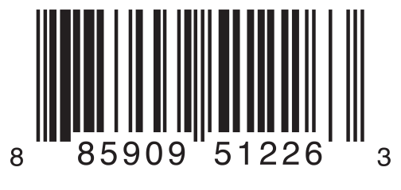

## 枚举

_枚举_为一组相关值定义了一个通用类型，从而可以让你在代码中类型安全地操作这些值。

如果你熟悉 C ，那么你可能知道 C 中的枚举会给一组整数值分配相关的名称。Swift 中的枚举则更加灵活，并且不需给枚举中的每一个成员都提供值。如果一个值（所谓“原始”值）_要被_提供给每一个枚举成员，那么这个值可以是字符串、字符、任意的整数值，或者是浮点类型。

而且，枚举成员可以指定_任意_类型的值来与不同的成员值关联储存，这更像是其他语言中的 union 或variant 的效果。你可以定义一组相关成员的合集作为枚举的一部分，每一个成员都可以有不同类型的值的合集与其关联。

Swift 中的枚举是具有自己权限的一类类型。它们使用了许多一般只被类所支持的特性，例如计算属性用来提供关于枚举当前值的额外信息，并且实例方法用来提供与枚举表示的值相关的功能。枚举同样也能够定义初始化器来初始化成员值；而且能够遵循协议来提供标准功能。

要了解更多， 请参阅[属性](/properties/), [方法](/methods/), [初始化](/initialization/), [扩展](/extensions/)，和[协议](/protocols/)。

## 枚举语法

你可以用enum关键字来定义一个枚举，然后将其所有的定义内容放在一个大括号（{}）中：

```
enum SomeEnumeration {
    // enumeration definition goes here
}
```

这是一个指南针的四个主要方向的例子：

```
enum CompassPoint {
    case north
    case south
    case east
    case west
}
```

在一个枚举中定义的值（比如：north，south`，east`和west）就是枚举的_成员值_（或_成员_）case关键字则明确了要定义成员值。

> 注意
> 
> 不像 C 和 Objective-C 那样，Swift 的枚举成员在被创建时不会分配一个默认的整数值。在上文的CompassPoint例子中，north，south，east和west并不代表 0 ，1，2和3。而相反，不同的枚举成员在它们自己的权限中都是完全合格的值，并且是一个在CompassPoint中被显式定义的类型。

多个成员值可以出现在同一行中，要用逗号隔开：

```
enum Planet {
    case mercury, venus, earth, mars, jupiter, saturn, uranus, neptune
}
```

每个枚举都定义了一个全新的类型。正如 Swift 中其它的类型那样，它们的名称（例如：CompassPoint和Planet）需要首字母大写。给枚举类型起一个单数的而不是复数的名字，从而使得它们能够顾名思义：

```
var directionToHead = CompassPoint.west
```

`当与CompassPoint`中可用的某一值一同初始化时directionToHead的类型会被推断出来`。`一旦directionToHead以CompassPoint类型被声明，你就可以用一个点语法把它设定成不同的CompassPoint值：

```
directionToHead = .east
```

directionToHead的类型是已知的，所以当设定它的值时你可以不用写类型。这样做可以使得你在操作确定类型的枚举时让代码非常易读。

## 使用 Switch 语句来匹配枚举值

你可以用switch语句来匹配每一个单独的枚举值：

```
directionToHead = .south
switch directionToHead {
case .north:
    print("Lots of planets have a north")
case .south:
    print("Watch out for penguins")
case .east:
    print("Where the sun rises")
case .west:
    print("Where the skies are blue")
}
// prints "Watch out for penguins"
```

你可以将上述代码读作：

“判断directionToHead的值。在等于.north的case中，则打印"Lots of planets have a north"。在等于.south的case中，则显示"Watch out for penguins"”

……以此类推。

就像在[控制流](/control-flow/)中所描述的那样，当判断一个枚举成员时，switch语句应该是全覆盖的。如果.west的case被省略了，那么代码将不能编译，因为这时表明它并没有覆盖CompassPoint的所有成员。要求覆盖所有枚举成员是因为这样可以保证枚举成员不会意外的被漏掉。

如果不能为所有枚举成员都提供一个case，那你也可以提供一个default情况来包含那些不能被明确写出的成员：

```
let somePlanet = Planet.earth
switch somePlanet {
case .earth:
    print("Mostly harmless")
default:
    print("Not a safe place for humans")
}
// Prints "Mostly harmless"

```

## 遍历枚举情况（case）

对于某些枚举来说，如果能有一个集合包含了枚举的所有情况就好了。你可以通过在枚举名字后面写: CaseIterable 来允许枚举被遍历。Swift 会暴露一个包含对应枚举类型所有情况的集合名为allCases 。下面是例子：

```
enum Beverage: CaseIterable {
    case coffee, tea, juice
}
let numberOfChoices = Beverage.allCases.count
print("\(numberOfChoices) beverages available")
// Prints "3 beverages available"
```

在上面的例子中，你写了一个Beverage.allCases 来访问包含Beverage 枚举所有情况的集合。你可以把allCases 当成和其他任意集合——集合的元素就是枚举类型的实例，所以在这里就是Beverage 的值。上面的例子计数了有多少个情况，然后下面的例子使用for 循环来遍历所有情况。

```
for beverage in Beverage.allCases {
    print(beverage)
}
// coffee
// tea
// juice
```

上面例子中使用的语法是标记枚举遵循CaseIterable 协议，关于协议的更多信息，见[协议](https://www.cnswift.org/protocols)。

<a id="spl-3"></a>
## 关联值

之前几节中的栗子展示了枚举成员是怎样在他们各自的权限中被定义（和被分类）的。你可以给Planet.earth设定常量或变量，然后再使用这个值。总之，有时将其它类型的_关联值_与这些成员值一起存储是很有用的。这样你就可以将额外的自定义信息和成员值一起储存，并且允许你在代码中使用每次调用这个成员时都能使用它。

你可以定义 Swift 枚举来存储任意给定类型的关联值，如果需要的话不同枚举成员关联值的类型可以不同。枚举其他语言中的 _discriminated unions_, _tagged unions_, 或者 _variants_ 类似。

举个栗子，假设库存跟踪系统需要按两个不同类型的条形码跟踪产品，一些产品贴的是用数字0~9 的 UPC-A 格式一维条形码。每一个条码数字都含有一个“数字系统”位，之后是五个“制造商代码”数字和五个“产品代码”数字。而最后则是一个“检测”位来验证代码已经被正确扫描：

[](https://www.logcg.com/wp-content/uploads/2015/08/barcode_UPC_2x.png)

其它的产品则贴着二维码，它可以使用任何 ISO 8859-1 字符并且编码最长有 2953 个字符的字符串：

[](https://www.logcg.com/wp-content/uploads/2015/08/barcode_QR_2x.png)

这样可以让库存跟踪系统很方便的以一个由 4 个整数组成的元组来储存 UPC-A 条形码，然而二维码则可以被存储为一个任意长度的字符串中。

在 Swift 中，为不同类型产品条码定义枚举大概是这种姿势：

```
enum Barcode {
    case upc(Int, Int, Int, Int)
    case qrCode(String)
}
```

这可以读作：

“定义一个叫做Barcode的枚举类型，它要么用(Int, Int, Int, Int)类型的关联值获取upc 值，要么用String 类型的关联值获取一个qrCode的值。”

这个定义并不提供任何实际的Int或者String`的`值——它只定义当Barcode常量和变量与Barcode. upc`或Barcode. qrCode`相同时可以存储的关联值的类型。

然后，新的条码就可以用任意一个类型来创建了：

```
var productBarcode = Barcode.upc(8, 85909, 51226, 3)
```

这个栗子创建了一个叫做`productBarcode`的新变量而且给它赋值了一个Barcode.upc的值关联了值为(8, 85909, 51226, 3)的元组值。

同样的产品可以被分配一个不同类型的条码：

```
productBarcode = .qrCode("ABCDEFGHIJKLMNOP")
```

这时，最初的Barcode.upc和它的整数值将被新的Barcode.qrCode和它的字符串值代替。Barcode类型的常量和变量可以存储一个.upc或一个.qrCode（和它们的相关值一起存储）中的任意一个，但是它们只可以在给定的时间内存储它们它们其中之一。

和以往一样，不同的条码类型可以用 switch 语句来检查。这一次，总之，相关值可以被提取为 switch 语句的一部分。你提取的每一个相关值都可以作为常量（用let前缀) 或者变量（用var前缀）在switch的case中使用：

```
switch productBarcode {
case .upc(let numberSystem, let manufacturer, let product, let check):
    print("UPC: \(numberSystem), \(manufacturer), \(product), \(check).")
case .qrCode(let productCode):
    print("QR code: \(productCode).")
}
// Prints "QR code: ABCDEFGHIJKLMNOP."
```

如果对于一个枚举成员的所有的相关值都被提取为常量，或如果都被提取为变量，为了简洁，你可以用一个单独的var或let在成员名称前标注：

```
switch productBarcode {
case let .upc(numberSystem, manufacturer, product, check):
    print("UPC : \(numberSystem), \(manufacturer), \(product), \(check).")
case let .qrCode(productCode):
    print("QR code: \(productCode).")
}
// Prints "QR code: ABCDEFGHIJKLMNOP."
```

## 原始值

[关联值](#spl-3)中条形码的栗子展示了枚举成员是如何声明它们存储不同类型的相关值的。作为相关值的另一种选择，枚举成员可以用相同类型的默认值预先填充（称为_原始值_）。

这里有一个和已命名的枚举成员一起存储的原始 ASCII 码的例子：

```
enum ASCIIControlCharacter: Character {
    case tab = "\t"
    case lineFeed = "\n"
    case carriageReturn = "\r"
}
```

这里，一个叫做ASCIIControlCharacter的枚举原始值被定义为类型Character，并且被放置在了更多的一些 ASCII 控制字符中，Character值的描述见[字符串和字符](/strings-and-characters/)。

> 注意
> 
> 原始值与关联值_不同_。原始值是当你第一次定义枚举的时候，它们用来预先填充的值，正如上面的三个 ASCII 码。特定枚举成员的原始值是始终相同的。关联值在你基于枚举成员的其中之一创建新的常量或变量时设定，并且在你每次这么做的时候这些关联值可以是不同的。

### 隐式指定的原始值

当你在操作存储整数或字符串原始值枚举的时候，你不必显式地给每一个成员都分配一个原始值。当你没有分配时，Swift 将会自动为你分配值。

实际上，当整数值被用于作为原始值时，每成员的隐式值都比前一个大一。如果第一个成员没有值，那么它的值是 0 `。`

下面的枚举是先前的Planet枚举的简化，用整数原始值来代表从太阳到每一个行星的顺序：

```
enum Planet: Int {
    case mercury = 1, venus, earth, mars, jupiter, saturn, uranus, neptune
}
```

在上面的例子中，`Planet.mercury`有一个明确的原始值1 ，`Planet.venus`的隐式原始值是`2`，以此类推。

当字符串被用于原始值，那么每一个成员的隐式原始值则是那个成员的名称。

下面的枚举是先前`CompassPoint`枚举的简化，有字符串的原始值来代表每一个方位的名字：

```
enum CompassPoint: String {
    case north, south, east, west
}
```

在上面的例子中，CompassPoint.south有一个隐式原始值`"south"` ，以此类推。

你可以用rawValue属性来访问一个枚举成员的原始值：

```
let earthsOrder = Planet.earth.rawValue
// earthsOrder is 3

let sunsetDirection = CompassPoint.west.rawValue
// sunsetDirection is "west"
```

### 从原始值初始化

如果你用原始值类型来定义一个枚举，那么枚举就会自动收到一个可以接受原始值类型的值的初始化器（叫做rawValue的形式参数）然后返回一个枚举成员或者nil 。你可以使用这个初始化器来尝试创建一个枚举的新实例。

这个例子从它的原始值7来辨认出uranus ：

```
let possiblePlanet = Planet(rawValue: 7)
// possiblePlanet is of type Planet? and equals Planet.Uranus
```

总之，不是所有可能的`Int`值都会对应一个行星。因此原始值的初始化器总是返回_可选的_枚举成员。在上面的例子中，possiblePlanet的类型是Planet? ，或者“可选项Planet”

> 注意
> 
> 原始值初始化器是一个可失败初始化器，因为不是所有原始值都将返回一个枚举成员。要获取更多信息，请参阅[可失败初始化器](/initialization/#spl-21)。

如果你尝试寻找有位置11的行星，那么被原始值初始化器返回的可选项Planet值将会是nil:

```
let positionToFind = 11
if let somePlanet = Planet(rawValue: positionToFind) {
    switch somePlanet {
    case .earth:
        print("Mostly harmless")
    default:
        print("Not a safe place for humans")
    }
} else {
    print("There isn't a planet at position \(positionToFind)")
}
// Prints "There isn't a planet at position 11"
```

这个例子使用可选项绑定来尝试访问一个原始值是11 的行星。其中的`if let somePlanet = Planet(rawValue: 11)`语句创建了一个可选项Planet，而且如果`Planet`的值可被取回的话，就将它赋给somePlanet。在这种情况下，取回一个位置为`11`的行星是不可能的，所以执行else分支会被执行。

## 递归枚举

枚举在对序号考虑固定数量可能性的数据建模时表现良好，比如用来做简单整数运算的运算符。这些运算符允许你组合简单的整数数学运算表达式比如5到更复杂的比如5+4.

数学表达式的一大特征就是它们可以内嵌。比如说表达式(5 + 4) \* 2 在乘法右手侧有一个数但其他表达式在乘法的左手侧。因为数据被内嵌了，用来储存数据的枚举同样需要支持内嵌——这意味着枚举需要被递归。

_递归枚举_是拥有另一个枚举作为枚举成员关联值的枚举。当编译器操作递归枚举时必须插入间接寻址层。你可以在声明枚举成员之前使用indirect关键字来明确它是递归的。

举例来讲，这里有一个储存简单数学运算表达式的枚举：

```
enum ArithmeticExpression {
    case number(Int)
    indirect case addition(ArithmeticExpression, ArithmeticExpression)
    indirect case multiplication(ArithmeticExpression, ArithmeticExpression)
}
```

你同样可以在枚举之前写indirect 来让整个枚举成员在需要时可以递归：

```
indirect enum ArithmeticExpression {
    case number(Int)
    case addition(ArithmeticExpression, ArithmeticExpression)
    case multiplication(ArithmeticExpression, ArithmeticExpression)
}
```

这个枚举可以储存三种数学运算表达式：单一的数字，两个表达式的加法，以及两个表达式的乘法。addition 和multiplication 成员拥有同样是数学表达式的关联值——这些关联值让嵌套表达式成为可能。比如说，表达式(5 + 4) \* 2 乘号右侧有一个数字左侧有其他表达式。由于数据是内嵌的，用来储存数据的枚举同样需要支持内嵌——这就是说枚举需要递归。下边的代码展示了为(5 + 4) \* 2 创建的递归枚举ArithmeticExpression ：

```
let five = ArithmeticExpression.number(5)
let four = ArithmeticExpression.number(4)
let sum = ArithmeticExpression.addition(five, four)
let product = ArithmeticExpression.multiplication(sum, ArithmeticExpression.number(2))
```

递归函数是一种操作递归结构数据的简单方法。比如说，这里有一个判断数学表达式的函数：

```
func evaluate(_ expression: ArithmeticExpression) -> Int {
    switch expression {
    case let .number(value):
        return value
    case let .addition(left, right):
        return evaluate(left) + evaluate(right)
    case let .multiplication(left, right):
        return evaluate(left) * evaluate(right)
    }
}
 
print(evaluate(product))
// Prints "18"
```

这个函数通过直接返回关联值来判断普通数字。它通过衡量表达式左手侧和右手侧判断是加法还是乘法，然后对它们加或者乘。
