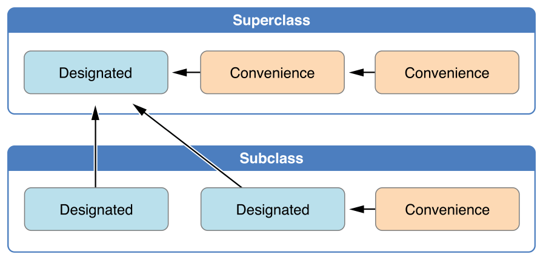
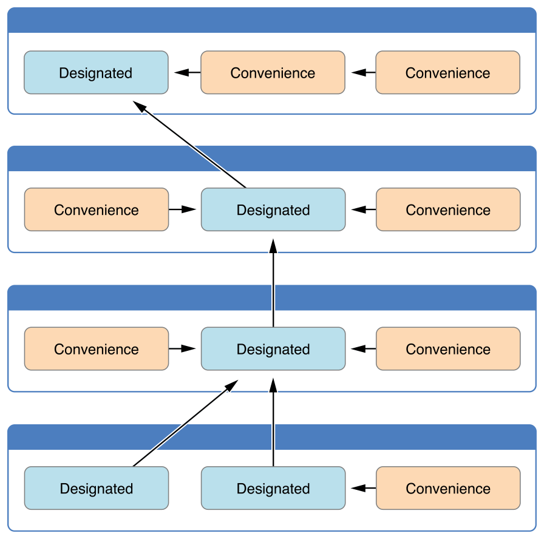
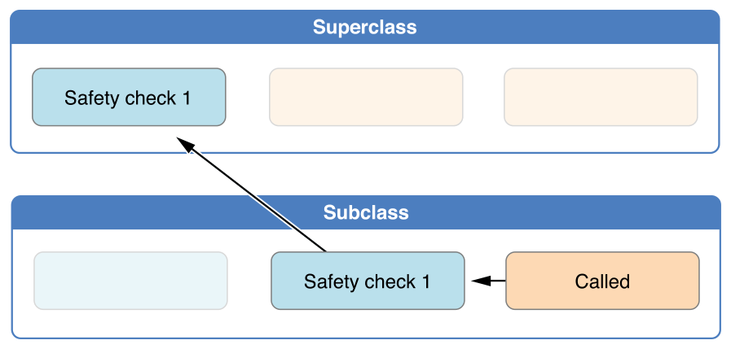
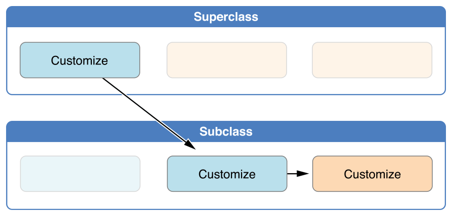
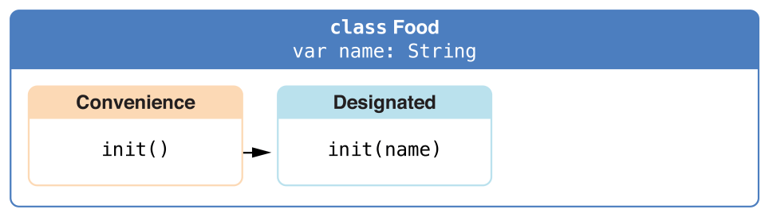
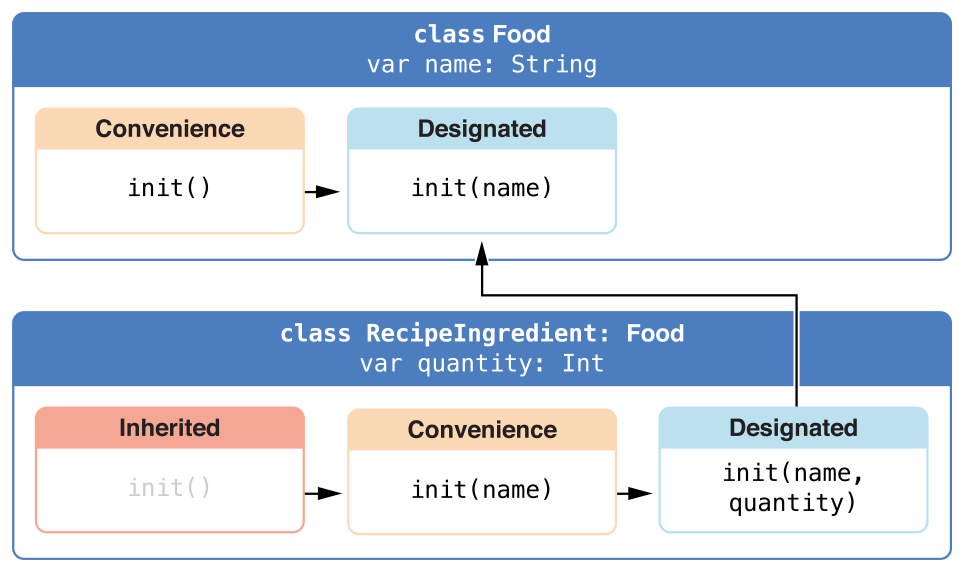
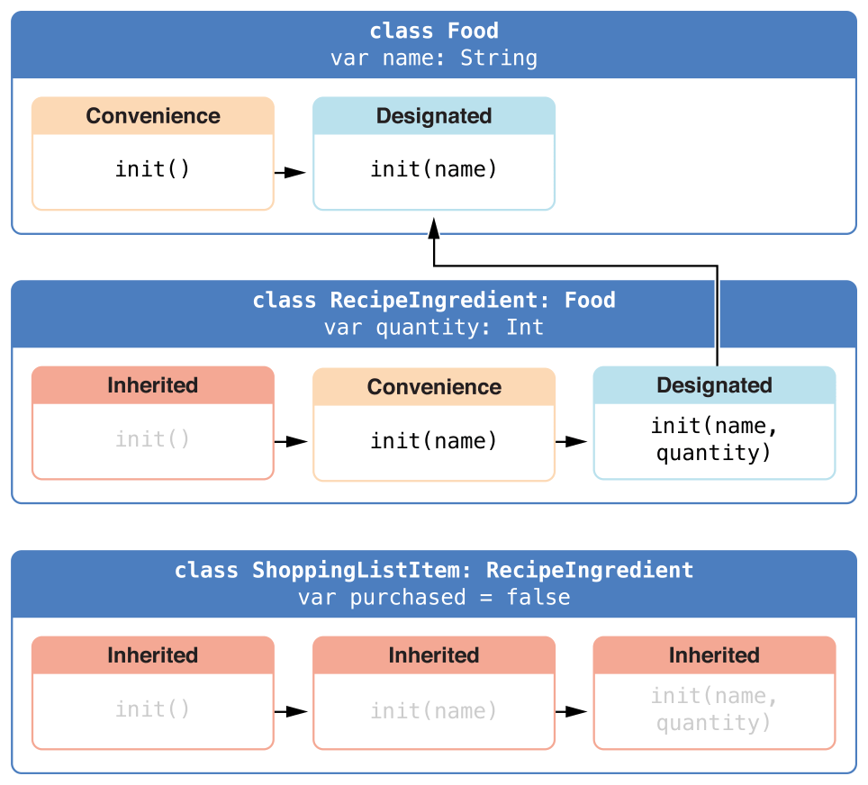

_初始化_是为类、结构体或者枚举准备实例的过程。这个过需要给实例里的每一个存储属性设置一个初始值并且在新实例可以使用之前执行任何其他所必须的配置或初始化。

你通过定义_初始化器_来实现这个初始化过程，它更像是一个用来创建特定类型新实例的特殊的方法。不同于 Objective-C 的初始化器，Swift 初始化器不返回值。这些初始化器主要的角色就是确保在第一次使用之前某类型的新实例能够正确初始化。

类类型的实例同样可以实现一个_反初始化器_，它会在这个类的实例被释放之前执行任意的自定义清理。更多关于反初始化器的信息，请看[反初始化](/deinitialization/)。

## 为存储属性设置初始化值

在创建类和结构体的实例时_必须_为所有的存储属性设置一个合适的初始值。存储属性不能遗留在不确定的状态中。

你可以在初始化器里为存储属性设置一个初始值，或者通过分配一个默认的属性值作为属性定义的一部分。在下面的小节中会描述这些动作。

> 注意
> 
> 当你给一个存储属性分配默认值，或者在一个初始化器里设置它的初始值的时候，属性的值就会被直接设置，不会调用任何属性监听器。

### 初始化器

_初始化器_在创建特定类型的实例时被调用。在这个简单的形式中，初始化器就像一个没有形式参数的实例方法，使用init 关键字来写：

```
init() {
    // perform some initialization here
}
```

下面的例子定义了一个名为Fahrenheit 结构体以储存华氏度表示的温度。Fahrenheit 结构体有一个Double 类型的存储属性temperature ：

```
struct Fahrenheit {
    var temperature: Double
    init() {
        temperature = 32.0
    }
}
var f = Fahrenheit()
print("The default temperature is \(f.temperature)° Fahrenheit")
// prints "The default temperature is 32.0° Fahrenheit"
```

这个结构体定义了一个初始化器，init ，没有形式参数，它初始化储存温度的值为32.0 (在华氏温度下水的冰点)。

<a id="spl-3"></a>
### 默认的属性值

如上所述，你可以在初始化器里为存储属性设置初始值。另外，指定一个_默认属性值_作为属性声明的一部分。当属性被定义的时候你可以通过为这个属性分配一个初始值来指定默认的属性值。

> 注意
> 
> 如果一个属性一直保持相同的初始值，可以提供一个默认值而不是在初始化器里设置这个值。最终结果是一样的，但是默认值将属性的初始化与声明更紧密地联系到一起。它使得你的初始化器更短更清晰，并且可以让你属性根据默认值推断类型。如后边的章节所述，默认值也让你使用默认初始化器和初始化器继承更加容易。

通过提供temperature 属性的默认值，你可以把上面的Fahrenheit 结构体写的更简单：

```
struct Fahrenheit {
    var temperature = 32.0
}

```

## 自定义初始化

如同下面章节所述，你可以通过输入形式参数和可选类型来自定义初始化过程，或者在初始化的时候分配常量属性。

### 初始化形式参数

你可以提供_初始化形式参数_作为初始化器的一部分，来定义初始化过程中的类型和值的名称。初始化形式参数与函数和方法的形式参数具有相同的功能和语法。

下面的例子定义了一个名为Celsius 的结构体，它用摄氏度表示储存温度。Celsius 结构体实现了两个自定义的初始化器init(fromFahrenheit:) 和 init(fromKelvin:) ， 它们用不同的温度单位初始化新的结构体实例：

```
struct Celsius {
    var temperatureInCelsius: Double
    init(fromFahrenheit fahrenheit: Double) {
        temperatureInCelsius = (fahrenheit - 32.0) / 1.8
    }
    init(fromKelvin kelvin: Double) {
        temperatureInCelsius = kelvin - 273.15
    }
}
let boilingPointOfWater = Celsius(fromFahrenheit: 212.0)
// boilingPointOfWater.temperatureInCelsius is 100.0
let freezingPointOfWater = Celsius(fromKelvin: 273.15)
// freezingPointOfWater.temperatureInCelsius is 0.0
```

第一个初始化器只有一个外部变量名fromFahrenheit 和一个局部变量名fahrenheit 的初始化形式参数。第二个初始化器只有一个外部变量名fromKelvin 和一个局部变量名kelvin 的初始化形式参数。这两个初始化器都把它们的实际参数转换为了摄氏度并且把这个值储存到了名为temperatureInCelsius 的属性里。

### 形式参数名和实际参数标签

与函数和方法的形式参数一样，初始化形式参数也可以在初始化器内部有一个局部变量名以及实际参数标签供调用的时候使用。

总之，初始化器并不能像函数和方法那样在圆括号前面有一个用来区分的函数名。因此，一个初始化器的参数名称和类型在识别该调用哪个初始化器的时候就扮演了一个非常重要的角色。因此，如果你没有提供外部名 Swift 会自动为_每一个_形式参数提供一个外部名称。

下面的例子定义了一个名为Color 的结构体，它有三个常量属性，分别为red ，green 和blue 。这些属性储存了一个介于0.0 到1.0 之间的值来表示颜色里的红、绿、蓝。

Color 给它的红绿蓝组合提供了一个初始化器，它带有三个合适名称的Double 类型形式参数。Color 同样提供了第二个只有一个white 形式参数的初始化器，它用来给三个颜色组合设置相同的值：

```
struct Color {
    let red, green, blue: Double
    init(red: Double, green: Double, blue: Double) {
        self.red   = red
        self.green = green
        self.blue  = blue
    }
    init(white: Double) {
        red   = white
        green = white
        blue  = white
    }
}
```

通过为每一个初始化器的形式参数提供一个初始值，初始化器可以用来创建新的Color 实例：

```
let magenta = Color(red: 1.0, green: 0.0, blue: 1.0)
let halfGray = Color(white: 0.5)
```

注意不使用外部名称是不能调用这些初始化器的。如果定义了外部参数名就必须用在初始化器里，省略的话会报一个编译时错误：

```
let veryGreen = Color(0.0, 1.0, 0.0)
// this reports a compile-time error - external names are required
```

### 无实际参数标签的初始化器形式参数

如果你不想为初始化器形式参数使用实际参数标签，可以写一个下划线(\_ )替代明确的实际参数标签以重写默认行为。

这里有一个之前Celsius 类的扩展版本例子，它有一个额外的初始化器来从已经是摄氏度的Double 值创建一个新的Celsius 类实例：

```
struct Celsius {
    var temperatureInCelsius: Double
    init(fromFahrenheit fahrenheit: Double) {
        temperatureInCelsius = (fahrenheit - 32.0) / 1.8
    }
    init(fromKelvin kelvin: Double) {
        temperatureInCelsius = kelvin - 273.15
    }
    init(_ celsius: Double) {
        temperatureInCelsius = celsius
    }
}
let bodyTemperature = Celsius(37.0)
// bodyTemperature.temperatureInCelsius is 37.0
```

调用初始化器Celsius(37.0) 有着清楚的意图而不需要外部形式参数名。因此，把初始化器写为init(\_ celsius: Double) 是合适的，它也就可以通过提供未命名的Double 值被调用了。

### 可选属性类型

如果你的自定义类型有一个逻辑上是允许“无值”的存储属性——大概因为它的值在初始化期间不能被设置，或者因为它在稍后允许设置为“无值”——声明属性为_可选_类型。可选类型的属性自动地初始化为nil ，表示该属性在初始化期间故意设为“还没有值”。

下面的例子定义了一个名为SurveyQuestion 的类，有一个可选String 属性，名为response ：

```
class SurveyQuestion {
    var text: String
    var response: String?
    init(text: String) {
        self.text = text
    }
    func ask() {
        print(text)
    }
}
let cheeseQuestion = SurveyQuestion(text: "Do you like cheese?")
cheeseQuestion.ask()
// prints "Do you like cheese?"
cheeseQuestion.response = "Yes, I do like cheese."
```

对调查问题的回答直到被问的时候才能知道，所以response 属性被声明为String? 类型，或者是“可选Stirng ”。当新的SurveyQuestion 实例被初始化的时候，它会自动分配一个为nil 的默认值，意味着“还没有字符串”。

<a id="spl-9"></a>
### 在初始化中分配常量属性

在初始化的任意时刻，你都可以给常量属性赋值，只要它在初始化结束是设置了确定的值即可。一旦为常量属性被赋值，它就不能再被修改了。

> 注意
> 
> 对于类实例来说，常量属性在初始化中只能通过引用的类来修改。它不能被子类修改。

你可以修改上面SurveyQuestion 的例子，给text 使用常量属性而不是变量属性来表示问题，来明确一旦SurveyQuestion 的实例被创建，那个问题将不会改变。尽管现在text 属性是一个常量，但是它依然可以在类的初始化器里设置：

```
class SurveyQuestion {
    let text: String
    var response: String?
    init(text: String) {
        self.text = text
    }
    func ask() {
        print(text)
    }
}
let beetsQuestion = SurveyQuestion(text: "How about beets?")
beetsQuestion.ask()
// prints "How about beets?"
beetsQuestion.response = "I also like beets. (But not with cheese.)"

```

<a id="spl-10"></a>
## 默认初始化器

Swift 为所有没有提供初始化器的结构体或类提供了一个_默认的初始化器_来给所有的属性提供了默认值。这个默认的初始化器只是简单地创建了一个所有属性都有默认值的新实例。

这个例子定义了一个名为ShoppingListItem 的类，它在购物列表的物品里封装了名称，数量和购买状态属性：

```
class ShoppingListItem {
    var name: String?
    var quantity = 1
    var purchased = false
}
var item = ShoppingListItem()
```

由于ShoppingListItem 类的所有属性都有默认值，又由于它是一个没有父类的基类，ShoppingListItem 类自动地获得了一个默认的初始化器，使用默认值设置了它的所有属性然后创建了新的实例。(name 属性是一个可选String 属性，所以它会自动设置为nil 默认值，尽管这个值没有写在代码里。)上面的例子给ShoppingListItem 类使用默认初始化器以及初始化器语法创建新的实例，写作ShoppingListItem() ，并且给这个新实例赋了一个名为item 的变量。

<a id="spl-11"></a>
### 结构体类型的成员初始化器

如果结构体类型中没有定义任何自定义初始化器，它会自动获得一个_成员初始化器_。不同于默认初始化器，结构体会接收成员初始化器即使它的存储属性没有默认值。

这个成员初始化器是一个快速初始化新结构体实例成员属性的方式。新实例的属性初始值可以通过名称传递到成员初始化器里。

下面的例子定义了一个名为Size 有两个属性分别是width 和height 的结构体，这两个属性通过分配默认值0.0 ，从而被推断为Double 类型。

Size 结构体自动接收一个init(width:heght:) 成员初始化器，你可以使用它来初始化一个新的Size 实例：

```
struct Size {
    var width = 0.0, height = 0.0
}
let twoByTwo = Size(width: 2.0, height: 2.0)

```

当你调用成员初始化器时，你可以省略任何拥有默认值的属性。在下面的例子中，Size 结构体的height 和width 都有默认值。你可以省略其中一个或者都省略，初始化器会使用默认值来初始化你省略的那个——比如说：

```
let zeroByTwo = Size(height: 2.0)
print(zeroByTwo.width, zeroByTwo.height)
// Prints "0.0 2.0"

let zeroByZero = Size()
print(zeroByZero.width, zeroByZero.height)
// Prints "0.0 0.0"
```

<a id="spl-12"></a>
## 值类型的初始化器委托

初始化器可以调用其他初始化器来执行部分实例的初始化。这个过程，就是所谓的_初始化器委托_，避免了多个初始化器里冗余代码。

初始化器委托的运作，以及允许那些形式的委托，这些规则对于值类型和类类型是不同的。值类型(结构体和枚举)不支持继承，所以他它们的初始化器委托的过程相当简单，因为它们只能提供它们自己为另一个初始化器委托。如同[继承](/inheritance/)里描述的那样，总之，类可以从其他类继承。这就意味着类有额外的责任来确保它们继承的所有存储属性在初始化期间都分配了一个合适的值。这些责任在下边的[类的继承和初始化](#spl-13)里做详述。

对于值类型，当你写自己自定义的初始化器时可以使用self.init 从相同的值类型里引用其他初始化器。你只能从初始化器里调用self.init 。

注意如果你为值类型定义了自定义初始化器，你就不能访问那个类型的默认初始化器(或者是成员初始化器，如果是结构体的话)。这个限制防止了别人意外地使用自动初始化器从而绕过复杂初始化器里提供的额外必要配置这种情况的发生。

> 注意
> 
> 如果你想要你自己的自定义值类型能够使用默认初始化器和成员初始化器初始化，以及你的自定义初始化器来初始化，把你的自定义初始化器写在扩展里而不是作为值类型原始实的一部分。想要了解更多的信息，请看[扩展](/extensions/)。

下面的例子定义了一个自定义的Rect 结构体代表几何矩形。这个例子需要两个结构体，分别是Size 和Point ，都为他们各自的属性默认值都是0.0 ：

```
struct Size {
    var width = 0.0, height = 0.0
}
struct Point {
    var x = 0.0, y = 0.0
}
```

你可以用三个方式中的任意一个来初始化下面的Rect 结构体——通过使用默认赋零初始化origin 和size 属性值，通过提供一个具体的原点坐标和大小，或者提供一个具体的中心点和大小。这三种初始化选项通过三个写在Rect 结构体定义里的自定义初始化器代表：

```
struct Rect {
    var origin = Point()
    var size = Size()
    init() {}
    init(origin: Point, size: Size) {
        self.origin = origin
        self.size = size
    }
    init(center: Point, size: Size) {
        let originX = center.x - (size.width / 2)
        let originY = center.y - (size.height / 2)
        self.init(origin: Point(x: originX, y: originY), size: size)
    }
}
```

第一个Rect 初始化器，init() ，和默认初始化器有一样的功能，就是那个如果Rect 没有自定义初始化器，它将会使用的那个默认初始化器。这个初始化器是空的，用一个大括号{} 来表示，并且不会执行任何初始化。调用这个初始化器会返回一个origin 和size 属性都被初始化为默认值0.0 的Rect 实例：

```
let basicRect = Rect()
// basicRect's origin is (0.0, 0.0) and its size is (0.0, 0.0)
```

第二个Rect 初始化器，init(origin:size:) ，和成员初始化器功能相同，就是如果Rect 没有自定义的初始化器，它将使用的那个初始化器。这个初始化器只是把origin 和size 实际参数值赋值给合适的存储属性：

```
let originRect = Rect(origin: Point(x: 2.0, y: 2.0),
    size: Size(width: 5.0, height: 5.0))
// originRect's origin is (2.0, 2.0) and its size is (5.0, 5.0)
```

第三个Rect 的初始化器，init(center:size:) ，略显复杂。它以计算一个基于center 和size 值的原点开始。然后调用(或是_委托_)init(origin:size:) 初始化器，它在合适的属性里储存了新的原点和大小值：

```
let centerRect = Rect(center: Point(x: 4.0, y: 4.0),
    size: Size(width: 3.0, height: 3.0))
// centerRect's origin is (2.5, 2.5) and its size is (3.0, 3.0)
```

init(center:size:) 初始化器可能自己已经为origin 和size 属性赋值了新值。总之，对于init(center:size:) 初始化器来说，可以更方便(更清楚)地利用现有已经提供了准确功能的初始化器。

> 注意
> 
> 另一种方法是不需要你自己定义init() 和init(origin:size:) 初始化器，请看[扩展](/extensions/)。

<a id="spl-13"></a>
## 类的继承和初始化

所有类的存储属性——包括从它的父类继承的所有属性——都_必须_在初始化期间分配初始值。

Swift 为类类型定义了两种初始化器以确保所有的存储属性接收一个初始值。这些就是所谓的指定初始化器和便捷初始化器。

### 指定初始化器和便捷初始化器

_指定初始化器_是类的主要初始化器。指定的初始化器可以初始化所有那个类引用的属性并且调用合适的父类初始化器来继续这个初始化过程给父类链。

类偏向于少量指定初始化器，并且一个类通常只有一个指定初始化器。指定初始化器是初始化开始并持续初始化过程到父类链的“传送”点。

每个类至少得有一个指定初始化器。如同在[初始化器的自动继承](#spl-19)里描述的那样，在某些情况下，这些需求通过从父类继承一个或多个指定初始化器来满足。

_便捷初始化器_是次要的，为一个类支持初始化器。你可以在相同的类里定义一个便捷初始化器来调用一个指定的初始化器作为便捷初始化器来给指定初始化器设置默认形式参数。你也可以为具体的使用情况或输入的值类型定义一个便捷初始化器从而创建这个类的实例。

如果你的类不需要便捷初始化器你可以不提供它。在为通用的初始化模式创建快捷方式以节省时间或者类的初始化更加清晰明了的时候使用便捷初始化器。

### 指定初始化器和便捷初始化器语法

用与值类型的简单初始化器相同的方式来写类的指定初始化器：

```
init(parameters) {
    statements
}
```

便捷初始化器有着相同的书写方式，但是要用convenience 修饰符放到init 关键字前，用空格隔开：

```
convenience init(parameters) {
    statements
}

```

<a id="spl-16"></a>
### 类类型的初始化器委托

为了简化指定和便捷初始化器之间的调用关系，Swift 在初始化器之间的委托调用有下面的三个规则:

#### **规则 1**

指定初始化器必须从它的直系父类调用指定初始化器。

#### **规则 2**

便捷初始化器必须从_相同的_类里调用另一个初始化器。

#### **规则 3**

便捷初始化器最终必须调用一个指定初始化器。

简单记忆的这些规则的方法如下：

- 指定初始化器必须总是向上委托。
- 便捷初始化器必须总是横向委托。

下面图中表示了这些规则：

[](https://www.logcg.com/wp-content/uploads/2015/08/initializerDelegation01_2x.png)

如图所示，父类包含一个指定初始化器和两个便捷初始化器。一个便捷初始化器调用另一个便捷初始化器，而后者又调用了指定初始化器。这满足了上边的规则2和规则3。父类本身没有其他父类，所以规则1不适用。

这个图中的子类有两个指定初始化器和一个便捷初始化器。便捷初始化器必须调用这两个指定初始化器之一，因为它只能从同一个类中调用初始化器。这满足了上边的规则2和规则3。两个指定初始化器又必须从父类调用一个指定初始化器，这满足了上边所说的规则1。

> 注意
> 
> 这些规则不会影响你的类的使用者为每个类创建实例。任何上图的初始化器都可以用来完整创建对应类的实例。这个规则只在类的实现时有影响。

下图展示了四个类之间更复杂的层级结构。它演示了指定初始化器是如何在此层级结构中充当"管道"作用，在类的初始化链上简化了类之间的内部关系：

[](https://www.logcg.com/wp-content/uploads/2015/08/initializerDelegation02_2x.png)

<a id="spl-17"></a>
### 两段式初始化

Swift 的类初始化是一个两段式过程。在第一个阶段，每一个存储属性被引入类为分配了一个初始值。一旦每个存储属性的初始状态被确定，第二个阶段就开始了，每个类都有机会在新的实例准备使用之前来定制它的存储属性。

两段式初始化过程的使用让初始化更加安全，同时在每个类的层级结构给与了完备的灵活性。两段式初始化过程可以防止属性值在初始化之前被访问，还可以防止属性值被另一个初始化器意外地赋予不同的值。

> 注意
> 
> Swift 的两段式初始化过程与 Objective-C 的初始化类似。主要的不同点是在第一阶段，Objective-C 为每一个属性分配零或空值(例如0  或nil )。Swift 的初始化流程更加灵活，它允许你设置自定义的初始值，并可以自如应对那些不把0  或nil 做为合法值的类型。

Swift编译器执行四种有效的安全检查来确保两段式初始化过程能够顺利完成：

#### **安全检查 1**

指定初始化器必须保证在向上委托给父类初始化器之前，其所在类引入的所有属性都要初始化完成。

如上所述，一个对象的内存只有在其所有储存型属性确定之后才能完全初始化。为了满足这一规则，指定初始化器必须保证它自己的属性在它上交委托之前先完成初始化。

#### **安全检查 2**

指定初始化器必须先向上委托父类初始化器，然后才能为继承的属性设置新值。如果不这样做，指定初始化器赋予的新值将被父类中的初始化器所覆盖。

#### **安全检查 3**

便捷初始化器必须先委托同类中的其它初始化器，然后再为任意属性赋新值（包括同类里定义的属性）。如果没这么做，便捷构初始化器赋予的新值将被自己类中其它指定初始化器所覆盖。

#### **安全检查 4**

初始化器在第一阶段初始化完成之前，不能调用任何实例方法、不能读取任何实例属性的值，也不能引用self 作为值。

直到第一阶段结束类实例才完全合法。属性只能被读取，方法也只能被调用，直到第一阶段结束的时候，这个类实例才被看做是合法的。

以下是两段初始化过程，基于上述四种检查的流程：

#### **阶段 1**

- 指定或便捷初始化器在类中被调用；
- 为这个类的新实例分配内存。内存还没有被初始化；
- 这个类的指定初始化器确保所有由此类引入的存储属性都有一个值。现在这些存储属性的内存被初始化了；
- 指定初始化器上交父类的初始化器为其存储属性执行相同的任务；
- 这个调用父类初始化器的过程将沿着初始化器链一直向上进行，直到到达初始化器链的最顶部；
- 一旦达了初始化器链的最顶部，在链顶部的类确保所有的存储属性都有一个值，此实例的内存被认为完全初始化了，此时第一阶段完成。

#### **阶段 2**

- 从顶部初始化器往下，链中的每一个指定初始化器都有机会进一步定制实例。初始化器现在能够访问self 并且可以修改它的属性，调用它的实例方法等等；
- 最终，链中任何便捷初始化器都有机会定制实例以及使用slef 。

下面展示了第一阶段假定的子类和父类之间的初始化调用关系： [](https://www.logcg.com/wp-content/uploads/2015/08/twoPhaseInitialization01_2x.png)

在这个例子中，初始化过程从一个子类的便捷初始化器开始。这个便捷初始化器还不能修改任何属性。它委托给了同一类里的指定初始化器。

指定初始化器确保所有的子类属性都有值，如安全检查1。然后它调用父类的指定初始化器来沿着初始化器链一直往上完成父类的初始化过程。

父类的指定初始化器确保所有的父类属性都有值。由于没有更多的父类来初始化，也就不需要更多的委托。

一旦父类中所有属性都有初始值，它的内存就被认为完全初始化了，第一阶段完成。

下图是相同的初始化过程在第二阶段的样子： [](https://www.logcg.com/wp-content/uploads/2015/08/twoPhaseInitialization02_2x.png)

现在父类的指定初始化器有机会来定制更多实例(尽管没有这种必要)。

一旦父类的指定初始化器完成了调用，子类的指定初始化器就可以执行额外的定制(同样，尽管没有这种必要)。

最后，一旦子类的指定初始化器完成，最初调用的便捷初始化器将会执行额外的定制操作。

<a id="spl-18"></a>
### 初始化器的继承和重写

不像在 Objective-C 中的子类，Swift 的子类不会默认继承父类的初始化器。Swift 的这种机制防止父类的简单初始化器被一个更专用的子类继承并被用来创建一个没有完全或错误初始化的新实例的情况发生。

> 注意
> 
> 只有在特定情况下才会继承父类的初始化器，但只有这样是安全且合适的时候。想要了解更多信息，请看下边的[初始化器的自动继承](#spl-19)。

如果你想自定义子类来实现一个或多个和父类相同的初始化器，你可以在子类中为那些初始化器提供定制的实现。

当你写的子类初始化器匹配父类_指定初始化器_的时候，你实际上可以重写那个初始化器。因此，在子类的初始化器定义之前你必须写override 修饰符。如同[默认初始化器](#spl-10)所描述的那样，即使是自动提供的默认初始化器你也可以重写。

作为一个重写的属性，方法或下标脚本，override 修饰符的出现会让 Swift 来检查父类是否有一个匹配的指定初始化器来重写，并且验证你重写的初始化器已经按照意图指定了形式参数。

> 注意
> 
> 当重写父类指定初始化器时，你必须写override 修饰符，就算你子类初始化器的实现是一个便捷初始化器。

相反，如同上边[类类型的初始化器委托](#spl-16)所描述的规则那样，如果你写了一个匹配父类_便捷_初始化器的子类初始化器，父类的便捷初始化器将永远不会通过你的子类直接调用。因此，你的子类不能(严格来讲)提供父类初始化器的重写。当提供一个匹配的父类便捷初始化器的实现时，你不用写override 修饰符。

下面的例子定义了一个名为Vehicle 的基类。基类声明了一个名为numberOfWheels 的存储属性，类型为Int 的默认值0  。numberOfWheels 属性通过一个名为description 的计算属性来创建一个String 类型的车辆特征字符串描述：

```
class Vehicle {
    var numberOfWheels = 0
    var description: String {
        return "\(numberOfWheels) wheel(s)"
    }
}
```

Vehicle 类只为它的存储属性提供了默认值，并且没有提供自定义的初始化器。因此，如同[默认初始化器](#spl-10)中描述的那样，它会自动收到一个默认初始化器。默认初始化器(如果可用的话)总是类的指定初始化器，也可以用来创建一个新的Vehicle 实例，numberOfWheels 默认为0  ：

```
let vehicle = Vehicle()
print("Vehicle: \(vehicle.description)")
// Vehicle: 0 wheel(s)

```

下面的例子定义了一个名为Bicycle 继承自Vehicle 的子类：

```
class Bicycle: Vehicle {
    override init() {
        super.init()
        numberOfWheels = 2
    }
}
```

子类Bicycle 定义了一个自定义初始化器init() 。这个指定初始化器和Bicycle 的父类的指定初始化器相匹配，所以Bicycle 中的指定初始化器需要带上override 修饰符。

Bicycle 类的init() 初始化器以调用super.init() 开始，这个方法作用是调用父类的初始化器。这样可以确保Bicycle 在修改属性之前它所继承的属性numberOfWheels 能被Vehicle 类初始化。在调用super.init() 之后，一开始的numberOfWheels 值会被新值2 替换。

如果你创建一个Bicycle 实例，你可以调用继承的description 计算属性来查看属性numberOfWheels 是否有改变。

```
let bicycle = Bicycle()
print("Bicycle: \(bicycle.description)")
// Bicycle: 2 wheel(s)
```

> 注意
> 
> 子类可以在初始化时修改继承的变量属性，但是不能修改继承过来的常量属性。

<a id="spl-19"></a>
### 初始化器的自动继承

如上所述，子类默认不会继承父类初始化器。总之，在特定的情况下父类初始化器_是_可以被自动继承的。实际上，这意味着在许多场景中你不必重写父类初始化器，只要可以安全操作，你就可以毫不费力地继承父类的初始化器。

假设你为你子类引入的任何新的属性都提供了默认值，请遵守以下2个规则：

#### **规则1**

如果你的子类没有定义任何指定初始化器，它会自动继承父类所有的指定初始化器。

#### **规则2**

如果你的子类提供了_所有_父类指定初始化器的实现——要么是通过规则1继承来的，要么通过在定义中提供自定义实现的——那么它自动继承所有的父类便捷初始化器。

就算你的子类添加了更多的便捷初始化器，这些规则仍然适用。

> 注意
> 
> 子类能够以便捷初始化器的形式实现父类指定初始化器来作为满足规则2的一部分。

### 指定和便捷初始化器的实战

下面的例子展示了在操作中指定初始化器，便捷初始化器和初始化器的自动继承。这个例子定义了Food ，RecipeIngredient 和ShoppingListItem 三个类的层级关系，并演示了它们的继承关系是如何相互作用的。

在层级关系中的基类称为Food ，它是一个简单的类用来封装了食品的名称。Food 类引入了一个名为name 的String 属性还提供了两个创建Food 实例的初始化器：

```
class Food {
    var name: String
    init(name: String) {
        self.name = name
    }
    convenience init() {
        self.init(name: "[Unnamed]")
    }
}
```

下面的图表展示了Food 类的初始化链：

[](https://www.logcg.com/wp-content/uploads/2015/08/initializersExample01_2x.png)

类没有默认成员初始化器，所以Food 类提供了一个接受单一实际参数的指定初始化器叫做name 。这个初始化器可以使用一个具体的名称来创建新的Food 实例：

```
let namedMeat = Food(name: "Bacon")
// namedMeat's name is "Bacon"
```

Food 类的init(name: String) 初始化器是一个_指定初始化器_，因为它确保Food 类新实例的所有存储属性都被完全初始化。Food 类没有父类，所以init(name: String) 初始化器不用调用super.init() 来完成它的初始化。

Food 类也提供了没有实际参数的_便捷_初始化器init() 。init() 初始化器通过委托调用同一类中定义的指定初始化器init(name: String) 并给参数name 传值\[Unnamed\] 来实现提供默认的名称占位符：

```
let mysteryMeat = Food()
// mysteryMeat's name is "[Unnamed]"
```

类层级中的第二个类是Food 的子类RecipeIngredient 。RecipeIngredient 类模型构建了食谱中一个调味剂。它引入了Int 类型的数量属性quantity （以及从Food 继承过来的name 属性)并且定义了两个初始化器来创建RecipeIngredient 实例：

```
class RecipeIngredient: Food {
    var quantity: Int
    init(name: String, quantity: Int) {
        self.quantity = quantity
        super.init(name: name)
    }
    override convenience init(name: String) {
        self.init(name: name, quantity: 1)
    }
}
```

下面的图标展示了RecipeIngredient 了的初始化链:

[](https://www.logcg.com/wp-content/uploads/2015/08/initializersExample02_2x.png)

RecipeIngredient 类只有一个指定初始化器，init(name: String, quantity: Int) ，它可以用来填充新的RecipeIngredient 实例中所有的属性。这个初始化器一开始先将传入的quantity 实际参数赋值给quantity 属性，这个属性也是唯一一个通过RecipeIngredient 引入的新属性。随后，初始化器将向上委托给父类Food 的init(name: String) 初始化器。这个过程满足上边所述的[两段式初始化](#spl-17)的安全检查1。

RecipeIngredient 同样定义了一个便捷初始化器，init(name: String) ，它只通过name来创建RecipeIngredient 的实例。这个便捷初始化器假设任意RecipeIngredient 没有明确数量的实例的quantity 值都为1 。便捷初始化器的定义让RecipeIngredient 实例创建的方便更快捷，并且当创建多个单数实例时可以避免代码冗余。这个便捷初始化器只是简单的委托了类的指定初始化器，传递了值为1 的quantity 。

RecipeIngredient 类提供的init(name: String) 便捷初始化器接收与Food 中指定初始化器init(name: String) 相同的形式参数。因为这个便捷初始化器从它的父类重写了一个指定初始化器，它必须使用override 修饰符(如同在[初始化器的继承和重写](#spl-18)中描述的那样)。

尽管RecipeIngredient 提供了init(name: String) 初始化器作为一个便捷初始化器，然而RecipeIngredient 类为所有的父类指定初始化器提供了实现。因此，RecipeIngredient 类也自动继承了父类所有的便捷初始化器。

在这个例子中，RecipeIngredient 的父类是Food ，它只有一个init() 便捷初始化器。因此这个初始化器也被RecipeIngredient 类继承。这个继承的init() 函数和Food 提供的是一样的，除了它是委托给RecipeIngredient 版本的init(name: String) 而不是Food 版本。

所有的这三种初始化器都可以用来创建新的RecipeIngredient 实例：

```
let oneMysteryItem = RecipeIngredient()
let oneBacon = RecipeIngredient(name: "Bacon")
let sixEggs = RecipeIngredient(name: "Eggs", quantity: 6)
```

类层级中第三个也是最后一个类是RecipeIngredient 的子类，叫做ShoppingListItem 。这个类构建了购物单中出现的某一种调味料。

在购物表里每一项都是从未购买状态开始的。为了展现这一事实，ShoppingListItem 引入了一个布尔类型的属性purchased ，默认值false 。ShoppingListItem 也添加了一个计算属性description 属性，它提供了关于ShoppingListItem 实例的一些文字描述：

```
class ShoppingListItem: RecipeIngredient {
    var purchased = false
    var description: String {
        var output = "\(quantity) x \(name)"
        output += purchased ? " ✔" : " ✘"
        return output
    }
}
```

> 注意
> 
> ShoppingListItem 没有定义初始化器来给purchased 一个初始值，这是因为任何添加到购物单（这里的模型）的项的初始状态总是未购买。

由于它为自己引入的所有属性提供了一个默认值并且自己没有定义任何初始化器，ShoppingListItem 会自动从父类继承_所有_的指定和便捷初始化器。

下图展示了三个类的初始化链：

[](https://www.logcg.com/wp-content/uploads/2015/08/initializersExample03_2x.png)

你可以使用全部三个继承来的初始化器来创建ShoppingListItem 的新实例：

```
var breakfastList = [
    ShoppingListItem(),
    ShoppingListItem(name: "Bacon"),
    ShoppingListItem(name: "Eggs", quantity: 6),
]
breakfastList[0].name = "Orange juice"
breakfastList[0].purchased = true
for item in breakfastList {
    print(item.description)
}
// 1 x Orange juice ✔
// 1 x Bacon ✘
// 6 x Eggs ✘
```

这里，名为breakfastList 的数组通过包含三个ShoppingListItem 实例的数组字面量创建。数组的类型被推断为\[ShoppingListItem\] 。数组创建之后，数组第一个ShoppingListItem 的name 从"\[Unnamed\]" 修改为"Orange juice" ，并且它的purchased 也标记为了true 。然后通过遍历打印每个数组的描述，展示了它们的默认状态都按照预期被设置了。

<a id="spl-21"></a>
## 可失败初始化器

定义类、结构体或枚举初始化时可以失败在某些情况下会管大用。这个失败可能由以下几种方式触发，包括给初始化传入无效的形式参数值，或缺少某种外部所需的资源，又或是其他阻止初始化的情况。

为了妥善处理这种可能失败的情况，在类、结构体或枚举中定义一个或多个_可失败的初始化器_。通过在init 关键字后面添加问号(init? )来写。

> 注意
> 
> 你不能定义可失败和非可失败的初始化器为相同的形式参数类型和名称。

可失败的初始化器创建了一个初始化类型的_可选_值。你通过在可失败初始化器写return nil 语句，来表明可失败初始化器在何种情况下会触发初始化失败。

> 注意
> 
> 严格来讲，初始化器不会有返回值。相反，它们的角色是确保在初始化结束时，self 能够被正确初始化。虽然你写了return nil 来触发初始化失败，但是你不能使用return 关键字来表示初始化成功了。

比如说，可失败初始化器为数字类型转换器做实现。为了确保数字类型之间的转换保持值不变，使用init(exactly:)  初始化器。如果类型转换不能保持值不变，初始化器失败。

```
let wholeNumber: Double = 12345.0
let pi = 3.14159
 
if let valueMaintained = Int(exactly: wholeNumber) {
    print("\(wholeNumber) conversion to int maintains value")
}
// Prints "12345.0 conversion to int maintains value"
 
let valueChanged = Int(exactly: pi)
// valueChanged is of type Int?, not Int
 
if valueChanged == nil {
    print("\(pi) conversion to int does not maintain value")
}
// Prints "3.14159 conversion to int does not maintain value"
```

下面的例子定义了一个名为Animal 的结构体，有一个名为species 的String 类型常量属性。Animal 结构体也定义了一个可失败初始化器，有一个形式参数species 。这个初始化器用来检查传入species 的字符串是否为空。如果发现了一个空字符串，初始化失败被触发。否则，就设置species 属性的值，然后初始化成功：

```
struct Animal {
    let species: String
    init?(species: String) {
        if species.isEmpty { return nil }
        self.species = species
    }
}
```

你可以通过可失败初始化器来尝试初始化一个新的Animal 实例并且检查初始化是否成功：

```
let someCreature = Animal(species: "Giraffe")
// someCreature is of type Animal?, not Animal
 
if let giraffe = someCreature {
    print("An animal was initialized with a species of \(giraffe.species)")
}
// prints "An animal was initialized with a species of Giraffe"
```

如果你给可失败初始化器的species 形式参数传了一个空字符串值，始化器触发初始化失败：

```
let anonymousCreature = Animal(species: "")
// anonymousCreature is of type Animal?, not Animal
 
if anonymousCreature == nil {
    print("The anonymous creature could not be initialized")
}
// prints "The anonymous creature could not be initialized"
```

> 注意
> 
> 检查空字符串值(比如是"" 而不是"Giraffe" )和检查值是否为nil 来表明可选项String是不是没有值是两个不一样的的概念。上面的例子中，空字符串("" )是合法的，非可选的String 。总之，对于Animal 来说让它的species属性有一个空的字符串作为值是不合适的。要模式化这个限制，可失败的初始化器就会在发现空字符串时触发初始化失败。

### 枚举的可失败初始化器

你可以使用一个可失败初始化器来在带一个或多个形式参数的枚举中选择合适的情况。如果提供的形式参数没有匹配合适的情况初始化器就可能失败。

下面的例子定义一个名为TemperatureUnit 的枚举，有三种可能的状态(Kelvin ， Celsius 和Fahrenheit )。使用一个可失败初始化器来找一个合适用来表示气温符号的Character 值：

```
enum TemperatureUnit {
    case Kelvin, Celsius, Fahrenheit
    init?(symbol: Character) {
        switch symbol {
        case "K":
            self = .Kelvin
        case "C":
            self = .Celsius
        case "F":
            self = .Fahrenheit
        default:
            return nil
        }
    }
}
```

你可以使用可失败初始化器为可能的三种状态来选择一个合适的枚举情况，当参数的值不能与任意一枚举成员相匹配时，该枚举类型初始化失败：

```
let fahrenheitUnit = TemperatureUnit(symbol: "F")
if fahrenheitUnit != nil {
    print("This is a defined temperature unit, so initialization succeeded.")
}
// prints "This is a defined temperature unit, so initialization succeeded."
 
let unknownUnit = TemperatureUnit(symbol: "X")
if unknownUnit == nil {
    print("This is not a defined temperature unit, so initialization failed.")
}
// prints "This is not a defined temperature unit, so initialization failed."

```

### 带有原始值枚举的可失败初始化器

带有原始值的枚举会自动获得一个可失败初始化器init?(rawValue:) ，该可失败初始化器接收一个名为rawValue 的合适的原始值类型形式参数如果找到了匹配的枚举情况就选择其一，或者没有找到匹配的值就触发初始化失败。

你可以把上面的TemperatureUnit 的例子可以重写为使用Character 原始值并带有改过的init?(rawValue:) 初始化器：

```
enum TemperatureUnit: Character {
    case Kelvin = "K", Celsius = "C", Fahrenheit = "F"
}
 
let fahrenheitUnit = TemperatureUnit(rawValue: "F")
if fahrenheitUnit != nil {
    print("This is a defined temperature unit, so initialization succeeded.")
}
// prints "This is a defined temperature unit, so initialization succeeded."
 
let unknownUnit = TemperatureUnit(rawValue: "X")
if unknownUnit == nil {
    print("This is not a defined temperature unit, so initialization failed.")
}
// prints "This is not a defined temperature unit, so initialization failed."

```

### 初始化失败的传递

类，结构体或枚举的可失败初始化器可以横向委托到同一个类，结构体或枚举里的另一个可失败初始化器。类似地，子类的可失败初始化器可以向上委托到父类的可失败初始化器。

无论哪种情况，如果你委托到另一个初始化器导致了初始化失败，那么整个初始化过程也会立即失败，并且之后任何初始化代码都不会执行。

> 注意
> 
> 可失败初始化器也可以委托其他的非可失败初始化器。通过这个方法，你可以为已有的初始化过程添加初始化失败的条件。

下面的例子定义了Product 类的子类CartItem 。CartItem 类建立了一个在线购物车中物品的模型。CartItem 引入了一个名为quantity 常量存储属性，并且确保了这个属性至少是1 :

```
class Product {
    let name: String
    init?(name: String) {
        if name.isEmpty { return nil }
        self.name = name
    }
}
 
class CartItem: Product {
    let quantity: Int
    init?(name: String, quantity: Int) {
        if quantity < 1 { return nil }
        self.quantity = quantity
        super.init(name: name)
    }
}
```

CartItem 的可失败初始化器以检测它是否接受了一个quantity 值为1或者更多开始。如果quantity 不合法，整个初始化过程会立即失败并且后来的初始化代码都不会执行。同样地，Product 的可失败初始化器检查name 的值，初始化器进程会在name 为空字符串时直接失败。

如果你用不能为空name 属性和数量为1 或者更多来创建CartItem 实例，则初始化成功：

```
if let twoSocks = CartItem(name: "sock", quantity: 2) {
    print("Item: \(twoSocks.name), quantity: \(twoSocks.quantity)")
}
// prints "Item: sock, quantity: 2"
```

如果你创建了一个CartItem 实例，quantity 的值为0  ，CartItem 初始化器会导致初始化失败：

```
if let zeroShirts = CartItem(name: "shirt", quantity: 0) {
    print("Item: \(zeroShirts.name), quantity: \(zeroShirts.quantity)")
} else {
    print("Unable to initialize zero shirts")
}
// prints "Unable to initialize zero shirts"
```

类似地，如果你尝试创建一个CartItem 实例，并且令name 为空值，那么父类Product 的初始化器就会导致初始化失败：

```
if let oneUnnamed = CartItem(name: "", quantity: 1) {
    print("Item: \(oneUnnamed.name), quantity: \(oneUnnamed.quantity)")
} else {
    print("Unable to initialize one unnamed product")
}
// prints "Unable to initialize one unnamed product"

```

### 重写可失败初始化器

你可以在子类里重写父类的可失败初始化器。就好比其他的初始化器。或者，你可以用子类的_非可失败_初始化器来重写父类可失败初始化器。这样允许你定义一个初始化不会失败的子类，尽管父类的初始化允许失败。

注意如果你用非可失败的子类初始化器重写了一个可失败初始化器，向上委托到父类初始化器的唯一办法是强制展开父类可失败初始化器的结果。

> 注意
> 
> 你可以用一个非可失败初始化器重写一个可失败初始化器，但反过来是不行的。

下面的例子定义了一个名为Document 的类。这个类建模了一个文档，其中的name 属性要么是一个非空的字符串值要么为nil ，但不能是一个空字符串：

```
class Document {
    var name: String?
    // this initializer creates a document with a nil name value
    init() {}
    // this initializer creates a document with a non-empty name value
    init?(name: String) {
        self.name = name
        if name.isEmpty { return nil }
    }
}
```

下面这个例子定义了一个名为AutomaticallyNamedDocument 的Document 类的子类。这个子类重写了Document 类引入的两个指定初始化器。这些重写确保了AutomaticallyNamedDocument 实例在初始化时没有名字或者传给init(name:) 初始化器一个空字符串时name 的初始值为"\[Untitled\]" ：

```
class AutomaticallyNamedDocument: Document {
    override init() {
        super.init()
        self.name = "[Untitled]"
    }
    override init(name: String) {
        super.init()
        if name.isEmpty {
            self.name = "[Untitled]"
        } else {
            self.name = name
        }
    }
}
```

AutomaticallyNamedDocument 类用非可失败的init(name:) 初始化器重写了父类的可失败init?(name:) 初始化器。因为AutomaticallyNamedDocument 类用不同的方式处理了空字符串的情况，它的初始化器不会失败，所以它提供了非可失败初始化器来代替。

你可以在初始化器里使用强制展开来从父类调用一个可失败初始化器作为子类非可失败初始化器的一部分。例如，下边的UntitledDocument 子类将总是被命名为"\[Untitled\]" ，并且在初始化期间它使用了父类的可失败init(name:) 初始化器：

```
class UntitledDocument: Document {
    override init() {
        super.init(name: "[Untitled]")!
    }
}
```

这种情况下，如果父类的init(name:) 初始化器曾以空字符串做名字调用，强制展开操作会导致运行时错误。总之，由于它调用了一个字符串常量，那么你可以看到初始化器不会失败，所以这时不会有运行时错误发生。

### 可失败初始化器 init!

通常来讲我们通过在init 关键字后添加问号 (init? )的方式来定义一个可失败初始化器以创建一个合适类型的可选项实例。另外，你也可以使用可失败初始化器创建一个隐式展开具有合适类型的可选项实例。通过在init 后面添加惊叹号(init! )是不是问号。

你可以在 init? 初始化器中委托调用 init! 初始化器，反之亦然。 你也可以用 init! 重写 init? ，反之亦然。 你还可以用init 委托调用init! ，尽管当init! 初始化器导致初始化失败时会触发断言。

## 必要初始化器

在类的初始化器前添加 required  修饰符来表明所有该类的子类都必须实现该初始化器：

```
class SomeClass {
    required init() {
        // initializer implementation goes here
    }
}
```

当子类重写父类的必要初始化器时，必须在子类的初始化器前同样添加required 修饰符以确保当其它类继承该子类时，该初始化器同为必要初始化器。在重写父类的必要初始化器时，不需要添加override 修饰符：

```
class SomeSubclass: SomeClass {
    required init() {
        // subclass implementation of the required initializer goes here
    }
}
```

> 注意
> 
> 如果子类继承的初始化器能够满足需求，则你无需显式地在子类中提供必要初始化器的实现。

## 通过闭包和函数来设置属性的默认值

如果某个存储属性的默认值需要自定义或设置，你可以使用闭包或全局函数来为属性提供默认值。当这个属性属于的实例初始化时，闭包或函数就会被调用，并且它的返回值就会作为属性的默认值。

这种闭包或函数通常会创建一个和属性相同的临时值，处理这个值以表示初始的状态，并且把这个临时值返回作为属性的默认值。

下面的代码框架展示了闭包是如何提供默认值给属性的：

```
class SomeClass {
    let someProperty: SomeType = {
        // create a default value for someProperty inside this closure
        // someValue must be of the same type as SomeType
        return someValue
    }()
}
```

注意闭包花括号的结尾跟一个没有参数的圆括号。这是告诉 Swift 立即执行闭包。如果你忽略了这对圆括号，你就会把闭包作为值赋给了属性，并且不会返回闭包的值。

> 注意
> 
> 如果你使用了闭包来初始化属性，请记住闭包执行的时候，实例的其他部分还没有被初始化。这就意味着你不能在闭包里读取任何其他的属性值，即使这些属性有默认值。你也不能使用隐式self 属性，或者调用实例的方法。

下面的例子定义了一个名为Checkerboard 结构体，建模了一个国际象棋的棋盘。国际象棋在一个8x8的棋盘上进行，这里我们用黑白色块来代替。


 

为了呈现游戏的棋盘，Checkerboard 结构体只有一个名为boardColors 的属性，它是一个包含 64 个Bool 值的数组。数组中的true 代表黑色的格子，false 代表白色的格子。数组中第一项代表棋盘的左上角方格，数组最后一项代表棋盘的右下角方格。

boardColors 数组在一个闭包里初始化，来设置它的颜色值：

```
struct Chessboard {
    let boardColors: [Bool] = {
        var temporaryBoard = [Bool]()
        var isBlack = false
        for i in 1...8 {
            for j in 1...8 {
                temporaryBoard.append(isBlack)
                isBlack = !isBlack
            }
            isBlack = !isBlack
        }
        return temporaryBoard
    }()
    func squareIsBlackAt(row: Int, column: Int) -> Bool {
        return boardColors[(row * 8) + column]
    }
}
```

无论何时，创建一个新的Checkboard ，闭包就会执行，并且boardColors 的默认值就会计算和返回。上面例子中的闭包在一个名为temporaryBoard 的临时数组中为每个方格计算并且设置合适的颜色，然后一旦设置完毕，就把这个临时数组作为闭包的返回值返回。返回的数组值储存在boardColors 中，并且可以通过squareIsBlackAtRow 工具函数来查询：

```
let board = Chessboard()
print(board.squareIsBlackAt(row: 0, column: 1))
// Prints "true"
print(board.squareIsBlackAt(row: 7, column: 7))
// Prints "false"
```
