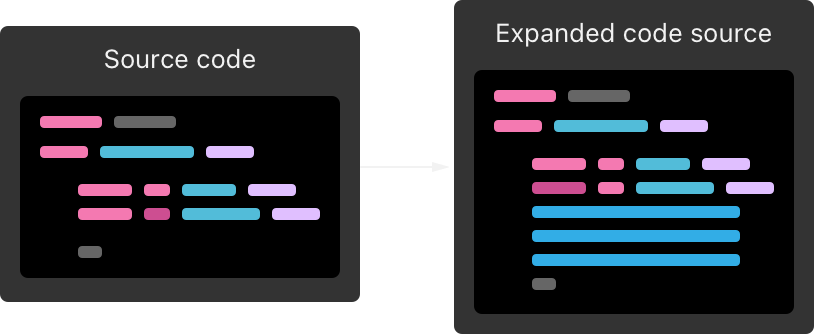
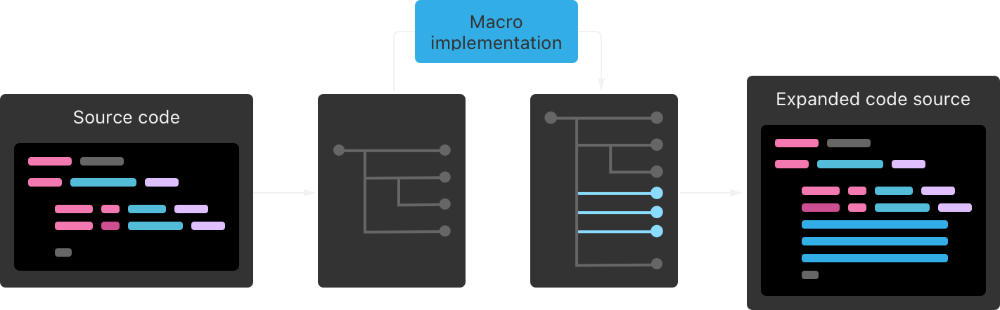
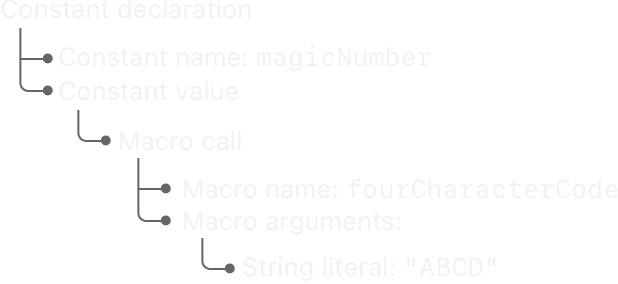
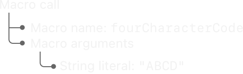
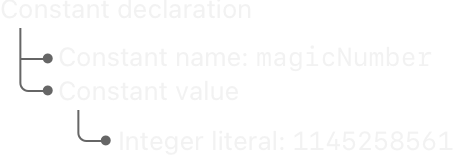

> 在编译时用宏生成代码。

宏在编译源代码时可以对其进行转换，以避免手动编写重复的代码。在编译过程中，Swift 会在构建代码之前展开代码中的所有宏。



宏的展开始终是一项增量操作：宏会添加新的代码，但不会删除或修改现有的代码。

宏的输入和宏展开的输出都会经过检查，以确保它们是符合语法的有效 Swift 代码。同样，你通过宏传递的值和由宏生成的代码中的值也会经过检查，以确保它们具有正确的类型。此外，如果宏的实现在展开宏时遇到错误，编译器将将其视为编译错误。这些保证使得理解使用宏的代码变得更容易，也更容易识别到错误使用宏或宏实现存在错误等问题。

Swift 有两种类型的宏：

- _独立宏_（Freestanding Macros）：独立宏自己出现，没有附加到声明。
- _附加宏_（Attached Macros）：附加宏修改它们所附加到的声明。

调用附加和独立宏的方式稍有不同，但它们都遵循相同的宏展开模型，并且你可以使用相同的方法来实现它们。下面的部分将更详细地描述这两种类型的宏。

### 独立宏

要调用独立宏，你在宏名称前加上井号（#），并在名称后的括号中写入宏的任何参数。例如：

```
func myFunction() {
    print("Currently running \(#function)")
    #warning("Something's wrong")
}
```

在第一行中，#function  调用了Swift标准库中的 function  宏。当你编译这段代码时，Swift 会调用该宏的实现，将 #function  替换为当前函数的名称。当你运行这段代码并调用 myFunction()  时，它会打印出“Currently running myFunction()”。在第二行中，#warning  调用了 Swift 标准库中的 warning(\_:)  宏，用于生成自定义的编译时警告。

独立宏可以产生一个值，就像 #function  这样，也可以在编译时执行一个动作，就像 #warning  这样。

### 附加宏

要调用附加宏，你在宏名称前加上 at 符号（@），并在名称后的括号中写入宏的任何参数。

附加宏会修改它们所附加到的声明。它们会向该声明添加代码，比如定义一个新的方法或添加符合某个协议。

例如，考虑下面这段不使用宏的代码：

```
struct SundaeToppings: OptionSet {
    let rawValue: Int
    static let nuts = SundaeToppings(rawValue: 1 << 0)
    static let cherry = SundaeToppings(rawValue: 1 << 1)
    static let fudge = SundaeToppings(rawValue: 1 << 2)
}
```

在这段代码中，SundaeToppings  选项集中的每个选项都包含对初始化程序的调用，这是重复且手动编写的。在添加新选项时很容易出错，例如在行末输入错误的数字。

下面是使用宏重写这段代码的版本：

```
@OptionSet<Int>
struct SundaeToppings {
    private enum Options: Int {
        case nuts
        case cherry
        case fudge
    }
}
```

这个版本的 SundaeToppings  调用了 Swift 标准库中的 @OptionSet  宏。该宏读取私有枚举中的选项列表，生成每个选项的常量列表，并添加符合 OptionSet  协议的实现。

作为比较，以下是展开后的 @OptionSet  宏的版本。你不需要编写这段代码，只有在特别要求 Swift 显示宏的展开时才会看到它。

```
struct SundaeToppings {
    private enum Options: Int {
        case nuts
        case cherry
        case fudge
    }

    typealias RawValue = Int
    var rawValue: RawValue
    init() { self.rawValue = 0 }
    init(rawValue: RawValue) { self.rawValue = rawValue }
    static let nuts: Self = Self(rawValue: 1 << Options.nuts.rawValue)
    static let cherry: Self = Self(rawValue: 1 << Options.cherry.rawValue)
    static let fudge: Self = Self(rawValue: 1 << Options.fudge.rawValue)
}
extension SundaeToppings: OptionSet { }
```

私有枚举之后的所有代码都来自 @OptionSet  宏。使用宏生成所有静态变量的 SundaeToppings  版本比手动编写的版本更易于阅读和维护。

### 宏声明

在大多数 Swift 代码中，当你实现一个符号，如函数或类型时，不需要单独的声明。但是，对于宏来说声明和实现是分开的。宏的声明包含其名称、参数、可用范围以及它生成的代码类型。宏的实现包含展开宏的代码。

你可以使用 macro 关键字引入宏声明。例如，下面是上述示例中使用的 @OptionSet  宏的一部分声明：

```
public macro OptionSet<RawType>() =
        #externalMacro(module: "SwiftMacros", type: "OptionSetMacro")
```

第一行指定了宏的名称和参数 — 名称为 OptionSet ，它不接受任何参数。第二行使用 Swift 标准库中的 externalMacro(module:type:)  宏告诉 Swift 宏的实现所在的位置。在这种情况下，SwiftMacros 模块包含了一个名为OptionSetMacro 的类型，它实现了 @OptionSet  宏。

因为 OptionSet  是一个附加宏，所以它的名称使用大驼峰命名法，就像结构体和类的名称一样。独立宏的名称使用小驼峰命名法，就像变量和函数的名称一样。

> 注意
> 
> 宏始终声明为 public 。因为声明宏的代码与使用宏的代码位于不同的模块中，所以没有地方可以应用非public 的宏。

宏声明定义了宏的角色 — 即可以调用该宏的源代码中的位置，以及宏可以生成的代码的类型。每个宏都有一个或多个角色，你在宏声明的属性中写入这些角色。以下是关于 @OptionSet  的声明的更多部分包含特性和它的角色：

```
@attached(member)
@attached(conformance)
public macro OptionSet<RawType>() =
        #externalMacro(module: "SwiftMacros", type: "OptionSetMacro")
```

在上面的声明中，@attached  属性出现两次，分别对应宏的每个角色。第一次使用 @attached(member) ，表示该宏添加新的成员到应用宏的类型中。@OptionSet  宏添加了符合 OptionSet  协议所需的 init(rawValue:)  初始化程序以及其他一些成员。第二次使用 @attached(conformance) ，告诉你 @OptionSet  添加一个或多个协议符合。@OptionSet  宏扩展了应用该宏的类型，以添加遵循 OptionSet  协议。

对于独立宏，你可以使用 @freestanding  属性指定其角色：

```
@freestanding(expression)
public macro line<T: ExpressibleByIntegerLiteral>() -> T =
        /* ... location of the macro implementation... */
```

上面的 #line  宏具有表达式角色。表达式宏产生一个值，或执行类似生成警告的编译时动作。

除了宏的角色之外，宏的声明还提供了关于宏生成的符号名称的信息。当宏声明提供名称列表时，它保证只产生使用这些名称的声明，这有助于你理解和调试生成的代码。以下是完整的 @OptionSet  声明：

```
@attached(member, names: named(RawValue), named(rawValue),
        named(`init`), arbitrary)
@attached(conformance)
public macro OptionSet<RawType>() =
        #externalMacro(module: "SwiftMacros", type: "OptionSetMacro")
```

上面的声明中，@attached(member)  宏在每个生成的符号名称后的标签 named:  之后包含了参数。宏为名为 RawValue 、rawValue  和 init  的符号添加了声明 — 因为这些名称事先已知，所以宏声明会将它们明确列出。

宏声明还在名称列表之后包含了 arbitrary ，允许宏生成名称在使用宏之前未知的声明。例如，当将 @OptionSet  宏应用于上述的 SundaeToppings  时，它会生成与枚举案例 nuts 、cherry  和 fudge  对应的类型属性。

详细信息和宏角色的完整列表，请参阅[特性](https://www.cnswift.org/attributes)中的 attached  和 freestanding 。

### 宏展开

在构建使用宏的 Swift 代码时，编译器调用宏的实现来展开宏。



具体来说，Swift 以以下方式展开宏：

1. 编译器读取代码，创建语法的内存表示。
2. 编译器将部分内存表示发送给宏实现，以展开宏。
3. 编译器用展开的形式替换宏调用。
4. 编译器继续编译，使用展开后的源代码。

下面通过以下示例来详细说明这些步骤：

```
let magicNumber = #fourCharacterCode("ABCD")
```

#fourCharacterCode 宏接受一个长度为四个字符的字符串，并返回一个无符号32位整数，该整数由字符串中的 ASCII 值连接而成。一些文件格式使用这样的整数来标识数据，因为它们既紧凑又可以方便地在调试器中阅读。下面的“实现宏”部分将展示如何实现这个宏。

要展开上面代码中的宏，编译器读取Swift文件并创建一个内存中的表示形式，称为抽象语法树（AST）。AST使代码的结构变得明确，这样更容易编写与该结构进行交互的代码，比如编译器或宏实现。下面是对上面代码的AST的表示，为了简化，省略了一些额外细节：



上面的图展示了内存中表示这段代码结构的方式。AST 中的每个元素都对应源代码的一部分。“常量声明” AST 元素的下方有两个子元素，它们表示常量声明的两个部分：名称和值。“宏调用”元素有子元素，表示宏的名称和传递给宏的参数列表。

在构造这个 AST 的过程中，编译器会检查源代码是否是有效的 Swift 代码，例如 #fourCharacterCode 接受一个参数，该参数必须是一个字符串。如果你尝试传递一个整数参数，或者忘记了字符串字面量末尾的引号（“\`”），则在这个过程中会得到一个错误。

编译器找到你调用宏的代码中的位置，并加载实现这些宏的外部二进制文件。对于每个宏调用，编译器将部分AST传递给该宏的实现。下面是该部分AST的表示：



`#fourCharacterCode` 宏的实现将这个部分 AST 作为输入进行展开。宏的实现仅操作作为输入接收到的部分 AST，这意味着无论在它前面还是后面有什么代码，宏始终以相同的方式展开。这种限制有助于更容易理解宏展开，并且可以使 Swift 避免展开未改变的宏，从而提高构建速度。

Swift 通过以下方式帮助宏作者避免意外读取其他输入的问题：

- 传递给宏实现的 AST 只包含表示宏的 AST 元素，不包含任何前后的代码。
- 宏实现在受限环境中运行，防止它访问文件系统或网络。

除了这些保护措施之外，宏的作者负责不读取或修改宏输入之外的任何内容。例如，宏的展开不能依赖于当前的时间。

`#fourCharacterCode` 的实现生成一个新的AST，其中包含展开后的代码。以下是编译器接收到的展开后代码的表示：


编译器接收到这个展开后的 AST 后，将包含宏调用的 AST 元素替换为包含宏展开的元素。在宏展开后，编译器再次检查以确保程序仍然是符合语法的有效 Swift 代码，并且所有类型都是正确的。这将产生一个最终的 AST，可以像往常一样编译：



这个 AST 对应于以下的 Swift 代码：

```
let magicNumber = 1145258561
```

在这个示例中，输入源代码只有一个宏，但是实际的程序可能有多个相同宏的实例和对不同宏的调用。编译器逐个展开宏。

如果一个宏出现在另一个宏内部，外部宏会先展开 — 这使得外部宏能够修改内部宏在展开之前的代码。

### 实现一个宏

要实现一个宏，你需要创建两个组件：一个执行宏展开的类型，以及一个声明宏以公开它作为API的库。即使你在同时开发宏和使用它的客户端代码，这些部分也是分开构建的，因为宏的实现是作为构建宏的客户端的一部分而运行的。

要使用 Swift Package Manager 创建新的宏，请运行 swift package init --type macro  — 这将创建几个文件，包括一个宏实现和声明的模板。

要在现有项目中添加宏，请按如下方式编辑 Package.swift  文件的开头：

- 在 swift-tools-version  注释中设置 Swift 工具版本为 5.9 或更高版本。
- 导入 CompilerPluginSupport  模块。
- 在平台列表中将 macOS 10.15 作为最低部署目标。

下面的代码显示了 Package.swift 文件示例的开头。

```
// swift-tools-version: 5.9

import PackageDescription
import CompilerPluginSupport

let package = Package(
    name: "MyPackage",
    platforms: [ .iOS(.v17), .macOS(.v13)],
    // ...
)
```

接下来，在现有的 Package.swift  文件中添加宏实现的目标和宏库的目标。例如，你可以添加类似以下内容，更改名称以匹配你的项目：

```
targets: [
    // Macro implementation that performs the source transformations.
    .macro(
        name: "MyProjectMacros",
        dependencies: [
            .product(name: "SwiftSyntaxMacros", package: "swift-syntax"),
            .product(name: "SwiftCompilerPlugin", package: "swift-syntax")
        ]
    ),

    // Library that exposes a macro as part of its API.
    .target(name: "MyProject", dependencies: ["MyProjectMacros"]),
]
```

上面的代码定义了两个目标：MyProjectMacros  包含宏的实现，MyProject  使这些宏可用。

宏的实现使用 SwiftSyntax  模块以结构化的方式与 Swift 代码进行交互，使用 AST。如果你使用 Swift Package Manager 创建了一个新的宏包，生成的 Package.swift  文件会自动包含对 SwiftSyntax  的依赖。如果你正在向现有项目添加宏，请在 Package.swift  文件中添加对 SwiftSyntax  的依赖：

```
dependencies: [
    .package(url: "https://github.com/apple/swift-syntax.git", from: "some-tag"),
],
```

将上面代码中的 some-tag  替换为你想要使用的 SwiftSyntax  版本的 Git 标签。

根据宏的角色，宏的实现要符合 SwiftSystem  中相应的协议。例如，考虑上面的 #fourCharacterCode 。下面是一个实现该宏的结构体：

```
public struct FourCharacterCode: ExpressionMacro {
    public static func expansion(
        of node: some FreestandingMacroExpansionSyntax,
        in context: some MacroExpansionContext
    ) throws -> ExprSyntax {
        guard let argument = node.argumentList.first?.expression,
              let segments = argument.as(StringLiteralExprSyntax.self)?.segments,
              segments.count == 1,
              case .stringSegment(let literalSegment)? = segments.first
        else {
            throw CustomError.message("Need a static string")
        }

        let string = literalSegment.content.text
        guard let result = fourCharacterCode(for: string) else {
            throw CustomError.message("Invalid four-character code")
        }

        return "\(raw: result)"
    }
}

private func fourCharacterCode(for characters: String) -> UInt32? {
    guard characters.count == 4 else { return nil }

    var result: UInt32 = 0
    for character in characters {
        result = result << 8
        guard let asciiValue = character.asciiValue else { return nil }
        result += UInt32(asciiValue)
    }
    return result.bigEndian
}
enum CustomError: Error { case message(String) }
```

如果要将此宏添加到现有的 Swift Package Manager 项目中，请添加一个类型，作为宏目标的入口点，并列出目标定义的宏：

```
import SwiftCompilerPlugin

@main
struct MyProjectMacros: CompilerPlugin {
    var providingMacros: [Macro.Type] = [FourCharacterCode.self]
}
```

`#fourCharacterCode`  是一个独立宏，它生成一个表达式，因此实现它的 FourCharacterCode  类型符合 ExpressionMacro  协议。ExpressionMacro  协议有一个要求，即 expansion(of:in:)  方法用于展开 AST。对于宏的角色列表和它们对应的SwiftSystem 协议，请参阅[特性](https://www.cnswift.org/attributes)中的 attached  和 freestanding 。

要展开 #fourCharacterCode  宏，Swift 将代码中使用该宏的 AST 发送给包含宏实现的库。在库内部，Swift 会调用 FourCharacterCode.expansion(of:in:)  方法，将 AST 和上下文作为参数传递给该方法。expansion(of:in:)  的实现找到作为参数传递给 #fourCharacterCode  的字符串字面量，并计算相应的整数字面量值。

在上面的示例中，第一个 guard  语句从 AST 中提取出字符串字面量，并将该 AST 元素分配给 literalSegment 。第二个 guard  语句调用了私有函数 FourCharacterCode(for:) 。这两个 guard  语句如果使用宏错误，则抛出错误 — 错误消息将成为错误信息的一部分。例如，如果尝试将宏调用写为 #fourCharacterCode("AB" + "CD") ，编译器将显示错误消息“Need a static string”。

`expansion(of:in:)`  方法返回 ExprSyntax  的实例，它是SwiftSyntax 中表示 AST 中的表达式的类型。因为这种类型符合 StringLiteralConvertible  协议，所以宏实现可以使用字符串字面量作为轻量级的语法来创建结果。你从宏实现返回的所有SwiftSyntax 类型都符合 StringLiteralConvertible ，因此在实现任何类型的宏时都可以使用这种方法。

### 开发和调试宏

宏可以很好地配合测试：它们将一个 AST 转换成另一个 AST，而不依赖于任何外部状态，并且不对任何外部状态进行更改。此外，你可以使用字符串字面量创建语法节点，这简化了测试输入的设置。你还可以读取 AST 的描述形式，以获得与预期值进行比较的字符串。例如，下面是对前面示例中的 #fourCharacterCode  宏进行测试的代码：

```
let source: SourceFileSyntax =
    """
    let abcd = #fourCharacterCode("ABCD")
    """

let file = BasicMacroExpansionContext.KnownSourceFile(
    moduleName: "MyModule",
    fullFilePath: "test.swift"
)

let context = BasicMacroExpansionContext(sourceFiles: [source: file])

let transformedSF = source.expand(
    macros:["fourCharacterCode": FourCC.self],
    in: context
)

let expectedDescription =
    """
    let abcd = 1145258561
    """

precondition(transformedSF.description == expectedDescription)
```

上面的示例使用 precondition  进行了宏的测试，但你也可以使用测试框架。
