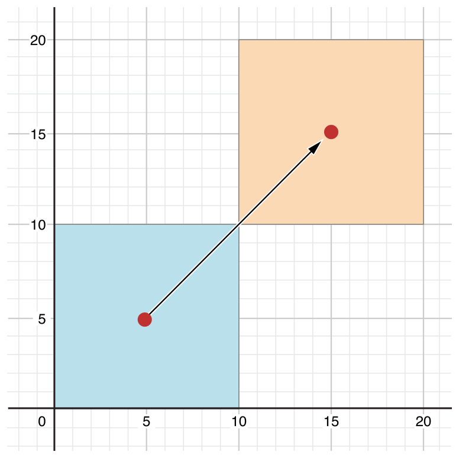
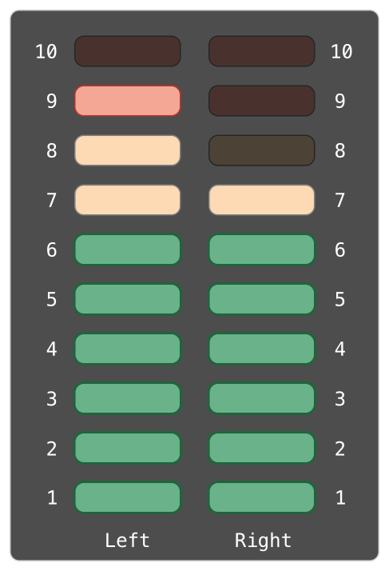

_属性_可以将值与特定的类、结构体或者是枚举联系起来。存储属性会存储常量或变量作为实例的一部分，反之计算属性会计算（而不是存储）值。计算属性可以由类、结构体和枚举定义。存储属性只能由类和结构体定义。

存储属性和计算属性通常和特定类型的实例相关联。总之，属性也可以与类型本身相关联。这种属性就是所谓的类型属性。

另外，你也可以定义属性观察器来检查属性中值的变化，这样你就可以用自定义的行为来响应。属性观察器可以被添加到你自己定义的存储属性中，也可以添加到子类从他的父类那里所继承来的属性中。

## 存储属性

在其最简单的形式下，存储属性是一个作为特定类和结构体实例一部分的常量或变量。存储属性要么是_变量存储属性_（由var  关键字引入）要么是_常量存储属性_（由let  关键字引入）。

正如[默认属性值](/initialization/#spl-3)中所述，你可以为存储属性提供一个默认值作为它定义的一部分。你也可以在初始化的过程中设置和修改存储属性的初始值。正如在[初始化中分配常量属性](/initialization/#spl-9)所述，这一点对于常量存储属性也成立。

下面的例子定义了一个名为FixedLengthRange 的结构体，它描述了一个一旦被创建长度就不能改变的整型值域：

```
struct FixedLengthRange {
    var firstValue: Int
    let length: Int
}
var rangeOfThreeItems = FixedLengthRange(firstValue: 0, length: 3)
// the range represents integer values 0, 1, and 2
rangeOfThreeItems.firstValue = 6
// the range now represents integer values 6, 7, and 8

```

FixedLengthRange 的实例有一个名为firstValue 的变量存储属性和一个名为length 的常量存储属性。在上面的例子中，当新的值域创建时length 已经被创建并且不能再修改，因为这是一个常量属性。

### 常量结构体实例的存储属性

如果你创建了一个结构体的实例并且把这个实例赋给常量，你不能修改这个实例的属性，即使是声明为变量的属性：

```
let rangeOfFourItems = FixedLengthRange(firstValue: 0, length: 4)
// this range represents integer values 0, 1, 2, and 3
rangeOfFourItems.firstValue = 6
// this will report an error, even though firstValue is a variable property

```

由于rangeOfFourItems 被声明为常量（用let 关键字），我们不能改变其firstValue 属性，即使firstValue 是一个变量属性。

这是由于结构体是_值类型_。当一个值类型的实例被标记为常量时，该实例的其他属性也均为常量。

对于类来说则不同，它是_引用类型_。如果你给一个常量赋值引用类型实例，你仍然可以修改那个实例的变量属性。

<a id="spl-3"></a>
### 延迟存储属性

_延迟存储属性_的初始值在其第一次使用时才进行计算。你可以通过在其声明前标注lazy 修饰语来表示一个延迟存储属性。

> 注意
> 
> 你必须把延迟存储属性声明为变量（使用var 关键字），因为它的初始值可能在实例初始化完成之前无法取得。常量属性则必须在初始化完成_之前_有值，因此不能声明为延迟。

一个属性的初始值可能依赖于某些外部因素，当这些外部因素的值只有在实例的初始化完成后才能得到时，延迟属性就可以发挥作用了。而当属性的初始值需要执行复杂或代价高昂的配置才能获得，你又想要在需要时才执行，延迟属性就能够派上用场了。

下面这个栗子使用了一个延迟存储属性来避免复杂类不必要的初始化。这个例子定义了两个名为DartImporter 和DartManager 的类，他们都没有完整显示：

```
class DataImporter {
    
    //DataImporter is a class to import data from an external file.
    //The class is assumed to take a non-trivial amount of time to initialize.
    
    var fileName = "data.txt"
    // the DataImporter class would provide data importing functionality here
}
 
class DataManager {
    lazy var importer = DataImporter()
    var data = [String]()
    // the DataManager class would provide data management functionality here
}
 
let manager = DataManager()
manager.data.append("Some data")
manager.data.append("Some more data")
// the DataImporter instance for the importer property has not yet been created

```

类DataManager 有一个名为data 的存储属性，它被初始化为一个空的新String 数组。尽管它的其余功能没有展示出来，还是可以知道类DataManager 的目的是管理并提供访问这个String 数组的方法。

DataManager 类的功能之一是从文件导入数据。此功能由DataImporter 类提供，它假定为需要一定时间来进行初始化。这大概是因为DataImporter 实例在进行初始化的时候需要打开文件并读取其内容到内存中。

DataManager 实例并不要从文件导入数据就可以管理其数据的情况是有可能发生的，所以当DataManager 本身创建的时候没有必要去再创建一个新的DataImporter 实例。反之，在DataImporter 第一次被使用的时候再创建它才更有意义。

因为它被lazy 修饰符所标记，只有在importer 属性第一次被访问时才会创建DataImporter 实例，比如当查询它的fileName 属性时：

```
print(manager.importer.fileName)
// the DataImporter instance for the importer property has now been created
// prints "data.txt"
```

> 注意
> 
> 如果被标记为lazy 修饰符的属性同时被多个线程访问并且属性还没有被初始化，则无法保证属性只初始化一次。

### 存储属性与实例变量

如果你有 Objective-C 的开发经验，那你应该知道在类实例里有_两_种方法来存储值和引用。另外，你还可以使用实例变量作为属性中所储存的值的备份存储。

Swift 把这些概念都统一到了属性声明里。Swift 属性没有与之相对应的实例变量，并且属性的后备存储不能被直接访问。这避免了不同环境中对值的访问的混淆并且将属性的声明简化为一条单一的、限定的语句。所有关于属性的信息——包括它的名字，类型和内存管理特征——都作为类的定义放在了同一个地方。

## 计算属性

除了存储属性，类、结构体和枚举也能够定义_计算属性_，而它实际并不存储值。相反，他们提供一个读取器和一个可选的设置器来间接得到和设置其他的属性和值。

```
struct Point {
    var x = 0.0, y = 0.0
}
struct Size {
    var width = 0.0, height = 0.0
}
struct Rect {
    var origin = Point()
    var size = Size()
    var center: Point {
        get {
            let centerX = origin.x + (size.width / 2)
            let centerY = origin.y + (size.height / 2)
            return Point(x: centerX, y: centerY)
        }
        set(newCenter) {
            origin.x = newCenter.x - (size.width / 2)
            origin.y = newCenter.y - (size.height / 2)
        }
    }
}
var square = Rect(origin: Point(x: 0.0, y: 0.0),
    size: Size(width: 10.0, height: 10.0))
let initialSquareCenter = square.center
square.center = Point(x: 15.0, y: 15.0)
print("square.origin is now at (\(square.origin.x), \(square.origin.y))")
// prints "square.origin is now at (10.0, 10.0)"

```

这个例子定义了三个结构体来处理几何图形：

- Point 封装了一个(x,y) 坐标;
- Size 封装了一个width 和height ;
- Rect 封装了一个长方形包括原点和大小。

Rect 结构体还提供了一个名为center 的计算属性。Rect 的当前中心位置由它的origin 和size 决定，所以你不需要把中心点作为一个明确的Point 值来存储。相反，Rect 为名为center 的计算变量定义了一个定制的读取器（getter ）和设置器（setter ），来允许你使用该长方形的center ，就好像它是一个真正的存储属性一样。

前面的例子创建了一个名为square 的新Rect 变量。square 变量以(0,0) 为中心点，宽和高为10 初始化。这个方形在下面的图像中以蓝色方形区域表示。

square 变量的center 属性通过点操作符（square. center ）来访问，通过调用center 的读取器，来得到当前的属性值。而读取器实际上是计算并返回一个新的Point 来表示这个方形区域的中心，而不是返回一个已存在的值。如上边你看到的，getter正确返回了一个值为（5，5 ）的中心点。

然后center 属性被赋予新值（15，15 ），使得该方形区域被移动到了右上方，到达下图中如黄色区域所在的新位置。设置center 属性调用center 的设置器方法，通过修改origin 存储属性中x 和y 的值，将该正方形移动到新位置。

[](https://www.logcg.com/wp-content/uploads/2015/08/computedProperties_2x-1.png)

### 简写设置器（setter）声明

如果一个计算属性的设置器没有为将要被设置的值定义一个名字，那么他将被默认命名为newValue 。下面是结构体Rect 的另一种写法，其中利用了简写设置器声明的特性。

```
struct AlternativeRect {
    var origin = Point()
    var size = Size()
    var center: Point {
        get {
            let centerX = origin.x + (size.width / 2)
            let centerY = origin.y + (size.height / 2)
            return Point(x: centerX, y: centerY)
        }
        set {
            origin.x = newValue.x - (size.width / 2)
            origin.y = newValue.y - (size.height / 2)
        }
    }
}

```

### 缩写读取器（getter）声明

如果整个 getter 的函数体是一个单一的表达式，那么 getter 隐式返回这个表达式。这里是另一个版本的Rect 结构体，它利用 getter 和 setter 应用了缩写标记：

```
struct CompactRect {
    var origin = Point()
    var size = Size()
    var center: Point {
        get {
            Point(x: origin.x + (size.width / 2),
                  y: origin.y + (size.height / 2))
        }
        set {
            origin.x = newValue.x - (size.width / 2)
            origin.y = newValue.y - (size.height / 2)
        }
    }
}
```

如果在[隐式返回的函数](/functions#隐式返回的函数)中描述的那样，在 getter 里省略return 与在函数里省略return 规则相同。

### 只读计算属性

一个有读取器但是没有设置器的计算属性就是所谓的_只读计算属性_。只读计算属性返回一个值，也可以通过点语法访问，但是不能被修改为另一个值。

> 注意
> 
> 你必须用var 关键字定义计算属性——包括只读计算属性——为变量属性，因为它们的值不是固定的。let 关键字只用于常量属性，用于明确那些值一旦作为实例初始化就不能更改。

你可以通过去掉get 关键字和他的大扩号来简化只读计算属性的声明：

```
struct Cuboid {
    var width = 0.0, height = 0.0, depth = 0.0
    var volume: Double {
        return width * height * depth
    }
}
let fourByFiveByTwo = Cuboid(width: 4.0, height: 5.0, depth: 2.0)
print("the volume of fourByFiveByTwo is \(fourByFiveByTwo.volume)")
// prints "the volume of fourByFiveByTwo is 40.0"

```

这个例子定义了一个名为Cuboid 的新结构体，它代表了一个有width ，height 和depth 属性的三维长方形结构。这个结构体还有一个名为volume 的只读计算属性，它计算并返回长方体的当前体积。对于volume 属性来说可被设置并没有意义，因为它会明确width ，height 和depth 中哪个值用在特定的volume 值中，对Cuboid 来说提供一个只读计算属性来让外部用户来发现它的当前计算体积就显得很有用了。

<a id="spl-7"></a>
## 属性观察者

_属性观察者_会观察并对属性值的变化做出回应。每当一个属性的值被设置时，属性观察者都会被调用，即使这个值与该属性当前的值相同。

你可以在如下地方添加属性观察者：

- 你定义的存储属性；
- 你继承的存储属性；
- 你继承的计算属性。

对于继承的属性，你可以通过在子类里重写属性来添加属性观察者。对于你定义的计算属性，使用属性的设置其来观察和响应值变化，而不是创建观察者。属性重载将会在[重写](/inheritance/#spl-3)中详细描述。

你可以选择将这些观察者或其中之一定义在属性上：

- willSet 会在该值被存储之前被调用。
- didSet 会在一个新值被存储后被调用。

如果你实现了一个willSet 观察者，新的属性值会以常量形式参数传递。你可以在你的willSet 实现中为这个参数定义名字。如果你没有为它命名，那么它会使用默认的名字newValue 。

同样，如果你实现了一个didSet观察者，一个包含旧属性值的常量形式参数将会被传递。你可以为它命名，也可以使用默认的形式参数名oldValue 。如果你在属性自己的didSet 观察者里给自己赋值，你赋值的新值就会取代刚刚设置的值。

> 注意
> 
> 父类属性的willSet 和didSet 观察者会在子类初始化器中设置时被调用。它们不会在类的父类初始化器调用中设置其自身属性时被调用。
> 
> 更多关于初始化器委托的信息，看[值类型的初始化器委托](/initialization/#spl-12)和[类类型的初始化器委托](/initialization/#spl-16)。

这里有一个关于willSet 和didSet 的使用例子。下面的例子定义了一个名为StepCounter 的新类，它追踪人散步的总数量。这个类可能会用于从计步器或者其他计步工具导入数据来追踪人日常的锻炼情况。

```
class StepCounter {
    var totalSteps: Int = 0 {
        willSet(newTotalSteps) {
            print("About to set totalSteps to \(newTotalSteps)")
        }
        didSet {
            if totalSteps > oldValue  {
                print("Added \(totalSteps - oldValue) steps")
            }
        }
    }
}
let stepCounter = StepCounter()
stepCounter.totalSteps = 200
// About to set totalSteps to 200
// Added 200 steps
stepCounter.totalSteps = 360
// About to set totalSteps to 360
// Added 160 steps
stepCounter.totalSteps = 896
// About to set totalSteps to 896
// Added 536 steps

```

StepCounter 类声明了一个Int 类型的totalSteps 属性。这是一个包含了willSet 和didSet 观察者的储存属性。

totalSteps 的willSet 和didSet 观察者会在每次属性被赋新值的时候调用。就算新值与当前值完全相同也会如此。

例子中的willSet 观察者为增量的新值使用自定义的形式参数名newTotalSteps ，它只是简单的打印出将要设置的值。

didSet 观察者在totalSteps 的值更新后调用。它用旧值对比totalSteps 的新值。如果总步数增加了，就打印一条信息来表示接收了多少新的步数。didSet 观察者不会提供自定义的形式参数名给旧值，而是使用oldValue 这个默认的名字。

> 注意
> 
> 如果你以输入输出形式参数传一个拥有观察者的属性给函数，willSet 和didSet 观察者一定会被调用。这是由于输入输出形式参数的拷贝入拷贝出存储模型导致的：值一定会在函数结束后写回属性。更多关于输入输出形式参数行为的讨论，参见[输入输出形式参数](/functions#spl-13)。

## 属性包装

属性包装给代码之间添加了一层分离层，它用来管理属性如何存储数据以及代码如何定义属性。比如说，如果你有一个提供线程安全检查或者把自身数据存入数据库的属性，你必须在每个属性里写相关代码。当你使用属性包装，你只需要在定义包装时写一遍就好了，然后把管理代码应用到多个属性上。

要定义一个包装，你可创建一个结构体、枚举或者定义了wrappedValue 属性的类。在下面的代码中，TwelveOrLess 结构体确保它内部的数字永远小于或等于 12。如果你要往它里边存更大的数字，它仅存入 12.

```
@propertyWrapper
struct TwelveOrLess {
    private var number = 0
    var wrappedValue: Int {
        get { return number }
        set { number = min(newValue, 12) }
    }
}
```

Setter 保证了新值小于12，getter 返回保存的值。

> 注意
> 
> 上面的例子中，number 的声明被标记为private ，它确保了number 仅能在TwelveOrLess 的实现中使用。写在其他任何地方的代码想要访问这个值，就只能使用wrappedValue 的 getter 和 setter，不能直接使用number 。更多关于private 的信息，见[访问控制](https://www.cnswift.org/access-control)。

你可在属性前以特性的方式写包装的名字。这里有一个保存小四边形的结构体，使用了和TwelveOrLess 中相同（而不是绝对）的对于“小”的定义包装实现：

```
struct SmallRectangle {
    @TwelveOrLess var height: Int
    @TwelveOrLess var width: Int
}

var rectangle = SmallRectangle()
print(rectangle.height)
// Prints "0"

rectangle.height = 10
print(rectangle.height)
// Prints "10"

rectangle.height = 24
print(rectangle.height)
// Prints "12"
```

height 和width 属性从TwelveOrLess 的定义中得到它们的初始值，它设置TwelveOrLess.number 为零。设置数字 10 到rectangle.height 可以成功，因为它是一个小数字。尝试存入 24 ，则实际存的是 12，因为 24 对于 setter 的规则来说太大了。

当你给属性应用包装时，编译器会为包装生成提供存储的代码以及通过包装访问属性的代码。（属性包装负责存储包装了的值，所以不需要合成代码。）你也可以自己写应用属性包装行为的代码，不使用特殊特性语法带来的优势。比如，这里有一个前面SmallRectangle 的例子，它在TwelveOrLess 结构体中显式地包装了自己的属性，而不是用@TwelveOrLess 这个特性：

```
struct SmallRectangle {
    private var _height = TwelveOrLess()
    private var _width = TwelveOrLess()
    var height: Int {
        get { return _height.wrappedValue }
        set { _height.wrappedValue = newValue }
    }
    var width: Int {
        get { return _width.wrappedValue }
        set { _width.wrappedValue = newValue }
    }
}
```

\_height 和\_width 属性存储了一个属性包装的实例，TwelveOrLess 。height 和width 的 getter 和 setter 包装了wrappedValue 属性的访问。

### 设定包装属性的初始值

上面例子中的代码通过在TwelveOrLess 的定义中给number 初始值来给包装属性设定初始值。使用属性包装的代码，不能为被TwelveOrLess 包装的属性设置不同的初始值——比如过，SmallRectangle 的定义中，不能给height 或者width 初始值。要支持设置初始值或者其他自定义，属性包装比如添加初始化器。这里有一个TwelveOrLess 的扩展版本叫做SmallNumber ，它定义了一个初始化器来设置包装了的最大值：

```
@propertyWrapper
struct SmallNumber {
    private var maximum: Int
    private var number: Int

    var wrappedValue: Int {
        get { return number }
        set { number = min(newValue, maximum) }
    }

    init() {
        maximum = 12
        number = 0
    }
    init(wrappedValue: Int) {
        maximum = 12
        number = min(wrappedValue, maximum)
    }
    init(wrappedValue: Int, maximum: Int) {
        self.maximum = maximum
        number = min(wrappedValue, maximum)
    }
}
```

SmallNumber 的定义包含了三个初始化器——init() 、init(wrappedValue:) 、以及init(wrappedValue:maximum:) ——也就是下面例子中用来设置包装值和最大值的初始化器。更多挂于初始化以及初始化器的语法，见[初始化](https://www.cnswift.org/initialization)。

当你给属性应用包装但并不指定初始值时，Swift 使用init() 初始化器来设置包装。比如说：

```
struct ZeroRectangle {
    @SmallNumber var height: Int
    @SmallNumber var width: Int
}

var zeroRectangle = ZeroRectangle()
print(zeroRectangle.height, zeroRectangle.width)
// Prints "0 0"
```

包装了height 和width 的SmallNumber 的实例通过调用SmallNumber() 生成。初始化器中的代码设置了初始的包装值和初始最大值，使用零和12作为默认值。属性包装还提供所有初始值，比如之前SmallRectangle 中使用TwelveOrLess 的例子。与那个例子不同的是，SmallNumber 也支持使用这些初始值作为属性声明的一部分。

当你为属性指定一个初始值时，Swift 使用init(wrappedValue:) 初始化器来设置包装。比如：

```
struct UnitRectangle {
    @SmallNumber var height: Int = 1
    @SmallNumber var width: Int = 1
}

var unitRectangle = UnitRectangle()
print(unitRectangle.height, unitRectangle.width)
// Prints "1 1"
```

当你在应用了包装的属性上使用\= 1 时，它被翻译成调用init(wrappedValue:) 初始化器。包装了height 和width 的实例SmallNumber 通过调用SmallNumber(wrappedValue: 1) 生成。初始化器使用这里指定的包装值，也就是使用默认 12 最大值。

当你在自定义特性后的括号中写实际参数时，Swift 使用接受那些实际参数的初始化器来设置包装。比如说，如果你提供初始值和最大值，Swift 使用 init(wrappedValue:maximum:) 初始化器：

```
struct NarrowRectangle {
    @SmallNumber(wrappedValue: 2, maximum: 5) var height: Int
    @SmallNumber(wrappedValue: 3, maximum: 4) var width: Int
}

var narrowRectangle = NarrowRectangle()
print(narrowRectangle.height, narrowRectangle.width)
// Prints "2 3"

narrowRectangle.height = 100
narrowRectangle.width = 100
print(narrowRectangle.height, narrowRectangle.width)
// Prints "5 4"
```

包装了height 的SmallNumber 实例通过调用SmallNumber(wrappedValue: 2, maximum: 5) 生成，并且包装width 的实例通过调用SmallNumber(wrappedValue: 3, maximum: 4) 生成。

通过为属性包装添加实际参数，你可以为包装设置初始状态或者在包装创建后传递其他选项。这个语法是使用属性包装最通用的方式。你可以给特性提供任意需要的实际参数，他们都会被传递到初始化器。

当你包含属性包装实际参数时，你也可以通过赋值来指定初始值。Swift 把赋值看作是wrappedValue 实际参数并且使用接受你包含的实际参数的初始化器来初始化。比如说：

```
struct MixedRectangle {
    @SmallNumber var height: Int = 1
    @SmallNumber(maximum: 9) var width: Int = 2
}

var mixedRectangle = MixedRectangle()
print(mixedRectangle.height)
// Prints "1"

mixedRectangle.height = 20
print(mixedRectangle.height)
// Prints "12"
```

包装height 的SmallNumber 实例通过调用SmallNumber(wrappedValue: 1) 生成，它使用默认的最大值 12.包装width 的实例通过调用SmallNumber(wrappedValue: 2, maximum: 9) 生成。

### 通过属性包装映射值

对于包装值来说，包装属性可以通过定义_映射值_来暴露额外功能——比如说，管理访问数据库的属性包装可以给它映射的值暴露一个flushDatabaseConnection() 方法。映射值的名称和包装的值一样，除了它起始于一个美元符号（$ ）。因为你的代码不能定义$ 开头的属性，所以映射值不可能影响到你定义的属性。

在上面SmallNumber 的例子中，如果你尝试设置一个过大的值给属性，属性包装就会在保存值之前调整。下面的代码给SmallNumber 结构体添加了projectedValue 属性以追踪属性包装是否在保存新值之前调整了新值的大小。

```
@propertyWrapper
struct SmallNumber {
    private var number = 0
    var projectedValue = false
    var wrappedValue: Int {
        get { return number }
        set {
            if newValue > 12 {
                number = 12
                projectedValue = true
            } else {
                number = newValue
                projectedValue = false
            }
        }
    }
}
struct SomeStructure {
    @SmallNumber var someNumber: Int
}
var someStructure = SomeStructure()

someStructure.someNumber = 4
print(someStructure.$someNumber)
// Prints "false"

someStructure.someNumber = 55
print(someStructure.$someNumber)
// Prints "true"
```

使用s.$someNumber 来访问包装的映射值。在保存一个小数字比如四之后，s.$someNumber 的值是false 。总之，在尝试保存一个过大的数字时映射的值就是true 了，比如 55.

属性包装可以返回它映射的任意类型值。在这个例子中，属性包装只暴露了一点信息——数字是否被调整过——所以它暴露了布尔值作为它映射的值。需要暴露更多信息的包装可以返回一个某种数据类型的实例，或者可以返回self 来暴露包装自身实例作为映射值。

当你从某类型访问映射值，比如属性的 getter 或者实例方法，你可以在属性名前面省略self. ，就像访问其他属性一样。下面例子中的代码将包装的height 和width 作为$height 和$width 来访问：

```
enum Size {
    case small, large
}

struct SizedRectangle {
    @SmallNumber var height: Int
    @SmallNumber var width: Int

    mutating func resize(to size: Size) -> Bool {
        switch size {
        case .small:
            height = 10
            width = 20
        case .large:
            height = 100
            width = 100
        }
        return $height || $width
    }
}
```

由于属性包装语法仅仅是属性 getter 和 setter 的语法糖，访问height 和width 的行为和访问其他任意属性相同。比如说，resize(to:) 里的代码使用他们的属性包装访问height 和width 。如果你调用resize(to: .large) ，switch 情况.large 就会设置长方形的高和宽到 100.包装这些属性的值大于 12，然后它设置映射值为true ，以记录它调整了它们值这个事实。在resize(to:) 结尾，返回语句检查$height 和$width 来决定属性包装是否调整了height 或width 。

## 全局和局部变量

上边描述的计算属性和观察属性的能力同样对_全局变量_和_局部变量_有效。全局变量是定义在任何函数、方法、闭包或者类型环境之外的变量。局部变量是定义在函数、方法或者闭包环境之中的变量。

你在之前章节中所遇到的全局和局部变量都是_存储变量_。存储变量，类似于存储属性，为特定类型的值提供存储并且允许这个值被设置和取回。

总之，你同样可以定义_计算属性_以及给存储变量定义观察者，无论是全局还是局部环境。计算变量计算而不是存储值，并且与计算属性的写法一致。

> 注意
> 
> 全局常量和变量永远是延迟计算的，与[延迟存储属性](#spl-3)有着相同的行为。不同于延迟存储属性，全局常量和变量不需要标记lazy 修饰符。

<a id="spl-9"></a>
## 类型属性

实例属性是属于特定类型实例的属性。每次你创建这个类型的新实例，它就拥有一堆属性值，与其他实例不同。

你同样可以定义属于类型本身的属性，不是这个类型的某一个实例的属性。这个属性只有一个拷贝，无论你创建了多少个类对应的实例。这样的属性叫做_类型属性_。

类型属性在定义那些对特定类型的_所有_实例都通用的值的时候很有用，比如实例要使用的常量属性（类似 C 里的静态常量），或者储存对这个类型的所有实例全局可见的值的存储属性（类似 C 里的静态变量）。

存储类型属性可以是变量或者常量。计算类型属性总要被声明为变量属性，与计算实例属性一致。

> 注意
> 
> 不同于存储实例属性，你必须总是给存储类型属性一个默认值。这是因为类型本身不能拥有能够在初始化时给存储类型属性赋值的初始化器。
> 
> 存储类型属性是在它们第一次访问时延迟初始化的。它们保证只会初始化一次，就算被多个线程同时访问，他们也不需要使用lazy 修饰符标记。

### 类型属性语法

在 C 和  Objective-C 中，你使用_全局_静态变量来定义一个与类型关联的静态常量和变量。在 Swift 中，总之，类型属性是写在类型的定义之中的，在类型的花括号里，并且每一个类型属性都显式地放在它支持的类型范围内。

使用static 关键字来声明类型属性。对于类类型的计算类型属性，你可以使用class 关键字来允许子类重写父类的实现。下面的栗子展示了存储和计算类型属性的语法：

```
struct SomeStructure {
    static var storedTypeProperty = "Some value."
    static var computedTypeProperty: Int {
        return 1
    }
}
enum SomeEnumeration {
    static var storedTypeProperty = "Some value."
    static var computedTypeProperty: Int {
        return 6
    }
}
class SomeClass {
    static var storedTypeProperty = "Some value."
    static var computedTypeProperty: Int {
        return 27
    }
    class var overrideableComputedTypeProperty: Int {
        return 107
    }
}
```

> 注意
> 
> 上边的计算类型属性示例时对于只读计算类型属性的，但你还是可以使用与计算实例属性相同的语法定义可读写计算类型属性。

### 查询和设置类型属性

类型属性使用点语法来查询和设置，与实例属性一致。总之，类型属性在_类_里查询和设置，而不是这个类型的实例。举例来说：

```
print(SomeStructure.storedTypeProperty)
// prints "Some value."
SomeStructure.storedTypeProperty = "Another value."
print(SomeStructure.storedTypeProperty)
// prints "Another value."
print(SomeEnumeration.computedTypeProperty)
// prints "6"
print(SomeClass.computedTypeProperty)
// prints "27"
```

接下来的栗子使用了两个存储类型属性作为建模一个为数字音频信道音频测量表的结构体的一部分。每一个频道都有一个介于0  到10 之间的数字音频等级。

下边的图例展示了这个音频频道如何组合建模一个立体声音频测量表。当频道的音频电平为0 ，那个对应频道的灯就不会亮。当电平是10 ，所有这个频道的灯都会亮。在这个图例里，左声道当前电平是9 ，右声道的当前电平是7 ：

[](https://www.logcg.com/wp-content/uploads/2015/08/staticPropertiesVUMeter_2x.png)

上边描述的音频声道使用AudioChannel 结构体来表示：

```
struct AudioChannel {
    static let thresholdLevel = 10
    static var maxInputLevelForAllChannels = 0
    var currentLevel: Int = 0 {
        didSet {
            if currentLevel > AudioChannel.thresholdLevel {
                // cap the new audio level to the threshold level
                currentLevel = AudioChannel.thresholdLevel
            }
            if currentLevel > AudioChannel.maxInputLevelForAllChannels {
                // store this as the new overall maximum input level
                AudioChannel.maxInputLevelForAllChannels = currentLevel
            }
        }
    }
}
```

AudioChannel 结构体定义了两个存储类型属性来支持它的功能。第一个，thresholdLevel ，定义了最大限度电平。它是对所有AudioChannel 实例来说是一个常量值10 。（如下方描述的那样）如果传入音频信号值大于10 ，则只会被限定在这个限定值上。

第二个类型属性是一个变量存储属性叫做maxInputLevelForAllChannels 。它保持追踪_任意AudioChannel_ 实例接收到的最大输入值。它以0  初始值开始。

AudioChannel 结构体同样定义了存储实力属性叫做currentLevel ，它表示声道的当前音频电平标量从0  到10 。

currentLevel 属性有一个didSet 属性观察者来检查每次currentLevel 设定的值，这个观察者执行两个检查：

- 如果currentLevel 的新值比允许的限定值要大，属性观察者就限定currentLevel 为thresholdLevel ；
- 如果currentLevel 的新值（任何限定之后）比之前_任何AudioChannel_ 实例接收的都高，属性观察者就在maxInputLevelForAllChannels 类型属性里储存currentLevel 的新值。

> 注意
> 
> 在这两个检查的第一个中，didSet 观察者设置currentLevel 为不同的值。总之，它不会导致观察者的再次调用。

你可以使用AudioChannel 结构体来创建两个新的音频声道leftChannel 和rightChannel ，来表示双声道系统的音频等级：

1. ```
    var leftChannel = AudioChannel()
    var rightChannel = AudioChannel()
    ```
    
    如果你设置_左_声道的currentLevel 为7 ，你就会看到maxInputLevelForAllChannels 类型属性被更新到了7 ：

1. ```
    leftChannel.currentLevel = 7
    print(leftChannel.currentLevel)
    // prints "7"
    print(AudioChannel.maxInputLevelForAllChannels)
    // prints "7"
    ```
    
    如果你尝试去设置_右_声道的currentLevel 到11 ，你就会看到右声道的currentLevel 属性被上限限制到了最大值10 ，并且maxInputLevelForAllChannels 类型属性被更新到了10 ：

1. ```
    rightChannel.currentLevel = 11
    print(rightChannel.currentLevel)
    // prints "10"
    print(AudioChannel.maxInputLevelForAllChannels)
    // prints "10"
    ```
