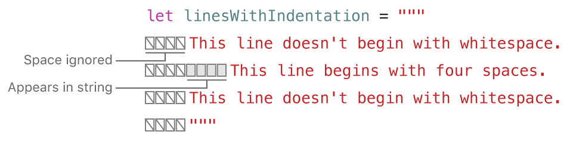
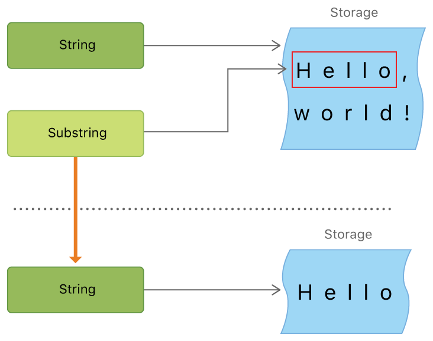
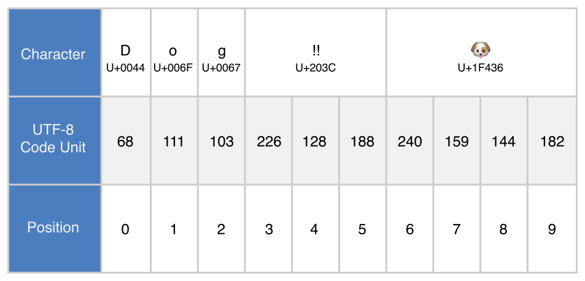
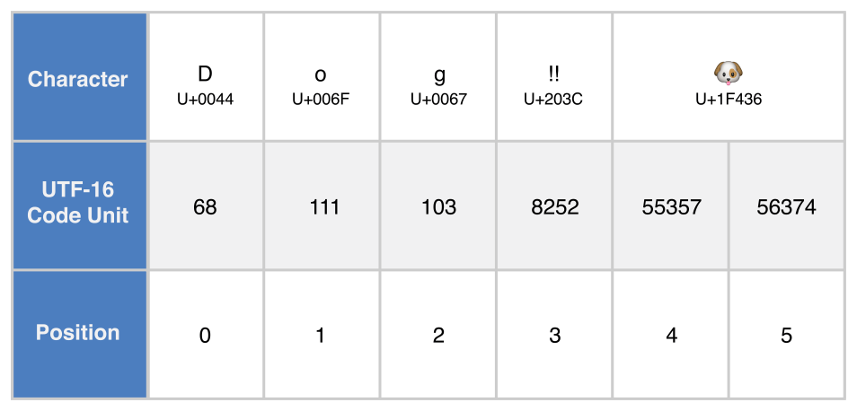
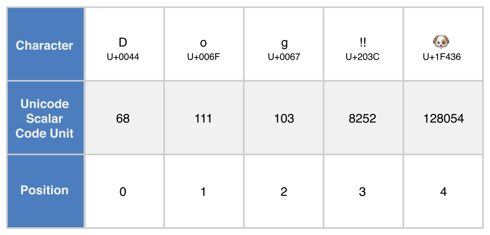

_字符串_是一系列的字符，比如说"hello, world"或者"albatross"。Swift 的字符串用String类型来表示。String的内容可以通过各种方法来访问到，包括作为Character值的集合。

Swift 的 String  和 Character  类型提供了一种快速的符合 Unicode 的方式操作你的代码。字符串的创建和修改语法非常轻量易读，使用与 C 类似的字符串字面量语法。字符串串联只需要使用+运算符即可，字符串的可修改能力通过选择常量和变量来进行管理，就如同 Swift 语言中的其他值。你同样可以使用字符串来插入常量、变量、字面量以及表达式到更长的字符串当中，这就是所谓的字符串插值。这样让创建自定义字符串值来显示、储存和打印值变得更加简单。

别看语法简单，Swift 的String类型仍旧是快速和现代的字符串实现。每一个字符串都是由 Unicode 字符的独立编码组成，并且提供了多种 Unicode 表示下访问这些字符的支持。

> 注意
> 
> Swift 的String类型桥接到了基础库中的NSString类。Foundation 同时也扩展了所有NSString 定义的方法给String 。也就是说，如果你导入 Foundation ，就可以在String 中访问所有的 NSString  方法，无需转换格式。
> 
> 更多在 Foundation 和 Cocoa 框架中使用String的内容，参见 [与 Cocoa 和 Objective-C 一起使用 Swift](https://developer.apple.com/library/content/documentation/Swift/Conceptual/BuildingCocoaApps/index.html#//apple_ref/doc/uid/TP40014216) （Swift 4）（官网链接）。

## 字符串字面量

你可以在你的代码中插入预先写好的String值作为_字符串字面量_。字符串字面量是被双引号（"）包裹的固定顺序文本字符。

使用字符串字面量作为常量或者变量的初始值：

```
let someString = "Some string literal value"
```

注意 Swift 会为someString常量推断类型为String，因为你用了字符串字面量值来初始化。

### 多行字符串字面量

如果你需要很多行的字符串，使用多行字符串字面量。多行字符串字面量是用三个双引号引起来的一系列字符：

```
let quotation = """
The White Rabbit put on his spectacles.  "Where shall I begin,
please your Majesty?" he asked.
 
"Begin at the beginning," the King said gravely, "and go on
till you come to the end; then stop."
"""
```

多行字符串字面量把所有行包括在引号内。字符串包含第一行开始于引号标记（""" ）并结束于末尾引号标记之前，也就是说下面的字符串的开始或者结束都不会有换行符：

```
let singleLineString = "These are the same."
let multilineString = """
These are the same.
"""
```

当你的代码中在多行字符串字面量里包含了换行，那个换行符同样会成为字符串里的值。如果你想要使用换行符来让你的代码易读，却不想让换行符成为字符串的值，那就在那些行的末尾使用反斜杠（\\ ）：

```
let softWrappedQuotation = """
The White Rabbit put on his spectacles.  "Where shall I begin, \
please your Majesty?" he asked.

"Begin at the beginning," the King said gravely, "and go on \
till you come to the end; then stop."
"""
```

要让多行字符串字面量起始或结束于换行，就在第一或最后一行写一个空行。比如说：

```
let lineBreaks = """

This string starts with a line break.
It also ends with a line break.

"""
```

多行字符串可以缩进以匹配周围的代码。双引号（""" ）前的空格会告诉 Swift 其他行前应该有多少空白是需要忽略的。比如说，尽管下面函数中多行字符串字面量缩进了，但实际上字符串不会以任何空白开头。

```
func generateQuotation() -> String {
    let quotation = """
        The White Rabbit put on his spectacles.  "Where shall I begin,
        please your Majesty?" he asked.
 
        "Begin at the beginning," the King said gravely, "and go on
        till you come to the end; then stop."
        """
    return quotation
}
print(quotation == generateQuotation())
// Prints "true"
```

总而言之，如果你在某行的空格超过了结束的双引号（""" ），那么这些空格_会_被包含。



在上面的例子中，尽管整个多行字符串字面量被缩进了，字符串中的第一行和最后一行不会有任何空白。中间的行如果有比结束引号有更多的缩进，那么它就会有额外的四个空格的缩进。

### 字符串字面量里的特殊字符

字符串字面量能包含以下特殊字符：

- 转义特殊字符 \\0 (空字符)， \\\\ (反斜杠)， \\t (水平制表符)， \\n (换行符)， \\r(回车符)， \\" (双引号) 以及\\' (单引号)；
- 任意的 Unicode 标量，写作 \\u{n}，里边的n是一个 1-8 个与合法 Unicode 码位相等的16进制数字。

下边的代码展示了这些特殊字符的四个栗子。wiseWords常量包含了两个转义双引号字符。dollarSign，blackHeart和sparklingHeart常量展示了 Unicode 标量格式：

```
let wiseWords = "\"Imagination is more important than knowledge\" - Einstein"
// "Imagination is more important than knowledge" - Einstein
let dollarSign = "\u{24}" // $, Unicode scalar U+0024
let blackHeart = "\u{2665}" // ♥, Unicode scalar U+2665
let sparklingHeart = "\u{1F496}" // 💖️, Unicode scalar U+1F496
```

由于多行字符串字面量使用三个双引号而不是一个作为标记，你可以在多行字符串字面量中包含双引号（" ）而不需转义。要在多行字符串中包含文本""" ，转义至少一个双引号。比如说：

```
let threeDoubleQuotationMarks = """
Escaping the first quotation mark \"""
Escaping all three quotation marks \"\"\"
"""
```

### 扩展字符串分隔符

你可以在字符串字面量中放置_扩展分隔符_来在字符串中包含特殊字符而不让它们真的生效。通过把字符串放在双引号（" ）内并由井号（# ）包裹。比如说，打印字符串字面量#"Line 1\\nLine 2"# 会打印出换行符\\n 而不是打印出两行。

如果你需要字符串中某个特殊符号的效果，使用使用匹配你包裹的井号数量的井号并在前面写转义符号\\ 。比如说，如果字符串是#"Line 1\\nLine 2"# 然后你想要让这个字符串输出两行，你可以使用#"Line 1\\#nLine 2"# ，类似地，###"Line1\\###nLine2"### 也会输出两行。

使用扩展分隔符创建的字符串字面量同样可以使用多行字符串字面量。你可以在多行字符串字面量中使用扩展分隔符来包含文本""" ，从而避免让它结束字面量。比如说：

```
let threeMoreDoubleQuotationMarks = #"""
Here are three more double quotes: """
"""#
```

## 初始化一个空字符串

为了绑定一个更长的字符串，要在一开始创建一个空的String值，要么赋值一个空的字符串字面量给变量，要么使用初始化器语法来初始化一个新的String实例：

```
var emptyString = ""               // empty string literal
var anotherEmptyString = String()  // initializer syntax
// these two strings are both empty, and are equivalent to each other
```

通过检查布尔量isEmpty属性来确认一个String值是否为空：

```
if emptyString.isEmpty {
    print("Nothing to see here")
}
// prints "Nothing to see here"

```

## 字符串可变性

你可以通过把一个String设置为变量（这里指可被修改），或者为常量（不能被修改）来指定它是否可以被修改（或者_改变_）：

```
var variableString = "Horse"
variableString += " and carriage"
// variableString is now "Horse and carriage"

let constantString = "Highlander"
constantString += " and another Highlander"
// this reports a compile-time error - a constant string cannot be modified
```

> 注意
> 
> 这个功能与 Objective-C 和 Cocoa 中的字符串改变不同，通过选择不同的类（NSString和NSMutableString）来明确字符串是否可被改变。

## 字符串是值类型

Swift 的String类型是一种值类型。如果你创建了一个新的String值，String值在传递给方法或者函数的时候会被复制过去，还有赋值给常量或者变量的时候也是一样。每一次赋值和传递，现存的String值都会被复制一次，传递走的是拷贝而不是原本。值类型在[结构体和枚举是值类型](https://www.cnswift.org/classes-and-structures#spl-6)一章当中有详细描述。

Swift 的默认拷贝String行为保证了当一个方法或者函数传给你一个String值，你就绝对拥有了这个String值，无需关心它从哪里来。你可以确定你传走的这个字符串除了你自己就不会有别人改变它。

另一方面，Swift 编译器优化了字符串使用的资源，实际上拷贝只会在确实需要的时候才进行。这意味着当你把字符串当做值类型来操作的时候总是能够有用很棒的性能。

## 操作字符

你可以通过for-in循环遍历String 中的每一个独立的Character值：

```
for character in "Dog!🐶️" {
    print(character)
}
// D
// o
// g
// !
// 🐶️
```

在 [For-In循环](https://www.cnswift.org/control-flow#For-in)一节中有for-in循环的详细叙述。

另外，你可以通过提供Character类型标注来从单个字符的字符串字面量创建一个独立的Character常量或者变量：

```
let exclamationMark: Character = "!"
```

String值可以通过传入Character值的字符串作为实际参数到它的初始化器来构造：

```
let catCharacters: [Character] = ["C", "a", "t", "!", "🐱️"]
let catString = String(catCharacters)
print(catString)
// prints "Cat!🐱️"
```

## 连接字符串和字符

String值能够被加起来（或者说_连接_），使用加运算符（+）来创建新的String值：

```
let string1 = "hello"
let string2 = " there"
var welcome = string1 + string2
// welcome now equals "hello there"
```

你同样也可以使用加赋值符号（+=）在已经存在的String值末尾追加一个String值：

```
var instruction = "look over"
instruction += string2
// instruction now equals "look over there"
```

你使用String类型的append()方法来可以给一个String变量的末尾追加Character值：

```
let exclamationMark: Character = "!"
welcome.append(exclamationMark)
// welcome now equals "hello there!"
```

> 注意
> 
> 你不能把String或者Character追加到已经存在的Character变量当中，因为Character值能且只能包含一个字符。

如果你使用多行字符串字面量来构建很长的字符串，又想让每一行字符串末尾有一个换行符，包括最后一行。比如说：

```
let badStart = """
one
two
"""
let end = """
three
"""
print(badStart + end)
// Prints two lines:
// one
// twothree

let goodStart = """
one
two

"""
print(goodStart + end)
// Prints three lines:
// one
// two
// three
```

在上面的代码中，串联badStart 和end 生成了一个两行字符串，它并不是期望的结果。因为badStart 的最后一行并没有结束于换行符，这一行与end 的第一行合并了。作为对比，goodStart 中的每一行都结束于换行符，所以当它和end 合并，结果就是三行，符合预期。

## 字符串插值

_字符串插值_是一种从混合常量、变量、字面量和表达式的字符串字面量构造新String值的方法。每一个你插入到字符串字面量的元素都要被一对圆括号包裹，然后使用反斜杠前缀：

```
let multiplier = 3
let message = "\(multiplier) times 2.5 is \(Double(multiplier) * 2.5)"
// message is "3 times 2.5 is 7.5"
```

在上边的栗子当中，multiplier的值以\\(multiplier)的形式插入到了字符串字面量当中。当字符串插值需要被用来创建真的字符串的时候，这个占位符就会被multiplier的真实值代替。

multiplier的值同时也是字符串后边更大一点表达式的一部分。这个表达式计算了Double(multiplier) \* 2.5的值并且插入结果 (7.5 ) 到字符串当中。在这个栗子当中，表达式在字符串字面量中被写作 \\(Double(multiplier) \* 2.5) 的形式。

你可以在扩展字符串分隔符中创建一个包含在其他情况下会被当作字符串插值的字符。比如说：

```
print(#"Write an interpolated string in Swift using \(multiplier)."#)
// Prints "Write an interpolated string in Swift using \(multiplier)."
```

要在使用扩展分隔符的字符串中使用字符串插值，在反斜杠后使用匹配首尾井号数量的井号。比如：

```
print(#"6 times 7 is \#(6 * 7)."#)
// Prints "6 times 7 is 42."
```

> 注意
> 
> 你作为插值写在圆括号中的表达式不能包含非转义的反斜杠 (\\)，并且不能包含回车或者换行符。总之，它们可以包含其他字符串字面量。

## Unicode

_Unicode_ 是一种在不同书写系统中编码、表示和处理文本的国际标准。它允许你表示几乎标准化格式的任何语言中的任何字符，并且为外部源比如文本文档或者网页读写这些字符。如同这节中描述的那样，Swift 的String和Character类型是完全 Unicode 兼容的。

### Unicode 标量

面板之下，Swift 的原生String 类型建立于 _Unicode 标量_值之上。一个 Unicode 标量是一个为字符或者修饰符创建的独一无二的21位数字，比如LATIN SMALL LETTER A (`"a"`)的U+0061 ，或者 FRONT-FACING BABY CHICK  ("🐥" )的 U+1F425 。

> 注意
> 
> Unicode 标量码位位于U+0000到U+D7FF或者U+E000到U+10FFFF之间。Unicode 标量码位不包括从U+D800到U+DFFF的16位码元码位。

注意不是所有的 21 位 Unicode 标量都指定了字符——有些标量是为将来所保留的。那些有了字符的标量通常来说也会有个名字，比如上边栗子中的LATIN SMALL LETTER A 和`FRONT-FACING BABY CHICK` 。

### 扩展字形集群

每一个 Swift 的Character类型实例都表示了单一的_扩展字形集群_。扩展字形集群是一个或者多个有序的 Unicode 标量（当组合起来时）产生的单个人类可读字符。

这有个栗子。字母é以单个 Unicode 标量é (LATIN SMALL LETTER E WITH ACUTE, 或者 U+00E9)表示。总之，同样的字母也可以用一对标量——一个标准的字母e (LATIN SMALL LETTER E,或者说 U+0065)，以及 COMBINING ACUTE ACCENT标量(U+0301)表示。 COMBINING ACUTE ACCENT标量会以图形方式应用到它前边的标量上，当 Unicode 文本渲染系统渲染时，就会把e转换为é来输出。

在这两种情况中，字母é都会作为单独的 Swift Character值以扩展字形集群来表示。在前者当中，集群包含了一个单独的标量；后者，则是两个标量的集群：

```
let eAcute: Character = "\u{E9}" // é
let combinedEAcute: Character = "\u{65}\u{301}" // e followed by ́
// eAcute is é, combinedEAcute is é
```

扩展字形集群是一种非常灵活的把各种复杂脚本字符作为单一Character值来表示的方法。比如说韩文字母中的音节能被表示为复合和分解序列两种。这两种表示在 Swift 中都完全合格于单一Character值：

```
let precomposed: Character = "\u{D55C}" // 한
let decomposed: Character = "\u{1112}\u{1161}\u{11AB}" // ᄒ, ᅡ, ᆫ
// precomposed is 한, decomposed is 한
```

扩展字形集群允许封闭标记的标量 (比如 COMBINING ENCLOSING CIRCLE, 或者说 U+20DD) 作为单一Character值来圈住其他 Unicode 标量：

```
let enclosedEAcute: Character = "\u{E9}\u{20DD}"
// enclosedEAcute is é⃝
```

区域指示符号的 Unicode 标量可以成对组合来成为单一的Character值，比如说这个REGIONAL INDICATOR SYMBOL LETTER U (U+1F1FA)和REGIONAL INDICATOR SYMBOL LETTER S  (U+1F1F8)：

```
let regionalIndicatorForUS: Character = "\u{1F1FA}\u{1F1F8}"
// regionalIndicatorForUS is 🇺🇸
```

## 字符统计

要在字符串中取回Character值的总数，使用字符串的count属性：

```
let unusualMenagerie = "Koala 🐨, Snail 🐌, Penguin 🐧, Dromedary 🐪"
print("unusualMenagerie has \(unusualMenagerie.count) characters")
// Prints "unusualMenagerie has 40 characters"
```

注意 Swift 为Character值使用的扩展字形集群意味着字符串的创建和修改可能不会总是影响字符串的字符统计数。

比如说，如果你使用四个字符的cafe来初始化一个新的字符串，然后追加一个COMBINING ACUTE ACCENT  (U+0301)到字符串的末尾，字符串的字符统计结果将仍旧是4，但第四个字符是é而不是e：

```
var word = "cafe"
print("the number of characters in \(word) is \(word.count)")
// Prints "the number of characters in cafe is 4"
 
word += "\u{301}"    // COMBINING ACUTE ACCENT, U+0301
 
print("the number of characters in \(word) is \(word.count)")
// Prints "the number of characters in café is 4"
```

> 注意
> 
> 扩展字形集群能够组合一个或者多个 Unicode 标量。这意味着不同的字符——以及相同字符的不同表示——能够获得不同大小的内存来储存。因此，Swift 中的字符并不会在字符串中获得相同的内存空间。所以说，字符串中字符的数量如果不遍历它的扩展字形集群边界的话，是不能被计算出来的。如果你在操作特殊的长字符串值，要注意count属性为了确定字符串中的字符要遍历整个字符串的 Unicode 标量。
> 
> 通过count属性返回的字符统计并不会总是与包含相同字符的NSString中length属性相同。NSString中的长度是基于在字符串的 UTF-16 表示中16位码元的数量来表示的，而不是字符串中 Unicode 扩展字形集群的数量。

## 访问和修改字符串

你可以通过下标脚本语法或者它自身的属性和方法来访问和修改字符串。

### 字符串索引

每一个String值都有相关的_索引类型_，String.Index，它相当于每个Character在字符串中的位置。

如上文中提到的那样，不同的字符会获得不同的内存空间来储存，所以为了明确哪个Character 在哪个特定的位置，你必须从String的开头或结尾遍历每一个 Unicode 标量。因此，Swift 的字符串不能通过整数值索引。

使用startIndex属性来访问String中第一个Character的位置。endIndex属性就是String中最后一个字符后的位置。所以说，endIndex属性并不是字符串下标脚本的合法实际参数。如果String为空，则startIndex与endIndex相等。

使用index(before:) 和index(after:) 方法来访问给定索引的前后。要访问给定索引更远的索引，你可以使用 index(\_:offsetBy:) 方法而不是多次调用这两个方法。

你可以使用下标脚本语法来访问String索引中的特定Character。

```
let greeting = "Guten Tag!"
greeting[greeting.startIndex]
// G
greeting[greeting.index(before: greeting.endIndex)]
// !
greeting[greeting.index(after: greeting.startIndex)]
// u
let index = greeting.index(greeting.startIndex, offsetBy: 7)
greeting[index]
// a
```

尝试访问的Character如果索引位置在字符串范围之外，就会触发运行时错误。

```
greeting[greeting.endIndex] // error
greeting.index(after: endIndex) // error
```

使用indices属性来访问字符串中每个字符的索引。

```
for index in greeting.indices {
    print("\(greeting[index]) ", terminator: "")
}
// Prints "G u t e n   T a g ! "
```

> 注意
> 
> 你可以在任何遵循了Indexable 协议的类型中使用startIndex 和endIndex 属性以及index(before:) ，index(after:) 和index(\_:offsetBy:) 方法。这包括这里使用的String ，还有集合类型比如Array ，Dictionary 和Set 。

### 插入和删除

要给字符串的特定索引位置插入字符，使用insert(\_:at:)方法，另外要冲入另一个字符串的内容到特定的索引，使用insert(contentsOf:at:) 方法。

```
var welcome = "hello"
welcome.insert("!", at: welcome.endIndex)
// welcome now equals "hello!"
 
welcome.insert(contentsOf: " there", at: welcome.index(before: welcome.endIndex))
// welcome now equals "hello there!"
```

要从字符串的特定索引位置移除字符，使用remove(at:)方法，另外要移除一小段特定范围的字符串，使用removeSubrange(\_:) 方法：

```
welcome.remove(at: welcome.index(before: welcome.endIndex))
// welcome now equals "hello there"
 
let range = welcome.index(welcome.endIndex, offsetBy: -6)..<welcome.endIndex
welcome.removeSubrange(range)
// welcome now equals "hello"
```

> 注意
> 
> 你可以在任何遵循了RangeReplaceableIndexable 协议的类型中使用insert(\_:at:) ，insert(contentsOf:at:) ， remove(at:) 方法。这包括了这里使用的String ，同样还有集合类型比如Array ，Dictionary 和Set 。

## 子字符串

当你获得了一个字符串的子字符串——比如说，使用下标或者类似prefix(\_:) 的方法——结果是一个[Substring](https://developer.apple.com/documentation/swift/substring) 的实例，不是另外一个字符串。Swift 中的子字符串拥有绝大部分字符串所拥有的方法，也就是说你可以用操作字符串相同的方法来操作子字符串。总之，与字符串不同，在字符串上执行动作的话你应该使用子字符串执行短期处理。当你想要把结果保存得长久一点时，你需要把子字符串转换为String 实例。比如说：

```
let greeting = "Hello, world!"
let index = greeting.index(of: ",") ?? greeting.endIndex
let beginning = greeting[..<index]
// beginning is "Hello"
 
// Convert the result to a String for long-term storage.
let newString = String(beginning)
```

与字符串类似，每一个子字符串都有一块内存区域用来保存组成子字符串的字符。字符串与子字符串的不同之处在于，作为性能上的优化，子字符串可以重用一部分用来保存原字符串的内存，或者是用来保存其他子字符串的内存。（字符串也拥有类似的优化，但是如果两个字符串使用相同的内存，他们就是等价的。）这个性能优化意味着在你修改字符串或者子字符串之前都不需要花费拷贝内存的代价。如同上面所说的，子字符串并不适合长期保存——因为它们重用了原字符串的内存，只要这个字符串有子字符串在使用中，那么这个字符串就必须一直保存在内存里。

在上面的例子中，greeting 是一个字符串，也就是说它拥有一块内存保存着组成这个字符串的字符。由于beginning 是greeting 的子字符串，它重用了greeting 所用的内存。不同的是，newString 是字符串——当它从子字符串创建时，它就有了自己的内存。下面的图例显示了这些关系：



>  注意
> 
> String 和Substring 都遵循[StringProtocol](https://developer.apple.com/documentation/swift/stringprotocol) 协议，也就是说它基本上能很方便地兼容所有接受StringProtocol 值的字符串操作函数。你可以无差别使用String 或Substring 值来调用这些函数。

## 字符串比较

Swift 提供了三种方法来比较文本值：字符串和字符相等性，前缀相等性以及后缀相等性。

### 字符串和字符相等性

如同[比较运算符](/basic-operators/#spl-10)中所描述的那样，字符串和字符相等使用“等于”运算符 (\==) 和“不等”运算符 (!=)进行检查：

```
let quotation = "We're a lot alike, you and I."
let sameQuotation = "We're a lot alike, you and I."
if quotation == sameQuotation {
    print("These two strings are considered equal")
}
// prints "These two strings are considered equal"
```

两个String值（或者两个Character值）如果它们的扩展字形集群是_规范化相等_，则被认为是相等的。如果扩展字形集群拥有相同的语言意义和外形，我们就说它规范化相等，就算它们实际上是由不同的 Unicode 标量组合而成。

比如说， LATIN SMALL LETTER E WITH ACUTE (U+00E9)是规范化相等于LATIN SMALL LETTER E(U+0065)加COMBINING ACUTE ACCENT (U+0301)的。这两个扩展字形集群都是表示字符é的合法方式，所以它们被看做规范化相等：

```
// "Voulez-vous un café?" using LATIN SMALL LETTER E WITH ACUTE
let eAcuteQuestion = "Voulez-vous un caf\u{E9}?"
 
// "Voulez-vous un café?" using LATIN SMALL LETTER E and COMBINING ACUTE ACCENT
let combinedEAcuteQuestion = "Voulez-vous un caf\u{65}\u{301}?"
 
if eAcuteQuestion == combinedEAcuteQuestion {
    print("These two strings are considered equal")
}
// prints "These two strings are considered equal"
```

反而，LATIN CAPITAL LETTER A (U+0041, 或者说 "A")在英语当中是_不同_于俄语的CYRILLIC CAPITAL LETTER A (U+0410,或者说 "А")的。字符看上去差不多，但是它们拥有不同的语言意义：

```
let latinCapitalLetterA: Character = "\u{41}"
 
let cyrillicCapitalLetterA: Character = "\u{0410}"
 
if latinCapitalLetterA != cyrillicCapitalLetterA {
    print("These two characters are not equivalent")
}
// prints "These two characters are not equivalent"
```

> 注意
> 
> 字符串和字符的比较在 Swift 中并不区分区域设置。

### 前缀和后缀相等性

要检查一个字符串是否拥有特定的字符串前缀或者后缀，调用字符串的hasPrefix(\_:)和hasSuffix(\_:)方法，它们两个都会接受一个String 类型的实际参数并且返回一个布尔量值。

下边的栗子假设一个表示莎士比亚的_《罗密欧与朱丽叶》_前两场场景位置的字符串数组：

```
let romeoAndJuliet = [
    "Act 1 Scene 1: Verona, A public place",
    "Act 1 Scene 2: Capulet's mansion",
    "Act 1 Scene 3: A room in Capulet's mansion",
    "Act 1 Scene 4: A street outside Capulet's mansion",
    "Act 1 Scene 5: The Great Hall in Capulet's mansion",
    "Act 2 Scene 1: Outside Capulet's mansion",
    "Act 2 Scene 2: Capulet's orchard",
    "Act 2 Scene 3: Outside Friar Lawrence's cell",
    "Act 2 Scene 4: A street in Verona",
    "Act 2 Scene 5: Capulet's mansion",
    "Act 2 Scene 6: Friar Lawrence's cell"
]
```

你可以使用hasPrefix(\_:)方法操作romeoAndJuliet数组来计算第一场场景的数量：

```
var act1SceneCount = 0
for scene in romeoAndJuliet {
    if scene.hasPrefix("Act 1 ") {
        act1SceneCount += 1
    }
}
print("There are \(act1SceneCount) scenes in Act 1")
// Prints "There are 5 scenes in Act 1"
```

同样的，使用hasSuffix(\_:)方法来计算与 Capulet’s mansion 和 Friar Lawrence’s cell 两个地方相关的场景数量：

```
var mansionCount = 0
var cellCount = 0
for scene in romeoAndJuliet {
    if scene.hasSuffix("Capulet's mansion") {
        mansionCount += 1
    } else if scene.hasSuffix("Friar Lawrence's cell") {
        cellCount += 1
    }
}
print("\(mansionCount) mansion scenes; \(cellCount) cell scenes")
// Prints "6 mansion scenes; 2 cell scenes"
```

> 注意
> 
> 如同[字符串和字符相等性](#spl-15)一节所描述的那样，hasPrefix(\_:)和hasSuffix(\_:)方法只对字符串当中的每一个扩展字形集群之间进行了一个逐字符的规范化相等比较。

## 字符串的 Unicode 表示法

当一个 Unicode 字符串写入文本文档或者其他储存里边的时候，这个字符串的 Unicode 标量会被编码为一个或者一系列 Unicode 定义的_编码格式_。每一种格式都把字符串编码成所谓码元的小块。这些包括 UTF-8 编码格式（它把字符串以8 码元编码），UTF-16 编码格式（它把字符串按照 16位 码元 编码），以及 UTF-32 编码格式（它把字符串以32位码元编码）。

Swift 提供了几种不同的方法来访问字符串的 Unicode 表示。你可以使用for-in语句来遍历整个字符串，来访以 Unicode 扩展字形集群的方式访问单独的Character值。这个过程在[操作字符](#spl-5)章节有着详细的描述。

 或者，你也可以用以下三者之一的其他 Unicode 兼容表示法来访问String值：

- UTF-8 码元的集合（关联于字符串的 utf8  属性）
- UTF-16 码元的集合（关联于字符串的 utf16  属性）
- 21位 Unicode 标量值的集合，等同于字符串的 UTF-32 编码格式（关联于字符串的unicodeScalars 属性）

下边的每一个例子都展示了接下来的字符串的不同表示方法，这个字符串由字符 D ，o ，g ，‼  (DOUBLE EXCLAMATION MARK, 或者说 Unicode 标量 U+203C)以及 🐶 字符(DOG FACE , 或者说 Unicode 标量 U+1F436)组成：

```
let dogString = "Dog‼🐶"
```

### UTF-8 表示法

你可以通过遍历utf8属性来访问一个String的 UTF-8 表示法。这个属性的类型是String.UTF8View，它是非负8位（UInt8）值，在字符串的 UTF-8 表示法中每一个字节的内容：



```
for codeUnit in dogString.utf8 {
    print("\(codeUnit) ", terminator: "")
}
print("")
// 68 111 103 226 128 188 240 159 144 182
```

上文中的栗子，前三个十进制codeUnit值 (68, 111, 103)表示了字符D , o , 和 g ，它们的 UTF-8 表示法与它们的 ASCII 表示法相同。接下来的三个十进制codeUnit值 (226, 128, 188)是DOUBLE EXCLAMATION MARK字符的三字节 UTF-8 表示法。最后四个codeUnit值 (240, 159, 144, 182)是DOG FACE字符的四字节 UTF-8 表示法。

### UTF-16 表示法

你可以通过遍历utf16属性来访问String的 UTF-16 表示法。这个属性的类型是`String.UTF16View`，它是非负 16位（UInt16）值，在字符串 UTF-16 表示法中每一个 16位 的内容：



```
for codeUnit in dogString.utf16 {
    print("\(codeUnit) ", terminator: "")
}
print("")
// Prints "68 111 103 8252 55357 56374 "
```

再一次，前三个codeUnit值 (68, 111, 103)表示了字符D , o , 和 g，它们的 UTF-16 码元与字符串 UTF-8 表示法中的值相同（因为这些 Unicode 标量表示 ASCII 字符）。

第四个codeUnit值(8252)是与十六进制值203C相等的十进制数字，它表示了DOUBLE EXCLAMATION MARK字符的 Unicode 标量U+203C。这个字符可以在 UTF-16 中表示为单个码元了。

第五和第六个codeUnit值 (55357和56374)是 UTF-16 16位码元对表示的DOG FACE字符。这些值是高16位码元值U+D83D（十进制值为55357）和低16位码元值U+DC36（十进制值为56374）。

### Unicode 标量表示法

你可以通过遍历unicodeScalars属性来访问String值的 Unicode 标量表示法。这个属性的类型是UnicodeScalarView，它是UnicodeScalar类型值的合集。

每一个UnicodeScalar都有值属性可以返回一个标量的21位值，用UInt32值表示：



```
for scalar in dogString.unicodeScalars {
    print("\(scalar.value) ", terminator: "")
}
print("")
// Prints "68 111 103 8252 128054 "
```

前三个UnicodeScalar值的value属性 (68, 111, 103) 还是表示了字符D, o, 和 g`。`

第四个codeUnit值 (8252)还是等于十六进制值203C的十进制值，它表示了DOUBLE EXCLAMATION MARK字符的 Unicode 标量 U+203C。

第五个和最后一个UnicodeScalar的value属性，128054，是一个等于十六进制值1F436的十进制数字，它表示了DOG FACE字符的 Unicode 标量 U+1F436。

作为查询它们value属性的替代方法，每一个UnicodeScalar值同样可以用来构造新的String值，比如说使用字符串插值：

```
for scalar in dogString.unicodeScalars {
    print("\(scalar) ")
}
// D
// o
// g
// ‼
// 🐶
```
