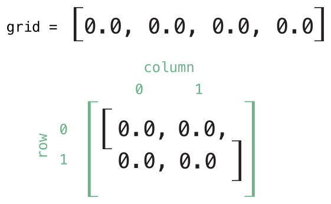
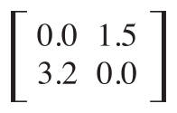

类、结构体和枚举可以定义_下标_，它可以作为访问集合、列表或序列成员元素的快捷方式。你可使用下标通过索引值来设置或检索值而不需要为设置和检索分别使用实例方法。比如说，用someArray\[index\] 来访问Array 实例中的元素以及用someDictionary\[key\] 访问Dictionary 实例中的元素。

你可以为一个类型定义多个下标，并且下标会基于传入的索引值的类型选择合适的下标重载使用。下标没有限制单个维度，你可以使用多个输入形参来定义下标以满足自定义类型的需求。

## 下标的语法

下标脚本允许你通过在实例名后面的方括号内写一个或多个值对该类的实例进行查询。它的语法类似于实例方法和计算属性。使用关键字subscript 来定义下标，并且指定一个或多个输入形式参数和返回类型，与实例方法一样。与实例方法不同的是，下标可以是读写也可以是只读的。这个行为通过与计算属性中相同的getter 和setter 传达：

```
subscript(index: Int) -> Int {
    get {
        // return an appropriate subscript value here
    }
    set(newValue) {
        // perform a suitable setting action here
    }
}
```

newValue 的类型和下标的返回值一样。与计算属性一样，你可以选择不去指定setter 的(newValue )形式参数。setter 默认提供形式参数newValue ，如果你自己没有提供的话。

与只读计算属性一样，你可以给只读下标省略get 关键字：

```
subscript(index: Int) -> Int {
    // return an appropriate subscript value here
}

```

下面是一个只读下标实现的栗子，它定义了一个TimeTable 结构体来表示整数的_n_倍表：

```
struct TimesTable {
    let multiplier: Int
    subscript(index: Int) -> Int {
        return multiplier * index
    }
}
let threeTimesTable = TimesTable(multiplier: 3)
print("six times three is \(threeTimesTable[6])")
// prints "six times three is 18"

```

在这个栗子中，创建了一个TimeTable 的新实例来表示三倍表。它表示通过给结构体的initializer 转入值3 来作为用于实例的multiplier 形式参数。

你可以通过下标来查询threeTimesTable ，比如说调用threeTimesTable\[6\] 。这条获取了三倍表的第六条结果，它返回了值18 或者6 的3 倍。

> 注意
> 
> n倍表是基于固定的数学公式。并不适合对threeTimesTable\[someIndex\] 进行赋值操作，所以TimesTable 的下标定义为只读下标。

## 下标用法

“下标”确切的意思取决于它使用的上下文。通常下标是用来访问集合、列表或序列中元素的快捷方式。你可以在你自己特定的类或结构体中自由实现下标来提供合适的功能。

例如，Swift 的Dictionary 类型实现了下标来对Dictionary 实例中存放的值进行设置和读取操作。你可以在下标的方括号中通过提供字典键类型相同的键来设置字典里的值，并且把一个与字典值类型相同的值赋给这个下标：

```
var numberOfLegs = ["spider": 8， "ant": 6， "cat": 4]
numberOfLegs["bird"] = 2
```

上面的栗子定义了一个名为numberOfLegs 的变量并用一个字典字面量初始化出了包含三个键值对的字典实例。numberOfLegs 字典的类型推断为\[String:Int\] 。字典实例创之后，这个栗子下标赋值来添加一个String 键"bird" 和Int 值2 到字典中。

更多关于Dictionary 下标的信息，请参考[访问和修改字典](/collection-types/#spl-22)。

> 注意
> 
> Swift 的Dictionary 类型实现它的下标为接收和返回_可选_类型的下标。对于上例中的numberOfLegs 字典，键值下标接收和返回一个Int? 类型的值，或者说“可选的Int  ”。Dictionary 类型使用可选的下标类型来建模不是所有键都会有值的事实，并且提供了一种通过给键赋值为nil 来删除对应键的值的方法。

## 下标选项

下标可以接收任意数量的输入形式参数，并且这些输入形式参数可以是任意类型。下标也可以返回任意类型。下标可以使用变量形式参数和可变形式参数，但是不能使用输入输出形式参数或提供默认形式参数值。

如同[可变形式参数](https://www.cnswift.org/functions#spl-13)和[默认形式参数值](https://www.cnswift.org/functions#spl-12)中描述的那样，类似函数，下标也可以接收不同数量的形式参数并且为它的形式参数提供默认值。

类或结构体可以根据自身需要提供多个下标实现，合适被使用的下标会基于值类型或者使用下标时下标方括号里包含的值来推断。这个对多下标的定义就是所谓的_下标重载_。

通常来讲下标接收一个形式参数，但只要你的类型需要也可以为下标定义多个参数。如下例定义了一个Matrix 结构体，它呈现一个Double 类型的二维矩阵。Matrix 结构体的下标接收两个整数形式参数：

```
struct Matrix {
    let rows: Int, columns: Int
    var grid: [Double]
    init(rows: Int, columns: Int) {
        self.rows = rows
        self.columns = columns
        grid = Array(repeating: 0.0, count: rows * columns)
    }
    func indexIsValid(row: Int, column: Int) -> Bool {
        return row >= 0 && row < rows && column >= 0 && column < columns
    }
    subscript(row: Int, column: Int) -> Double {
        get {
            assert(indexIsValid(row: row, column: column), "Index out of range")
            return grid[(row * columns) + column]
        }
        set {
            assert(indexIsValid(row: row, column: column), "Index out of range")
            grid[(row * columns) + column] = newValue
        }
    }
}
```

Matrix 提供了一个接收rows 和columns 两个形式参数的初始化器，创建了一个足够容纳rows \* columns 个数的Double 类型数组。矩阵里的每个位置都用0.0 初始化。要这么做，数组的长度，每一格初始化为0.0 ，都传入数组初始化器来创建和初始化一个正确长度的数组。这个初始化器在使[用默认值创建数组](/collection-types/#spl-5)里有更详细的描述。

你可以通过传入合适的行和列的数量来构造一个新的Matrix 实例：

```
var matrix = Matrix(rows: 2, columns: 2)
```

上例中创建了一个新的两行两列的Matrix 实例。Matrix 实例中的数组`grid是` 矩阵的高效扁平化版本，阅读顺序从左上到右下：

[](https://www.logcg.com/wp-content/uploads/2015/12/subscriptMatrix01_2x.png)

矩阵里的值可以通过传行和列给下标来设置，用逗号分隔：

```
matrix[0, 1] = 1.5
matrix[1, 0] = 3.2
```

上面两条语句调用的下标的设置器来给矩阵的右上角（row 是0  ，column 是1 ）赋值为1.5 ，给左下角（row 是1 ，column 是0  ）赋值为3.2 ：

[](https://www.logcg.com/wp-content/uploads/2015/12/subscriptMatrix02_2x.png)

 

Matrix 下标的设置器和读取器都包含了一个断言来检查下标的row 和column 是否有效。为了方便进行断言，Matrix 包含了一个名为indexIsValid(row:column:) 的成员方法，它用来确认请求的row 或column 值是否会造成数组越界：

```
func indexIsValidForRow(row: Int, column: Int) -> Bool {
    return row >= 0 && row < rows && column >= 0 && column < columns
}
```

断言在下标越界时触发：

```
let someValue = matrix[2, 2]
// this triggers an assert, because [2, 2] is outside of the matrix bounds
```

## 类型下标

实例下标，如果上文描述的那样，你在对应类型的实例上调用下标。你同样也可以定义类型本身的下标。这类下标叫做_类型下标_。你可通过在subscript 关键字前加static 关键字来标记类型下标。在类里则使用class 关键字，这样可以允许子类重写父类的下标实现。下面的例子展示了如何定义和调用类型下标：

```
enum Planet: Int {
    case mercury = 1, venus, earth, mars, jupiter, saturn, uranus, neptune
    static subscript(n: Int) -> Planet {
        return Planet(rawValue: n)!
    }
}
let mars = Planet[4]
print(mars)
```
